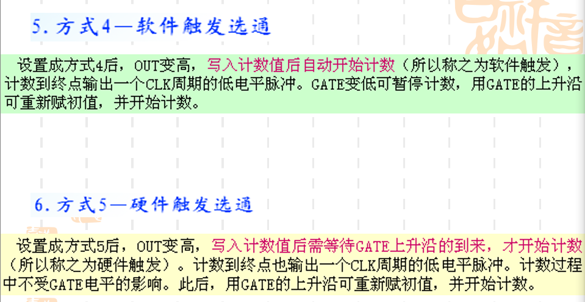
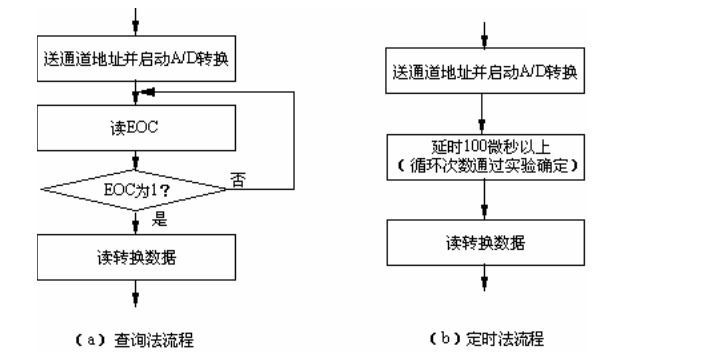

[TOC]

# 计算机接口技术

---


## 第一章

### 概论

微机接口是微处理器CPU与“外部世界”的连接电路，是CPU与外界进行信息交换的中转站。其中，外部世界：除CPU本身以外的所有设备或电路，包括存储器、I/O设备、测量设备、通讯设备、多媒体设备等。


一个传统的电脑主机中，包括了一些并口连接器，串口连接器，USB接口，鼠标接口（但是现在大多数鼠标也都采用USB口），还包括南桥和北桥芯片组，IDE接口，PCI(PCIE)插槽，ISA插槽，AGP插槽，ROM 和 BIOS等等。

## 第二章

### 微处理器导论

可以查看8086的外部引脚如下图所示：


其中，主要包括了这样几个部分：

+ GND ，CLK ，VCC 等基本控制信号
+ AD $\rightarrow$ 其中可以作为16位数据线和20位地址线。

### 8086的总线周期

### 基于某CPU的总线设计

### 8086系统总线形成

#### 两种模式下功能相同的引脚

1. $AD_{15} \sim AD_0$ 地址数据复用信号，双向，三态。
2. $A_{19}/S_6 \sim A_{16}/S_3$ 地址状态复用信号，输出，三态。$S_6$指示8086微处理器当前是否使用总线，$S_5$指示中断允许标志位的状态。$S_4,S_3$指明当前正使用的段寄存器，分别对应一个段寄存器。“0,0”，“0,1”，“1,0”，“1,1”分别对应ES,SS,CS,DS
3. $\overline{BHE}/S_7$ 控制，状态复用信号，输出，三态。$\overline{BHE}$为低电平时，表示在数据总线高8位上可以进行数据传送。
4. $\overline{RD}$,读控制信号，输出，三态。低电平有效，从存储器或者IO读出数据到CPU。
5. READY 表示准备就绪，输入，当其有效，则不需要插入等待时钟。
6. INTR 中断请求信号，输入，可屏蔽中断请求。
7. $\overline{TEST}$ 测试信号，输入
8. NMI 非屏蔽中断请求信号，输入
9. CLK 时钟输入信号
10. $V_{CC}$ 电源输入引脚
11. GND 接地引脚
12. $MN/\overline{MX}$ 组态选择信号，输入，高位表示在最小模式，低位表示在最大模式

#### 最小模式下系统总线的形成

##### 控制总线

控制总线包括$\overline{WR},\overline{RD},M/\overline{IO}$之类的信号，主要是控制读写以及保持是IO读写状态还是为存储器操作。

##### 地址总线

包括$A_{19} \sim A_{16}$ 和 $A_{15} \sim A_{0}$等地址。

##### 数据总线

包括$D_{15} \sim D_0$

| 总线              | 作用                                  |
| ----------------- | ------------------------------------- |
| $\overline{WR}$   | 写控制信号，输出，三态                |
| $M/\overline{IO}$ | 存储器操作/输入输出操作执行信号，三态 |
| $\overline{INTA}$ | 中断响应信号，输出                    |
| $ALE$             | 地址锁存允许信号，输出，三态          |
| $DT/\overline{R}$ | 数据收发控制信号，输出，三态          |
| $\overline{DEN}$  | 数据允许信号，输出，三态              |
| $HOLD$            | 总线持有请求信号，输入                |
| $HLDA$            | 总线持有响应信号，输出                |


#### 最大模式下系统总线的形成

| 总线信号                                          | 作用                                          |
| ------------------------------------------------- | --------------------------------------------- |
| $\overline{S_1}、\overline{S_2} 、\overline{S_3}$ | 状态信号，输出，三态                          |
| $\overline{LOCK}$                                 | 总线锁定信号，输出，三态 封锁其它总线控制设备 |
| $QS_1、QS_0$                                      | 指令队列状态信号，输入，了解队列当前状态      |
| $\overline{RQ_0 / GT_0} / \overline{RQ_0 / GT_0}$ | 请求/同意信号，双向，三态                     |

当8086工作在最大模式下时，一些控制信号需要借助于总线控制器8288产生。

总线控制器8288接收8086在最大模式下工作时产生的工作状态编码信号$\overline{s_2},\overline{s_1},\overline{s_0}$。识别8086将要执行的总线周期类型，产生总线周期所需的相应存储器访问、IO访问、中断相应等总线命令信号以及$DEN、DT/\overline{R}、ALE$等总线控制信号。

需要引起注意的三点：

1. 存储器读/写控制信号已经与I/O读写控制信号分开
2. 存储器和I/O都具有两个写命令：一般的写命令和超前的写命令。
3. 总线控制器8288产生的DEN信号与最小模式下的极性相反，使用时需要加上一个反相器。


### 8086的总线周期

#### 8086的时序与周期

指令周期：CPU执行一条指令所需要的的时间。

总线周期：CPU为了读取指令或传送数据，进行一次数据传送的总线操作定义为一个总线周期。


**对8086来说，总线周期有6种：存储器读周期，存储器写周期，I/O读周期，I/O写周期，中断周期和取指令周期**。一个标准的总线周期有四个时钟周期：T1,T2,T3和T4。当4个时钟周期不能完成所规定的的操作时，可以插入等待时钟$T_w$

#### 8086 的读写周期过程

+ 存储器读周期 
+ I/O读周期
+ 存储器写周期
+ I/O写周期
+ 等待时钟的插入

存储器与I/O的主要区别：

读周期：I/O端口地址只有16位，所以T1,T2期间没有出现A19 - A16

写周期：I/O端口地址只有16位，所以T1,T2期间没有出现A19 - A16

## 第三章

### I/O接口概述

#### I/O接口的主要功能

##### 1. 对传输数据实现缓冲、隔离和寄存。

在输出接口中，一般都要安排寄存环节。对CPU而言，要输出的数据送到寄存器就可以了，此后由输出设备利用寄存器中的数据去具体实现输出，输出得快一些或慢一些都可以。

在输入接口中，一般要安排缓冲隔离环节（三态门），当CPU读取数据时，只有被选定的输入设备将数据送到总线，其它的输入设备此时与数据总线隔离。

##### 2. 对信号形式和数据格式进行转换

I/O接口应能进行相互之间的转换（数据格式），比如将电流信号变为电压信号，将模拟信号变为数字信号，将串行数据变为并行数据，以及反方向转换等。

##### 3. 对I/O端口进行寻址

从编程角度看，从CPU角度看，和I/O设备打交道实际是和I/O端口打交道。每一个I/O端口有一个编号，称为端口地址。

##### 4. 实现I/O设备与CPU的联络和通讯协议

I/O接口处于CPU和I/O设备的中间，要在两个方向上进行联络，联络的具体信息包括：

+ 状态信号（设备准备好）
+ 请求信号（中断请求）
+ 控制信号（中断响应）

#### I/O接口的器件和集成化


#### I/O接口与CPU的连接


### I/O端口的编址方式

#### 存储器统一编址


#### I/O独立编址


### I/O指令及高级语言程序访问

#### I/O指令


#### 高级语言程序的访问


### 简单输入输出接口设计

计算机主机与外设之间进行数据传送的方式有四种

1. 程序直接控制传送方式
2. 中断传送方式
3. 直接存储器存取(DMA)方式
4. I/O处理机方式


#### 无条件传送方式

##### 无条件


其时序图为：


##### 无条件输出


其时序图为：


#### 查询传送方式

##### 查询输入接口电路


当外设准备好一个数据后，STB(Strobe)端产生一个选通信号，该信号将数据打入输入缓冲器，供CPU读取，同时将Ready触发器置为1。

​	Ready被置1起两个作用；

+ 表示设备已准备好，输入数据已经放到输入缓冲器中；
+ 通过与设备的IBF（Input Buffer Full）端的连接告诉设备，输入缓冲器满，CPU尚未取走数据，暂时不要送新的数据。

**C语言程序实现：**

其逻辑框图为：


具体结果为：

```c
while((inportb(status_port) & 1) == 0);
A = inportb(data_port);
```

##### 查询输出接口电路


对于查询输出接口，CPU要向其输出数据，必须是设备处于空闲状态。而了解设备是否空闲，就看Busy触发器是否为0，因为当输出设备利用完输出缓冲器中的数据时，会发出一股响应信号$\overline{ACK}$(Acknowledge)，将Busy触发器清0。

**C语言程序实现**


代码实现：

```c
while((inportb(status_port) & 0x80) != 0);
outportb(data_port,data);
```


### 接口设计方案

#### 微处理器的I/O接口信号


#### 端口地址安排

如果用微处理器或单片机设计一个小的应用系统，则I/O端口地址就完全由自己安排。


#### 端口地址译码

地址译码通常包括五步

1. 弄清所要设计的电路的输入输出关系
2. 列真值表
3. 由真值表写出输出信号的逻辑表达式
4. 化简表达式（公式法和图解法）
5. 根据最简表达式画出逻辑电路图

#### 基地址可变


#### 接口电路设计举例

##### ==一些主要的芯片的作用==

1. 74138： 用于地址译码，通常作为片选信号，一般而言，都使用地址线作为相应的输入，然后得到输出进行相应的控制
2. 8282： 常用的三态输出的信号锁存器，8输入8输出，同样有相应的控制信号，包括STB,$\overline{OE}$
3. 8286： 双向数据收发器，8输入8输出，$\overline{EN}$信号表示工作，T信号为高表示输出，为低表示输入。
4. 7432：2输入4或门，其包括了4个两输入或门
5. 74244: 74LS244为3态8位[缓冲器](https://baike.baidu.com/item/缓冲器/3697522)，一般用作总线[驱动器](https://baike.baidu.com/item/驱动器/310105)。74LS244没有锁存的功能。[地址锁存器](https://baike.baidu.com/item/地址锁存器/1315189)就是一个[暂存器](https://baike.baidu.com/item/暂存器/4308343)，它根据[控制信号](https://baike.baidu.com/item/控制信号/10329713)的状态，将总线上地址代码暂存起来。8086/8088数据和[地址总线](https://baike.baidu.com/item/地址总线/4307936)采用[分时复用](https://baike.baidu.com/item/分时复用/9844162)操作方法，即用同一总线既传输数据又传输地址。
6. 用于输出控制信号，其中CP表示选中。


### 中断传输接口设计

由于查询传送方式存在很多问题，即外设的速度相对于CPU而言慢很多，因此，采用这种方式，CPU大量等待，有很多浪费。

故而引入中断传送方式，中断传送方式让CPU和外设并行工作，当CPU发送一个数据至串行通信接口后继续进行自己的工作；当接口电路完成具体的发送后提出一个中断请求；CPU在条件许可时响应这个请求，进入相应的中断服务程序，在中断服务程序中给接口电路再送下一个数据，然后返回去接着做原来的工作。可见，在外设工作期间，CPU不再等待了，机器最重要的资源得到充分利用。


#### 中断传输的原理

##### 中断传送方式进行数据输入


**(1) 发出中断请求**

当输入设备准备好一个数据后，产生一个选通信号STB。该信号：

+ 将设备的数据打入到输入缓冲寄存器
+ 同时把中断请求触发器置1

若这时该中断源没有被屏蔽，即屏蔽触发器为1，则中断请求触发器“1”端的输出通过与门，向CPU提出中断请求INTR，与此同时，还将信号送到输入设备IBF，表示CPU还未将输入缓冲器中的数据取走，输入设备不要送新的数据。

**（2）中断响应**

如果该输入设备提出请求时，没有更高优先级中断源提出请求，则CPU在当前指令执行结束响应应该中断请求，进入中断响应周期。 在中断响应周期内中断响应信号$\overline{INTA}$有效，该信号把事先准备好的中断标识码（中断向量）送上数据总线，于是CPU得到中断服务程序入口地址，从而进入到中断服务程序。

**（3）中断服务程序中读取输入缓冲器中的数据**

​	在中断服务程序中执行一条输入指令可将已存放在输入缓冲器中的数据读入到CPU指定的寄存器。同时，将中断请求触发器复位。

​	复位中断请求触发器，一方面为下一次提中断请求做准备，另一方面，通知输入设备，CPU已将输入缓冲器中的数据取走，可以送新的数据了。

**（4）中断返回**

中断服务程序中的最后一条指令是==中断返回指令==。执行该指令，CPU返回去继续执行被中断了的主程序。

##### 中断传送方式进行数据输出

其方式和输入类似，因此这里可以直接通过看图认识到：


#### 可编程中断控制器8259A


##### 8259A的内部结构及引脚


**（1）中断请求寄存器**


**（2）中断屏蔽寄存器**


**（3）正在服务寄存器**


**（4）控制逻辑**


**（5）优先权判决电路**


##### 8259A的工作方式

参见PPT，关注嵌套方式和中断优先级方式，中断结束方式

##### 8259A的初始化命令字

##### 8259A的初始化编程

##### 8259A的操作命令字


## 第四章

### 可编程并行输入/输出接口8255A

#### 并行接口概述

并行接口连接CPU与并行外设，实现两者间的并行通信，在信息传送过程中，起到输出锁存或输入缓冲的作用

典型硬件结构包括：


其大体结构为：


#### 8255A的结构

8255A引脚结构图如下所示：


对其内部结构示意图为：


1. 数据总线缓冲器，连接到相应的数据总线接口中
2. 根据读写控制逻辑对A组和B组进行相应的控制，A组为A+ C高....
3. 数据总线同时可以控制工作方式

其控制为：


#### 8255A的工作方式概述

8255A的工作方式分为方式0，方式1和方式2

##### 方式0

方式0为基本的输入/输出方式，传送数据时不需要联络信号，A,B,C口可以单独设置为方式0输入口或输出口

##### 方式1

方式1为==选通输入/输出方式，即需要进行联络的输入/输出。==A组、B组的8位口可被设置为方式1输入口或方式1输出口，而这时要用相应C口的3根线作为联络线

##### 方式2

方式2 为双向传送，该方式要用C口的5根线做联络线，C口只有8根线，故而只能由A组作为方式2使用，A口被设置为双向端口，C口的5根线作为联络线。


##### 关于五个重要信号


#### 8255A的控制字


#### 8255A的三种工作方式的技术细节

##### 方式0

==输入输出都没有锁存功能==


方式0有两种基本应用：

（1） 无条件传送方式的接口

（2） 作查询方式的接口

##### 方式1

==任意端口均可作为输入或输出方式，输入和输出均有锁存功能==


如果使用方式1来进行数据输入，其过程为：


这样，8255A就能很好地协调外设向CPU的数据传送，不管外设与CPU之间存在的速度差异。

而对于方式1的输出结构，其应该为：


##### 方式2

==输入输出均能锁存，输出缓冲器是三态的。==作为终端传送方式的双向端口


#### 从端口C读取状态字


#### 8255A的应用举例


注意这个图的画法！！！！


其结果为：


### 可编程间隔定时器8253/8254

#### 8253的基本功能与结构

基本功能：


其内部引脚和结构大体如下：


其端口安排为；


#### 8253的控制字及初始化

对于8253的控制字


##### 8253初始化过程


初始化具体实例：

```c
outp(port_CMD,0x30);
outp(port_A,0x00);
outp(port_A,0x00);
```


#### 8253的工作方式

##### 方式0

==计数到终点输出变为高电平==


##### 方式1

==可编程单稳==：它有两种状态，但只能稳定在一种状态，在一定的外界作用下，它能从这一种状态进入到另一种状态，但经过一定时间后，又自动回复到原来的状态。


##### 方式2

==分频脉冲发生器（分频器）==


##### 方式3

==方波发生器==




##### 小结


#### 间隔定时器8254

#### 8253/8254应用举例

## 小键盘

## 数模转换


# 计算机接口实验

---

## 实验1—— 无条件输出端口的构成和地址译码

无条件输出端口和无条件输入端口是构建接口电路的基础。从原理上看，无条件输出端口是由寄存器、地址译码器和负与逻辑构成的。

利用 FPGA 芯片可构成一个典型的 8 位无条件输出端口。无条件输出端口模块处实际是一个进行了相关连接的 8 位寄存器（74LS273）


74LS540 为八反相缓冲器/驱动器，参数之一 I OL （低电平输出电流，即输出为
低时的灌入电流）为 24mA，足可以点亮发光二极管 LED。


因此，对应的结果即为：在 74LS273 的输出与 74LS540 的输入对应相连的情况下，当 74LS273 的某位为 0，则对应的 LED 亮，为 1，则对应的 LED 灭（因为 74LS540 为反相逻辑）。

## 实验2 ——手动数字量输入与无条件输入端口的构成

### ==三态门==

计算机中的记忆元件由触发器组成，而触发器只有两个状态。即“0”态和“1”态，所以每条信号线上只能传送一个触发器的信息。如果要在一条信号线上连接多个触发器，而每个触发器可以根据需要与信号线连通或断开，当连通时可以传送“0”或“1”,断开时对信号线上的信息不产生影响，就需要一个特殊的电路加以控制，此电路即为三态输出电路，又称为三态门。

三态电路可提供三种不同的输出值：逻辑“0”，逻辑“1”和高阻态。高阻态主要用来将逻辑门同系统的其他部分加以隔离。

### 相关背景

无条件输入端口通常也是接口的组成部分。从原理上看，无条件输入端口是由三态门、地址译码器和负与逻辑构成的。利用 FPGA 板可构成一个典型的 8 位无条件输入端口。无条件输入端口电路实际是一个进行了相关连接的八三态门（74LS244）


**构成无条件输入端口的关键是产生三态门的控制信号，实际上它是 IO 读信号（IOR#）和地址译码信号的负与。**

##### 函数退出代码

```c
void key(void)
{
    if(bioskey(1) != 0)
        exit(0);
}
```


## 实验3 —— 可编程接口芯片8255A的使用

### 8255连接示意图


8255A是一种可编程并行输入输出接口，并行，是指数据的各位同时传送。其只支持字节数据的并行传送。

#### 8255的结构

40引脚、双列直插式封装，包括数据端口、组控制电路、数据总线缓冲器、读/写控制逻辑等组成。

##### 数据端口

8255A有3个8位的数据端口：端口A,B,C。每一个端口都可由程序设定为输入或输出。C口可分成两个4位的端口：C高4位口和C低4位口

##### A、B组控制电路

A口和C高4位为A组，同理，可知B组。其都具有相应控制字。

##### 数据总线缓冲器

8位三态双向缓冲器，作为8255A与系统总线的接口。一般都应具有三态缓冲器，保证在芯片未被选中时和系统总线处于“脱离”状态。

##### 读/写控制逻辑

包括很多控制信号：


#### 8255A工作方式

##### 方式0

基本输入输出方式，传送数据时不需要联络信号，A口、B口和C口均可单独设置为方式0输入口或方式0输出口

##### 方式1

选通输入输出方式，需要进行联络。A组，B组的A口，B口可以被设置为方式1输入口或输出口，这是C口的3根线作为联络线。

##### 方式2

双向传送，C口的五根线作为联络线，只有1组能用于方式2，确定为A组，当A组设置为方式2时，A口被设置为双向端口，输入和输出。


##### 方式选择控制字


##### 置位/复位控制字


## 实验4——4 * 4小键盘的使用

在单片机等小应用系统以及智能设备中，经常使用简单键盘来进行输入操作，4 * 4键盘矩阵的典型电路图如图所示：


有 4 根行线（水平线）和 4 根列线（竖线），行线和列线相交位置上都接
有一个按键。这样就构成了一个 4×4 键盘矩阵。

为了识别键盘上的闭合键，通常可以采用两种方法：行扫描法和行反转法。

行扫描法识别按键的原理如下：先使第 0 行接地，其余行为高电平，然后读取列线的电位。如果有某列线为低电平，则表示第 0 行与该列线相交的位置上的键被按下；如果没有任何一条列线为低电平，则说明第 0 行没有任何键按下。此后，再将第 1 行接地，然后检测是否有变为低电平的列线。如此往下一行一行地扫描。在扫描过程中，当发现某一行有键闭合（即被按下）时，便可结束扫描，通过组合行线和列线即可识别此刻按下的是哪一键。

实际操作时，先快速检查有无键按下，然后再确定具体位置。参看图 4.1，检查有无键按下通过向行线输出全 0 读列线实现。如果列线输入端口的读入值为 0x×f（假定列线接到输入端口的低 4 位，所以只需考虑低 4 位,高 4 位是要去掉的，这里用×表示），则表明无键按下，否则，表明有键按下。如果发现有键按下，则进行下一步，即判断哪一个键被按下。为此，输出端口依次输出行扫描码。所谓行扫描码，是指欲扫描的的一行对应的位为 0 而其它行对应的位都为 1。这里共需 4 个行扫描码，其十六进制值分别是×E、×D、×B、×7（×表示任意, 这里假定行线接到输出端口的低 4 位）。每当输出一个行扫描码后，读一次列线输入端口。若读入值为 0x×f，则继续输出下一个行扫描码；若读入值为非 0x×f，则找到了闭合键。拿此次读入值（反映了闭合键所在的列）及行扫描码（反映了闭合键所在的行）
进行后续处理（如直接组合在一起）即可形成闭合键的编码。

行反转法要求与之配合的行列线的数据端口能改变输入输出方式。先将行端口设置为输出口，列端口设置为输入口。通过行端口输出一个（低 4 位）全 0 的字节数据，然后读入列线值。如果此时有键按下，则必定会使某列线值为 0。接着，程序改变对两个端口的设置：使行端口变成输入口，而列端口变成输出口。接下来，将刚才读得的列值从列端口输出，从行端口读取行线的输入值。显然，闭合键所在的行线值为 0。这样，当一个键被按下时，必定可以读到一对唯一的行值和列值。

#### 行扫描法代码：

```c
#include<stdio.h>  
#include<stdlib.h>  
#include<conio.h>  
#include<bios.h>  
#include<ctype.h>  
#include<process.h>  
//根据查看配置信息修改下列符号值***********************************  
#define IOY0    0x3038  
	//*****************************************************************  
#define MY8255_A    IOY0+0x00*2  
#define MY8255_B    IOY0+0x01*2  
#define MY8255_C    IOY0+0x02*2  
#define MY8255_MODE IOY0+0x03*2  
void main()
{
    char output[4] = {0x07,0x0b,0x0d,0x0e};
    int i,num;
    char input;
    outp(MY8255_MODE,0x82);
    while(true)
    {
        for(i=0;i<4;i++)
        {
            outp(MY8255_A,output[i]);
            input = inp(MY8255_B);
            if(input&0x0f != 0x0f)
            {
                switch(input)
                {
                    case 0x07:
                        num = i*4;
                        break;
                    case 0x0b:
                        num = i*4+1;
                      	break;
                    case 0x0d:
                        num = i*4+2;
                        break;
                    case 0x0e:
                        num = i*4+3;
                        break;
                    default:
                        break;
                }
                printf("Num:%d",num);
            }
        }
    }
}
    
```


#### 行反转法代码：

```c
#include<stdio.h>  
#include<stdlib.h>  
#include<conio.h>  
#include<bios.h>  
#include<ctype.h>  
#include<process.h>  
//根据查看配置信息修改下列符号值***********************************  
#define IOY0    0x3038  
	//*****************************************************************  
#define MY8255_A    IOY0+0x00*2  
#define MY8255_B    IOY0+0x01*2  
#define MY8255_C    IOY0+0x02*2  
#define MY8255_MODE IOY0+0x03*2  

void main()
{
    int i,j,num;
    char col,row;
    outp(MY8255_MODE,0x82);
    while(true)
    {
        outp(MY8255_A,0x00);
        col = inp(MY8255_B);
        col = col & 0x0f;
        outp(MY8255_MODE,0x90);
        outp(MY8255_B,col);
        row = inp(MY8255_A);
        switch(col)
        {
            case 0x07:
                i = 0;
                break;
            case 0x0b:
                i = 1;
                break;
            case 0x0d:
                i = 2;
                break;
            case 0x0e:
                i = 3;
                break;
            default:
                i = 4;
                break;
        }
		switch(row)
        {
            case 0x07:
                j = 0;
                break;
            case 0x0b:
                j = 1;
                break;
            case 0x0d:
                j = 2;
                break;
            case 0x0e:
                j = 3;
                break;
            default:
                j = 4;
                break;
        }
        num = i*4 +j;
        printf("Num: %d",num);
    }
}
```


## 实验5 —— 七段数码管的使用

一个七段数码管主要包括：


一个七段数码管能够显示一位十进制数码，通常的显示一般需要若干位。一般包括了段选和位选两种情况。

具体实验三代码如下：

```c
#include<stdio.h>  
#include<stdlib.h>  
#include<conio.h>  
#include<bios.h>  
#include<ctype.h>  
#include<process.h>  
//根据查看配置信息修改下列符号值***********************************  
#define IOY0    0x3038  
	//*****************************************************************  
#define MY8255_A    IOY0+0x00*2  
#define MY8255_B    IOY0+0x01*2  
#define MY8255_C    IOY0+0x02*2  
#define MY8255_MODE IOY0+0x03*2  

void main()
{
    char choose_bit[6] = {0xFE,0xF0,0xFB,0xF7,0xEF,0xDF};
    char nums[10] = {0x3F,0x06,0x5B,0x4F,0x66,0x6D,0x7D,0x07,0x7F,0x6F}

	char col,row;
	int i,j,num,times;
	outp(MY8255_MODE,0x80);//C口作为输出
	while(1)
    {
        while(1)
        {
            outp(MY8255_C,0x00);
            outp(MY8255_MODE,0x89);//C口作为输入
            col = inp(MY8255_C);
            col = col & 0xf;
            outp(MY8255_MODE,0x80);
            outp(MY8255_C,col);
            outp(MY8255_MODE,0x89)
        	row = inp(MY8255_C);
           	row = row & 0xf;
            switch(col)
            {
                case 0x07:
                    i = 0;
                    break;
                case 0x0b:
                    i = 1;
                    break;
                case 0x0d:
                    i = 2;
                    break;
                case 0x0e:
                    i = 3;
                    break;
                default:
                    i = 4;
                    break;
            }
            switch(row)
            {
                case 0x07:
                    j = 0;
                    break;
                case 0x0b:
                    j = 1;
                    break;
                case 0x0d:
                    j = 2;
                    break;
                case 0x0e:
                    j = 3;
                    break;
                default:
                    j = 4;
                    break;
            }
            num = i*4 +j;
            if(num > 9 && num != 20)
            	return;
            else if(num<=9)
                break;
        }

       	for(times=0;times<10000;times++)
        {
            outp(MY8255_A,0xFE);
            outp(MY8255_B,nums[num]);
        }
        pirntf("Num %d\n",num);
    }
};
```


## 实验6——D/A转换器的使用

D/A 转换器，即将数字量变成模拟量的转换器，也是计算机本身及应用系统中的常用电路。例如，在声卡中就用到 D/A 转换器，将数字信号变成音频电压信号。有了 D/A 转换器，计算机就可以实现各种控制，如对生产过程进行控制。D/A 转换器也早已集成化，种类、型号也非常多。本实验系统中安排了一片 DAC0832。这是用 CMOS 工艺制成的 8 位精度的 D/A转换芯片，它所接收的待转换的数字量为二进制 8 位（TTL 电平）。转换成的模拟量是电流，电流建立时间为 1μs，若要变成与数字量对应的电压，需要外接一个运算放大器（简称运放）。


DAC0832 由四个部分所组成：输入寄存器、DAC 寄存器、D/A 转换器和输入控制逻辑。这是一种两级数据缓冲结构。当数据进到第二级，便进行 D/A 转换。

图中内部信号 LE1#和 LE2#为锁存允许（Latch Enable）。为高时，寄存器为跟随状态，即输出随输入的变化而变化；变低的瞬间，输入端的状态被锁存到寄存器中。

运算放大器的输出电压值与D/A转换数据成正比，具体如下式所示：


## 实验7——A/D转换器的使用

A/D 转换器，即将模拟量变成数字量的转换器，是计算机本身及应用系统中常用的电路。有了它，可以将各种模拟量采集到计算机中（对于非电模拟信号，需要先通过传感器或变送器变成电信号），进行数据处理、统计或决策，有时再通过 D/A 转换器和执行结构，实现对生产过程或被控对象的自动控制。


图中，IN0～IN7 为模拟量输入。ADD C、ADD B 和 ADD A 为通道地址输入。内部的译码器对通道地址译码，选中对应的一路模拟量去进行 A/D 转换（ADD C、ADD B 和 ADD A 为 000时，选中 IN0，为 001 时，选中 IN1,其他组合依此类推）。

ALE 为地址锁存允许信号，当它从低到高的跳变时将通道地址的输入锁存。
START 为启动信号，正脉冲有效，它的上升沿将内部寄存器复位（为转换作准备），下降沿启动 A/D 转换。

EOC 为转换结束标志。在转换期间 EOC 为低电平，一旦转换完毕，则变成高电平。EOC可作为查询信号，了解转换是否结束；也可以作为中断请求信号，在转换结束时由低到高的跳变提出中断请求。

EOC和START 的时序关系如图所示：


根据A/D转换原理，模拟输入信号$V_{in}$与转换结果B（二进制数）有下面的关系：

$$B = \frac{V_{in} - V_{ref-}}{V_{ref+} - V_{ref-}} \times 2^n$$

对 A/D 转换器的编程可采用查询法或定时法



## 实验8——可编程计数器/定时器8254的使用

可编程计数器/定时器 8253/8254 几乎在所有微机接口技术的书中都会有介绍，这是因为计算机本身以及多数应用系统中都要用到计数功能和定时功能。众所周知，8253 内含 3个独立的 16 位计数器，每个计数器有 6 种工作方式，而 8254 是 8253 的改进型。8254 的引脚、工作方式与 8253 完全相同。改进主要在两个方面：一是计数频率更高，二是 8254 多了一个读回命令，该命令可将选择的计数器的状态字和（或）当前计数值一起存，供 CPU读取。在目前的情况下，8254 用的可能更多一些，因为利用读回命令可知道初值是否写入了计数器。因此，本实验系统对于计数/定时功能的实验安排的是 8254。实验板上8254 的引脚示意图如下。


##### 