[TOC]

# 计算机网络

## 第一章 计算机网络概论

几个基本概念：

+ 信息、数据、信号
+ 串行通信与并行通信
+ 传输介质与信道
+ 信道带宽与信道容量
+ 传输速率
+ 信噪比
+ 误码率
+ 传输延迟
+ 网络协议
+ 报文、分组

多台计算机之间的连接，方式： 共享式连接 和 交换式连接

交换方式包括：电路交换与分组交换

对于网络的扩展方式：

+ 可以利用网桥对网络进行扩展，网桥包括了多种形式
+ 多交换机扩展，利用多个交换机改变网络结构

英特网的结构：

+ network edge: end systems running TCP/IP protocol and applications
+ access networks: wired, wireless communication links
+ network core: interconnected routers, running routing protocol and IP protocol

接入网络(access networks)：

+ residential access networks（住宅接入网络）
  + DSL: digital subscriber line
  + HFC: hybrid fiber coax(cable modem)
  + FTTH: fiber to the home
+ institutional access networks (school,company)（组织接入网络）
+ wireless access networks(WiFi, 4G/5G)（无线接入网络）

包交换网络中的一些核心问题:

1. 当同时又多个包同时到达同一个线路，路由器是如何处理的？（buffer, store and forward,queue,congest)  how does a router deal with the packets when packets arrive for the same output link at the same time ?
2. 路由器是如何知道一个包应该向何处转发的？(routing)  how does a router know which router to forward a packet to ? 
3. 一个接收器是如何知道正确的包的顺序的？ (eg. TCP) how does a receiver know the correct ordering of packets
4. 发送方是如何判断包丢失并且需要重传的？ (eg. TCP) how does a sender know which packet is lost and must be retransmitted


## 第二章 应用层

## 第三章 传输层

## 第四章 网络层

### 网络层功能

网络层协议在每个主机和路由之间都有。

##### 发送方(sending)

打包segments 到链路层

##### 接收方(receiving)

发送segments 到传输层

##### 路由(router)

校验，利用头部校验和进行校验，然后传递。

网络层主要有两大功能：路由和传递(routing  and forwarding)

#### 网络层的协议

网络层主要包括两种协议，IP协议和ICMP协议。对于IP协议而言，主要包括地址规定，数据报格式和包处理规定，对于其中的细节请参考[4.2](IP协议)。对于ICMP协议，其主要包括差错报告和路由器标识。

其中，路由协议主要是用于路径选择，主要包括RIP,OSPF,BGP等方式。

### IP协议

网络层提供的服务：

1. 面向无连接的服务(datagram-based)
   + 没有提前连接的建立被需要
   + 数据报的传递用目的主机地址标识
   + 每个数据报独立传输
2. 尽最大努力传递(unreliable service)
   + 数据报可以被长时间delay
   + 数据报可以被丢弃
   + 数据报乱序发送
   + 数据报冗余发送

#### IPv4数据包格式

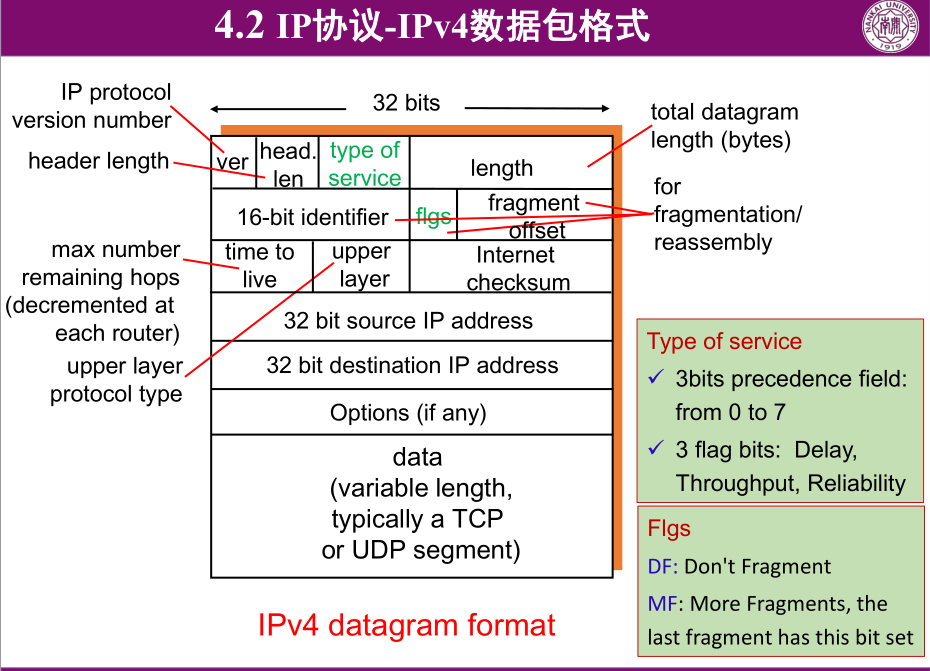

IP地址包括网络号和主机号(net-id 和 host-id)

A类地址，B类地址，C类地址，D类地址，E类地址 0 , 10 , 110 , 1110 , 11110

如何获得一个IP地址：

+ 系统管理员中保存有ip地址
+ DHCP：Dynamic Host Configuration Protocol
  + host broadcasts "DHCP discover" msg
  + DHCP server responds with "DHCP offer" msg
  + host requests IP address: "DHCP request" msg
  + DHCP server sends address: "DHCP ack" msg
+ other protocol

网络连接（有不同的方式）有MTU(max transfer unit)，因此需要切割不同的数据包。

路由器转发数据包的过程：

1. 路由器决定目的地址的网络号
2. 如果为本地网络地址，则直接发送，否则转发
3. 检查网络号是否在路由表项中，如果在，则发送到相应端口，否则丢弃
4. TTL减1，并更新校验和
5. 传递到下一网络的接口中

#### IPv4地址问题及解决策略

无类地址划分（CIDR）

IP地址分为前缀和后缀两部分

##### CIDR路由聚合

主要考虑最长匹配原则。

NAT: network address translation

==motivation==：IP地址不够分配

+ 对所有设备而言，只有一个IP（或几个）
+ 可以改变设备的本地IP地址，而不改变外部网络
+ 可以不用改变设备的IP地址，而更换ISP服务
+ 设备的内部地址是不是外网可见的。

#### IPv6基础

##### IPv4局限性

+ IPv4地址资源枯竭
+ 路由成为互联网的瓶颈（网络数目增加，地址层次性差，数据包首部长度可变）
+ 缺乏服务质量保证
+ 配置较为繁琐

##### IPv4的改进措施

1. 无类型域间选路（CIDR）
2. 网络地址转换(NAT)

##### IPv6互联网的优势

+ 解决地址耗尽问题：更大的地址空间
+ 自动配置的支持（即插即用）
+ 改善网络性能
+ 方便各项业务开展
+ 安全性更高
+ 移动性支持

##### IPv6地址的表示方法

128位地址：由冒号分开的8组十六进制字段组成，CIDR IPv6前缀表示：（IPv6/前缀长度）

#### IPv6地址类型

单播地址


### ICMP协议

 internet control message protocol

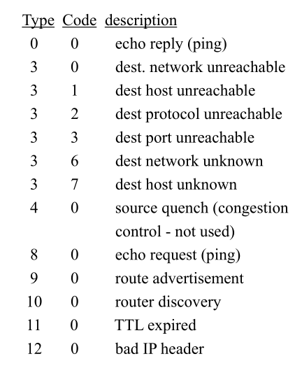

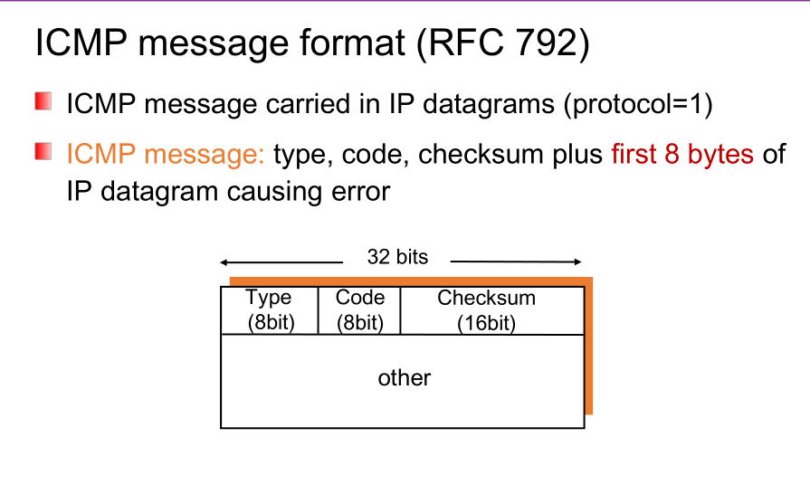

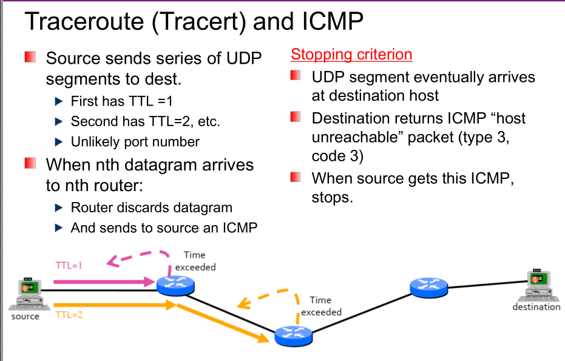

### 路由算法

通过图选择最短的到达路径。相关定义：

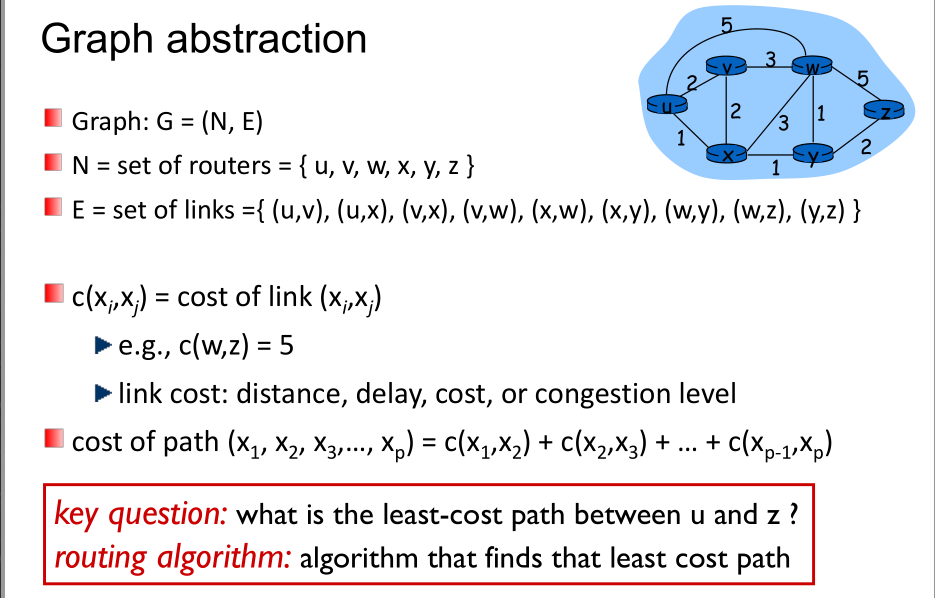

主要包括链路状态路由算法，向量状态路由算法和.....

#### 链路状态算法

其实质是一个Dijkstra算法，一个节点知道其它所有节点（这是通过"link state broadcast"）实现的。

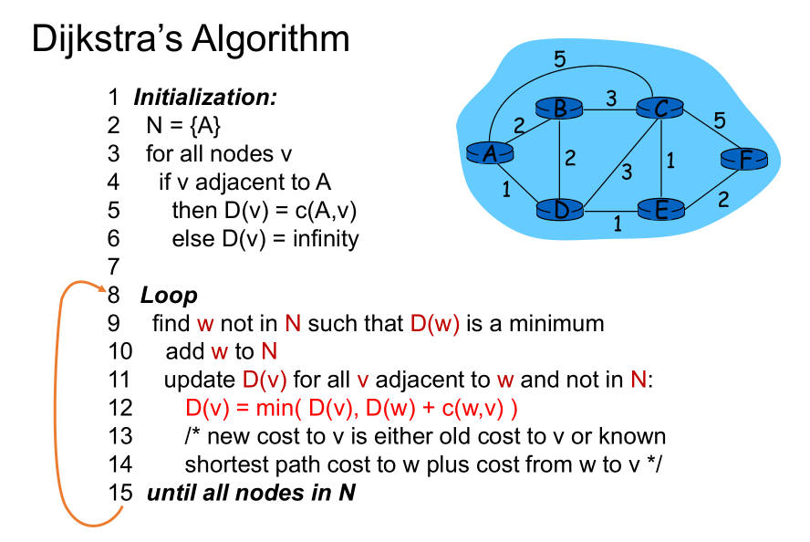

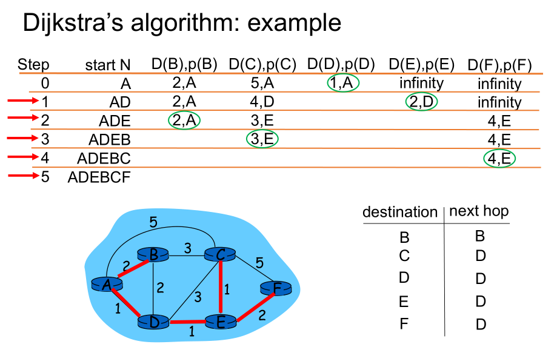

#### 距离向量算法

其实质上是Bellman-Ford算法。


### 互联网路由协议

根据A,B,C类IP地址的划分，我们大概有2 million 个IP地址，那么很显然需要大量的空间。因此考虑Hierarchical Routing

##### Two-level routing 

###### Intra-AS routing

• all routers in same AS must run same intra-domain protocol
• routers in different AS can run different intra-domain routing
protocol
• gateway router: at “edge” of its own AS, has link(s) to router(s) in
other AS’es

###### Inter-AS routing

• routing among AS’es
• gateways perform inter-domain routing (as well as intra-domain
routing)

#### RIP

RIP协议是基于距离向量算法，使用“跳数”来衡量到达目标地址的路由距离

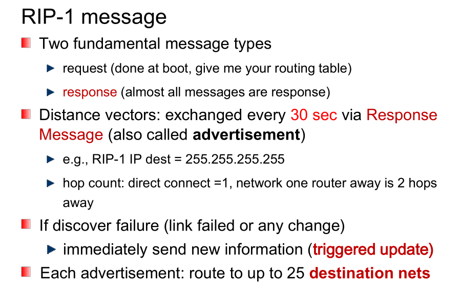

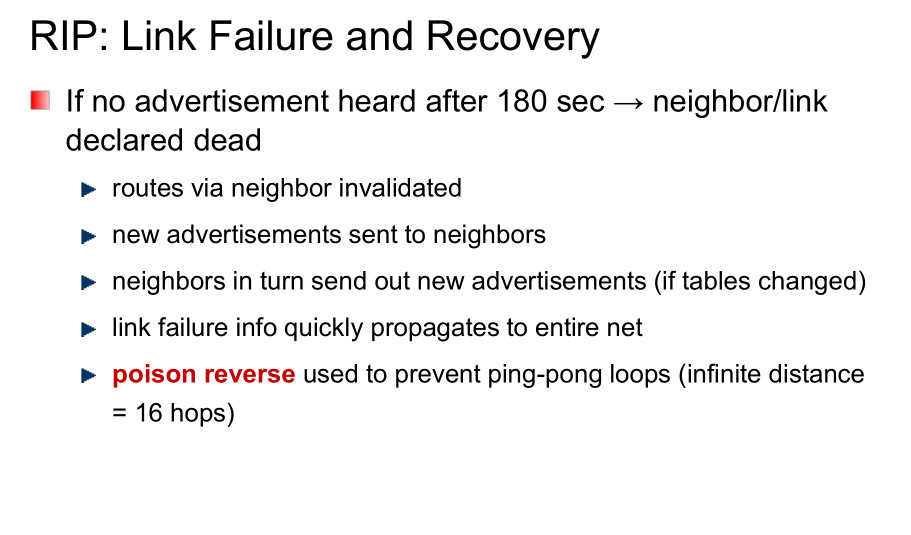

#### OSPF(open shortest path first)

使用链路状态算法

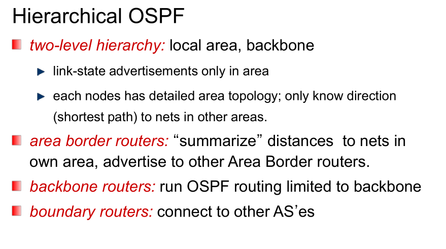

使用OSPF的一些优点：

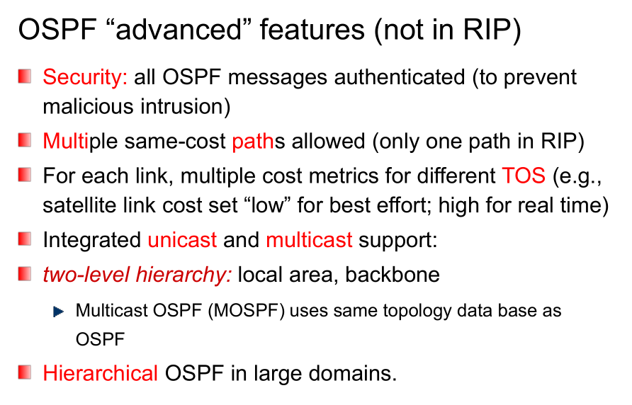

#### Internet inter-AS routing : BGP

border gateway protocol 提供

+ eBGP：获得网络的AS信息
+ iBGP：传递相应的AS信息到AS-internal 路由器
+ 决定一个"good" 路由

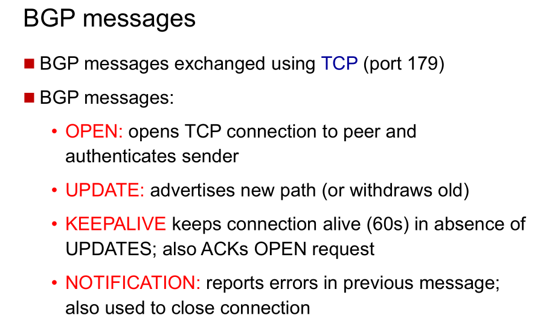

### 软件定义网络SDN

逻辑中心管理层：

远程的控制中心和本地的路由器代理交互来形成一个路由表，进行路由传输。

一个逻辑中心的控制，能够更好地进行路由管理，避免路由器的一些细节配置，有更大的灵活性。

### 补充：RIP防止路由环路

#### 水平分割

    水平分割的概念
    由于路由器可能收到它自己发送的路由信息，而这种信息是无用的。
    
    水平分割的原理
    路由器从某个接口接收到的更新信息不允许再从这个接口发回去。
    
    水平分割的优点
    1，能够阻止路由环路的产生。
    2，减少路由器更新信息占用的链路带宽资源。
    水平分割(split horizons)的思想
    就是在路由信息传送过程中，不再把路由信息发送到接收到此路由信息的接口上。从而在一定程度上避免了环路的产生。

#### 毒性逆转（Poisoned Reverse）

毒性逆转实际上是一种改进的水平分割。

这种方法的运作原理是：路由器从某个接口上接收到某个网段的路由信息之后，并不是不往回发送信息了，而是发送，只不过是将这个网段的跳数设为无限大，再发送出去。

收到此种的路由信息后，接收方路由器会立刻抛弃该路由，而不是等待其老化时间到（Age Out）。这样可以加速路由的收敛。

#### 触发更新

若网络中没有变化，则按通常的30秒间隔发送更新信息。但若有变化，路由器就立即发送其新的路由表。这个过程叫做触发更新。

#### 抑制计时（holddown timer）

一条路由信息无效之后，一段时间内这条路由都处于抑制状态，即在一定时间内不再接收关于同一目的地址的路由更新。

如果，路由器从一个网段上得知一条路径失效，然后，立即在另一个网段上得知这个路由有效。这个有效的信息往往是不正确的，抑制计时避免了这个问题，而且，当一条链路频繁起停时，抑制计时减少了路由的浮动，增加了网络的稳定性。

## 链路层：链路、接入网和局域网（接口层原理和协议）

两种不同类型的链路层信道：广播信道和点对点通信链路。

### 接口层基础

接口层主要包括物理层和数据链路层两层：

+ 物理层：提供位流服务
  + 编码与解码
  + 时钟同步
  + 信号的发送与接收
  + 传输介质和拓扑定义
+ 数据链路层：提供可靠和不可靠的传输服务
  + 数据单元及寻址方式定义
  + 链路层差错检测
  + 链路层的复用和分用
  + 可靠数据传输
  + 共享式连接：提供介质访问控制方法

可以将接口技术按照范围分为三类：局域网，城域网和广域网，这里主要研究局域网。除此之外，还可以包括个人区域网和无线传感网络等。

### 局域网体系结构和组网方法


### 局域网编址与ARP协议

#### LLC和MAC地址

LLC地址是用于标识上层协议的，即是用于标识网络层的相应协议，现在网络层一般使用IP协议。而MAC地址被称为物理网络地址，简称物理地址，其实际上是标识了当前网络所在物理层的地址。

##### MAC地址和IP地址区分

IP地址实际上是一个网络层地址，它被用来传输数据报到目的网络

MAC地址是物理地址，被用来从一个接口传到另一个物理接口，故实际上，MAC地址需要在每一层都做相应的传输。


每一个局域网中的网络信息中心都有一个特定的局域网地址（MAC地址），广播地址规定为：FF-FF-FF-FF

####  ARP：Address Resolution Protocol

每个在局域网上的IP结点都有一个ARP表项。一个ARP表项应该是这样一个三元组：<IP address; MAC address; TTL>

+ A知道B的IP地址，想知道B的物理地址
+ A广播ARP查询报文，包括了B的IP地址
+ B接收到ARP报文，回应给A其物理地址
+ A保存这样一个三元组

**ARP协议是一个插入即用的协议，它不需要网络管理的中介**

当不同局域网之间进行信息传输，路由的时候，A首先是将其发送到路由器R，并利用ARP协议进行查询MAC地址，并进行转发，同理，将由R查询后再次进行转发。

### 链路层差错控制

#### 循环冗余校验（CRC）

在数据链路层中，广泛使用==循环冗余校验（Cyclic Redundancy Check）==

计算方法：


###### 生成多项式G在以太网中为：$G = x^{32}+x^{26}+x^{23}+x^{22}+x^{16}+x^{12}+x^{11}+x^{10}+x^8+x^7+x^5+x^4+x^2+x+1$

### 共享式以太网

#### 以太网的发展


#### 共享式以太网连接方式与功能

服务：面向非连接的不可靠服务

功能：

+ 物理层：信号编码、时钟同步等，如差分曼切斯特编码
+ 介质访问控制层：介质访问控制，差错校验
+ 逻辑链路控制层：复用与分用

相应帧结构：


介质访问控制方法：CSMA/CD


其具体算法可以实现如下：

```
sense channel, f if idle
	then {
		transmit and monitor the channel;
		If detect another transmission
			then {
                abort and send jam signal;
                update # collisions;
                delay as required by binary exponential backoff algorithm;
                goto A A
                }
			else {done with the frame; set collisions to zero}
	}
		else {wait until ongoing transmission is over and goto A}
```


而对于以太帧的接受而言，其应该为：


### 交换式以太网


### 虚拟局域网

### 无线局域网

