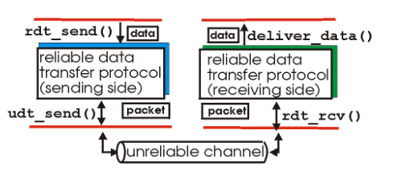
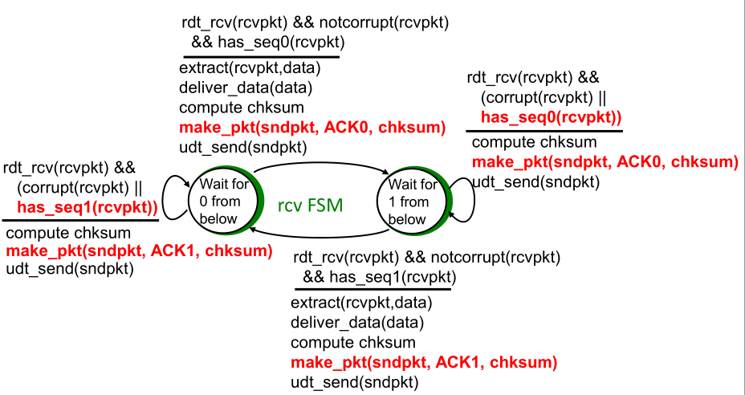
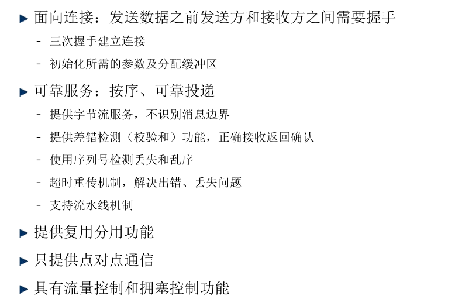
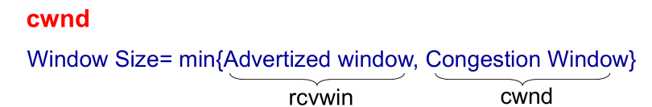
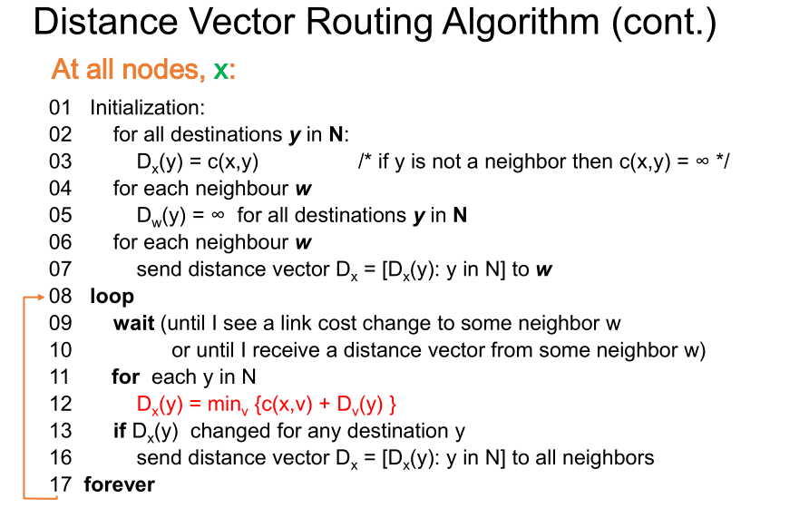

[TOC]

# 计算机网络


## 复习

### 第一章

#### TCP/IP体系结构

#### Internet 的核心与边缘

分组交换，统计  传输时间，传播时间，端延时的计算 理解分组交换的机制

统计机制： FTP服务器访问示例

### 第二章

#### 应用协议与进程通信模型

理解client server 和p2p的特点 ： 分别的优点 为什么需要这样的机制

两个进程之间相互交流的问题？

#### 文件传输服务与协议

FTP：特点，双链接 ，控制连接和数据连接   数据连接实现并发传输

#### 域名服务协议

关注两种不同的解析过程，本地域名服务器（知道IP地址），一般使用较近的，比较方便快捷。

#### 网络编程

复习编程过程

### 第三章

#### UDP

udp特点，然后为什么需要udp，根据UDP进行开发。复用和分用，校验和。

四元组

#### 可靠数据传输

#### TCP

#### 拥塞控制

理解拥塞控制，用TCP拥塞控制图

### 第四章

#### IP协议

CIDR路由聚合协议 ， 查表方法 

数据包查表转发，分段，路由聚合，分片，IP地址问题和解决方法

IPv6

#### ICMP协议

tracert工作原理，理解其具体方式

#### 路由算法

结合协议和算法进行共同思考。

#### SDN

稍微看一下

### 第五章

理解局域网的内容

#### 接口层和局域网

ARP协议的工作，ARP实现IP到MAC地址，校验和计算


## 第一章 计算机网络概论

几个基本概念：

+ 信息、数据、信号
+ 串行通信与并行通信
+ 传输介质与信道
+ 信道带宽与信道容量
+ 传输速率
+ 信噪比
+ 误码率
+ 传输延迟
+ 网络协议
+ 报文、分组

多台计算机之间的连接，方式： 共享式连接 和 交换式连接

交换方式包括：电路交换与分组交换

对于网络的扩展方式：

+ 可以利用网桥对网络进行扩展，网桥包括了多种形式
+ 多交换机扩展，利用多个交换机改变网络结构

英特网的结构：

+ network edge: end systems running TCP/IP protocol and applications
+ access networks: wired, wireless communication links
+ network core: interconnected routers, running routing protocol and IP protocol

接入网络(access networks)：

+ residential access networks（住宅接入网络）
  + DSL: digital subscriber line
  + HFC: hybrid fiber coax(cable modem)
  + FTTH: fiber to the home
+ institutional access networks (school,company)（组织接入网络）
+ wireless access networks(WiFi, 4G/5G)（无线接入网络）

包交换网络中的一些核心问题:

1. 当同时又多个包同时到达同一个线路，路由器是如何处理的？（buffer, store and forward,queue,congest)  how does a router deal with the packets when packets arrive for the same output link at the same time ?
2. 路由器是如何知道一个包应该向何处转发的？(routing)  how does a router know which router to forward a packet to ? 
3. 一个接收器是如何知道正确的包的顺序的？ (eg. TCP) how does a receiver know the correct ordering of packets
4. 发送方是如何判断包丢失并且需要重传的？ (eg. TCP) how does a sender know which packet is lost and must be retransmitted


## 第二章 应用层

### 应用协议与进程通信模型

#### 应用协议

应用：通信和分发处理，运行在用户空间中，通过交换不同的信息来实现不同的应用，例如email,ftp,web等等。

应用协议：根据不同的应用需求定义不同的消息，并通过底层的协议进行信息的通信和传输（TCP,UDP)

#### 进程通信

进程通信中，进程是运行在一个主机上的程序，在同一个进程中，进程通信使用进程间通信方式（通过操作系统定义），而对于不同进程，则使用信息交互(exchanging message)，不同主机之间的通信模式主要分为：客户端/服务器模式 和p2p模式(个人对个人)。

##### Sockets

Sockets是在应用层和传输层之间的一个类似接口一样的东西，进程会将其消息发送到socket中，并以此方式进行传输。这个会在[网络编程方法](### 网络编程方法)中具体介绍。

##### 客户/服务器模型

服务器端：

+ 等待连接
+ 永远在线
+ 固定永久IP地址
+ 用于扩展的服务器集群

客户端：

+ 与服务器建立初始连接
+ 间歇性可连接
+ 动态IP地址分配
+ 客户端之间不直接交流

##### P2P 模型

没有固定的服务器，随意的直接相连，每台主机都是间歇性连接，并且可以改变IP地址。

##### 混合客户/服务器和p2p模型


#### 地址分配

为了接受到相应的信息，每个进程都应该有相应的标识符，主机设备都拥有一个32位的特定IP地址，但是许多进程都需要运行在同一个主机上，故而还需要设置端口(port numbers)，对于一般的应用，都有其相对固定的端口，例如：

+ HTTP :  80
+ MAIL: 25

端口实际上有16位，一般而言，1-1023之间的端口号是分配管理的，如果我们需要设计一些新的应用，尽量不要使用这些端口号。

### 传输层服务对应用的支持

**在进行应用设计的时候，需要考虑到哪些点：data loss,timing 和 bandwidth，对于不同的应用而言，其对于数据是否有错误和损失是有不同的标准的，而同时，有些应用讲求实时性，而另一些则不需要；同样的，对于一些应用，它有最低带宽要求的限制，而对于另一些应用，则没有。**

例如：


#### Internet transport services

##### TCP（具体参考传输层）

面向连接的服务

可靠的传输服务

流量控制

拥塞控制

不提供：时间和最小带宽保障

##### UDP

不可靠的数据传输

不提供：连接建立，可靠性，流量控制，拥塞控制，时间和最小带宽保障

==为什么要提供UDP服务？==

**因为UDP服务非常简单，容易实现，在实际应用中有很大价值，而对于某些应用而言，确实不需要提供过于复杂的服务，只需要极为简单的服务即可，简单的消息处理能够减少处理的时间和复杂性。**

### 文件传输服务与协议

#### Whole-file transfer

用户首先获得当前本地一个文件的复制并操作这个副本，大多数这种文件的传输不是在本机之间进行的，也不是整个直接进行的。

相应的应用有：离线远端文件下载，软件和信息分发。

#### FTP：file transfer protocol

客户端使用TCP来与服务器建立连接。

特点：

+ 交互式：用户可使用命令行和服务器进行交互
+ 格式定义：客户端可以定义存储数据的类型和方式
+ 授权控制：客户端必须提供一个登陆的名字和密码


 双连接：控制连接和数据连接


主要理解ftp需要实现的功能：FTP主要需要实现文件的下载和上传，同时要考虑其自身的安全性，故而需要的操作主要是：

1. 文件的浏览和查找
2. 下载，上传功能（包括多个文件同时下载） 最基础的实现为建立队列，复杂的方式包括利用多线程方式进行
3. 登陆，选择下载文件
4. 文件下载内容和方式（binary file , text file）
5. ie..

### Web服务与协议

#### Web Client/Server Mode

**client**: **根据浏览的内容发出请求**，**并接受反馈信息和展示相应Web内容**

**server:服务器发送相应的请求的内容**


可以看到，HTTP服务底层也是通过TCP协议实现的。

#### HTTP： HyperText Transfer Protocol

+ 标准的Web转换协议在Web服务器和客户端之间
+ HTTP 通常使用TCP连接（但是这不是在协议中规定好的）
+ HTTP是面向事务的客户机/服务器协议，每个事务都是独立处理的
+ 不高效但是简答
+ 链接到同一服务器和链接到其他服务器之间没有区别

服务器不维护关于过去客户端请求的信息


从http1.0 到http1.1 ，将非持续性的连接变为了持续性的连接，即不像上面所展示的那样，当server返回了相应请求的信息之后就会关闭TCP连接。因此，这样，能够减少整个HTTP工作时需要交互的信息量。 ==result: fewer RTTs,less slow start==

HTTP协议中传输的信息的格式为：


对于一个具体例子而言：


#### 对于HTTP 1.0 的改进

对于一个无状态的HTTP连接而言，每一条请求都需要包含authorization，但是变为一个有状态的而言，（也就是现在使用的这种方式），那么可以利用cookies来保持这个连接的状态。

对于某些经常需要访问的网页而言，一般来说，客户端会对其进行cache 缓存，在这种情形下，会有这样的操作状况：向服务器端发送请求后，服务器端会根据客户端的相应请求，查看当前保存在客户端的结果是否为最新的，如果是，那么服务器不再发送相应内容，否则则进行发送 


#### URL

对于一个URL(uniform resource locators)，其具体的格式为：


更多的例子：


### 电子邮件服务与协议

#### 电子邮件系统

一个电子邮件系统包括三个主要部分： 用户代理，邮件服务器，简单邮件传输协议（smtp）


对于一个电子邮件的发送和接收过程而言，其具体连接方式为：


一个邮箱名应该为：local-part@domain-name

#### SMTP

同样是使用TCP协议来建立可靠的连接，应该包括三个阶段：

+ 握手
+ 信息的交换
+ 关闭连接

关于握手的一些具体交互信息，实际上可以参见之前做过的作业。

##### MIME编码

由于无法用ASCII编码表示所有的语言，故需要采用MIME编码方式来进行编码。

### 域名服务与协议

DNS: Domain Name System

由于对于网络的访问需要使用IP地址，但是我们一般习惯于使用名字来进行表示，故我们需要一个域名解析服务器来为我们解析域名 ： DNS

将名字和IP地址进行相应的映射：

+ 分配： 有一组服务器用于将网站名字解析为地址
+ 有效性：大多数名字可以本地被解析
+ 可靠性： 都会正确执行
+ 目的： 不要将地址限定为机器地址

#### DNS 域名服务器

##### 根目录域名服务器

##### 顶层域名服务器(top-level domain)

##### 授权域名服务器(authoritative)

##### 本地域名服务器(local)

DNS服务器请求地址转换的两种方式：


#### Name server caching

为了降低查找对应IP地址的成本，一般而言，域名服务器都会对常用网站的映射进行缓存。故其具体步骤为：


#### Host caching

除了域名服务器会对映射表进行缓存之外，主机也会对其进行缓存。


##### DNS 报文格式


### 对等通信

#### P2P 与 客户-服务器的比较


对客户-服务器而言，时间为： $d_{cs} = max\{NF/u_s,F/min(d_i)\}$

而对于P2P而言，时间为： $d_{p2p}=max\{F/u_s,F/min(d_i),NF/(u_s + \sum u_i)\}$

可以看到，如果N越大，那么P2P模型对于文件的上传下载能提供更少的时间。


bittorrent 的例子。

对于P2P模型而言，不但是用于上传下载文件，同时还可以用于信息检索。文件传输是去中心化的，但是信息检索是高度中心化的。

### 网络编程方法


## 第三章 传输层

### 传输层需要解决的基本问题

1.在网络层，将IP数据报从源主机发送到目的主机，提供的是无连接不可靠服务，而本身数据报传输存在的问题有：<font color=red>延迟、乱序、出错、丢失等</font>。故而，传输层需要解决的问题之一： <font color= blue>可靠机制，向应用层提供可靠服务</font>。

2.应用层有多个端口，可以同时运行多个应用程序，但是其共享单一的网络层协议(IP)和网络接口，因此需要传输层解决的问题之二是：<font color = blue>复用(multiplexing) 和 分用(demultiplexing)</font>

### TCP/IP体系结构中传输层协议与服务

可以知道，传输层协议的基本功能是：复用和分用 可靠性保证

具体执行的动作：

+ 发送端： 将应用层的消息封装层传输层的数据单元，传递到网络层
+ 接收端：将从网络层接收到的传输层数据单元，处理后交给应用层

#### TCP 和 UDP


### 用户数据报协议（UDP）

#### UDP协议特点

+ 发送方和接收方不需要握手过程
+ 每个UDP数据单元==数据报==独立传输
+ 提供复用分用功能和==可选==的差错检测功能
+ 支持组播通信（点到多点通信）
+ 不提供可靠性保证：无确认重传、可能有出错、丢失、乱序等现象。

数据报格式


伪首部并非TCP&[UDP](https://baike.baidu.com/item/UDP/571511)[数据报](https://baike.baidu.com/item/数据报/2194617)中实际的有效成分。伪首部是一个虚拟的数据结构，其中的信息是从数据报所在IP分组头的分组头中提取的，既不向下传送也不向上递交，而仅仅是为计算[校验和](https://baike.baidu.com/item/校验和)。这样的校验和，既校验了TCP&UDP用户数据的源[端口号](https://baike.baidu.com/item/端口号)和目的端口号以及TCP&UDP用户数据报的数据部分，又检验了[IP数据报](https://baike.baidu.com/item/IP数据报/1581132)的源[IP地址](https://baike.baidu.com/item/IP地址/150859)和目的地址。伪报头保证TCP&UDP[数据单元](https://baike.baidu.com/item/数据单元/1415766)到达正确的目的地址。因此，伪报头中包含IP地址并且作为计算校验和需要考虑的一部分。最终目的端根据伪报头和数据单元计算校验和以验证通信数据在传输过程中没有改变而且到达了正确的目的地址。

#### UDP数据报差错检测


#### 检验和计算方法


##### 几点说明：

在IPv4中,UDP校验和是可选项，而在IPv6中，变成强制性的。

UDP校验和覆盖的范围超出了UDP数据报本身，使用伪首部的目的是检验UDP数据报是否真正到达目的地，正确的目的地包括了特定的主机和该主机上特定的端口

伪首部不随用户数据报一起传输，接收方需自己形成伪首部进行校验

伪首部的使用破坏了层次划分的基本前提，即每一层的功能独立

##### 为什么要提供UDP服务

+ 不需要建立连接，建立连接需要增加延时，特别对简单的交互应用
+ 协议简单：在发送端和接收端不需要维护连接状态
+ 数据报头部短，额外开销小
+ 无拥塞控制

同时，由于UDP协议简单，可以利用此协议自己实现相应的一些缺省的操作，适合实际应用

### 可靠数据传输

一般而言，我们希望在应用层之下能够提供一个可靠数据传输通道，但是实际上，其情况如下图所示：



从这个图中我们可以认识到，实际上只有发送端在进行数据报发送过程中是不可靠的，但是主机内部的数据传送和数据接收是可靠的。

#### Rdt1.0: reliable transfer over a reliable channel

假设：没有字节错误，没有包丢失

这样的话，实际上的结构就很简单：


#### Rdt2.0: channel with bit errors

显然，这个时候需要对是否出现错误进行检测，那么很容易可以想到差错检验，但是一个显而易见的问题是：差错检验之后，怎么恢复错误呢？

一个很简洁的方法，是接收端回复ACK或者NAK表示收到信息（正确）和未接收到正确报文。

**相较于rdt1.0,rdt2.0增加了**

+ 差错检测
+ 接收方反馈： 控制信息从接收到发送给发送方
+ 发送方重传

其有限状态自动机模型为：


##### Rdt2.0的问题所在：

没有考虑到，如果ACK和NAK发生错误了，需要怎么办？因此需要对其进行修改

#### Rdt2.1:sender, handles garbled ACK/NAKS

主要是进行相应的修改，即判断是否发送回来的ACK和NAK出现错误，增加了相应的序列号，0,1 交替出现

其有限状态自动机为：


#### Rdt2.2: a NAK-free protocol

实现了和rdt2.1相同的功能，但是只使用了ACK，而没有使用NAK，其方式为：

接收方发送最后一个接收到的包的ACK

重复的一个ACK序列号表示需要重传当前的包。

这样而言，那么需要形成的有限状态自动机为：


而相同的，接收方为：



#### Rdt3.0: channels with errors and loss

当数据包可能丢失的时候，应该怎么处理？应该设置超时重传机制，进行重传。


如果利用rdt3.0进行传输的话，其效率极低，故而需要进行效率改进。改进方案其实很简单，回顾rdt3.0的设计方案，其实际上是stop-and-wait的相应操作，那么应该将其修改为：流水化的协议。

因此，产生了两种不同的方案：

#### go-Back-N（GBN）

设定一个k位的序列号seq，然后设置一个窗口大小为N，可以将所有数据分为四种：<font color = red>already ack / sent,not acked /usable not sent /not usable</font>


对于当前而言，其实际上分为了两种情况，即发送接收到的连续的最大的包的名字，如果没接收到的，则进行重传。


#### selective repeat (SR)

接收方会确认每个正确收到的包，这样，接收方就需要进行相应的缓存。相应的，那么发送方只需要发送没有收到ACK回复的那些包。

### 传输控制协议（TCP）

#### TCP协议特点



TCP连接标识:arrow_right: 四元组:源IP地址，目的IP地址，源端口号，目的端口号。这样实际上实现了分用和复用。

通过建立的TCP连接为应用进程提供可靠的字节流服务

#### TCP提供可靠字节流服务

对于TCP而言，需要将数据封装成段：其情况为 数据达到MSS大小，定时器超时和应用进程PUSH

一般而言，MSS(maximum segment size)表示最大段长度

#### TCP可靠数据传输

##### 基本机制：

+ 发送端：发送数据、等待确认、超时重传
+ 接收端：进行差错检测，采用累积确认机制（确认按序正确接收到字节的下一个字节序列号）

##### 支持流水线机制

+ 发送序列号：32位
+ 接收序列号：32位
+ 每个字节都有序列号，对段的边界没有要求

##### 乱序段处理：协议无明确规定

+ 接收端不缓存，可以正常工作，处理简单，效率低
+ 接收端缓存，效率高，处理复杂

##### 发送序列号和确认序列号

对于发送端而言，发送序列号为数据部分中第一个字节在字节流中的序号

对于接收端而言，确认序列号为接收的下一个字节的序号


对于TCP重传情景而言，其实际上是重传机制中的GBN + SR

#### TCP重传超时时间考虑

TCP采用自适应方法计算重传超时时间

基于往返时间（RTT）确定重传超时时间(RTO)


新算法：


#### TCP快速重传

RTO时间通常设置的相对较长，一般而言，我们假定，如果三次重复发送相同ACK检测TCP段的丢失

快速重传： 在超时之前重传丢失的TCP段，以降低延迟


#### TCP选择确认（SACK)

在建立连接时在选项部分通告是否支持选择确认（SACK）

#### TCP流量控制

在接收端：标明接收窗口的大小

在发送端：保证传送的数量不大于窗口大小


##### 流量控制的性能问题解决

当窗口很小时，不要发送，一般而言，设置当窗口为$min(1/2 Receive buffer size, Max segment size)$之后，才进行相应的设置。

同时，接收端不要立即发送ACK，等待相应的时间之后再进行发送

#### TCP连接建立

##### 

##### ==SYN洪泛攻击==

SYN攻击利用的是[TCP](https://baike.baidu.com/item/TCP)的[三次握手](https://baike.baidu.com/item/三次握手/5111559)机制，攻击端利用伪造的[IP](https://baike.baidu.com/item/IP)地址向被攻击端发出请求，而被攻击端发出的响应 [报文](https://baike.baidu.com/item/报文/3164352)将永远发送不到目的地，那么被攻击端在等待关闭这个连接的过程中消耗了资源，如果有成千上万的这种连接，[主机](https://baike.baidu.com/item/主机/455151)资源将被耗尽，从而达到攻击的目的。

对于SYN泛洪攻击的防范，优化主机系统设置是常用的手段。如降低SYN timeout时间，使得主机尽快释放半连接的占用；又比如采用SYN  cookie设置，如果短时间内连续收到某个IP的重复SYN请求，则认为受到了该IP的攻击，丢弃来自该IP的后续请求报文。此外合理地采用防火墙等外部网络安全设施也可缓解SYN泛洪攻击。

#### TCP连接关闭


##### TCPreset段的使用


### 理解网络拥塞

拥塞产生的原因，太多的source 传递大量的数据

#### 拥塞控制方法

1. 端到端拥塞控制 ：网络没有特定的反馈，端系统通过检测进行判断，TCP所使用
2. 网络协助的拥塞控制 ：网络协助的拥塞控制


### TCP拥塞控制机制

目的：	TCP应该尽可能发送，但是不要产生拥塞

去中心化策略：每个TCP发送者设定其特定的rate，基于特定的反馈


#### TCP拥塞控制窗口大小

TCP实现基于窗口大小的拥塞控制

窗口大小设定为：



TCP拥塞控制的特点：慢启动，拥塞避免

慢启动指cwnd 被设置为一个MSS在初始的时候

拥塞避免采用加性增，乘性减的方式。

具体表现为：


## 第四章 网络层

### 网络层功能

网络层协议在每个主机和路由之间都有。

##### 发送方(sending)

打包segments 到链路层

##### 接收方(receiving)

发送segments 到传输层

##### 路由(router)

校验，利用头部校验和进行校验，然后传递。

网络层主要有两大功能：路由和传递(routing  and forwarding)

#### 网络层的协议

网络层主要包括两种协议，IP协议和ICMP协议。对于IP协议而言，主要包括地址规定，数据报格式和包处理规定，对于其中的细节请参考[4.2](IP协议)。对于ICMP协议，其主要包括差错报告和路由器标识。

其中，路由协议主要是用于路径选择，主要包括RIP,OSPF,BGP等方式。

### IP协议

网络层提供的服务：

1. 面向无连接的服务(datagram-based)
   + 没有提前连接的建立被需要
   + 数据报的传递用目的主机地址标识
   + 每个数据报独立传输
2. 尽最大努力传递(unreliable service)
   + 数据报可以被长时间delay
   + 数据报可以被丢弃
   + 数据报乱序发送
   + 数据报冗余发送

#### IPv4数据包格式


IP地址包括网络号和主机号(net-id 和 host-id)

A类地址，B类地址，C类地址，D类地址，E类地址 0 , 10 , 110 , 1110 , 11110

如何获得一个IP地址：

+ 系统管理员中保存有ip地址
+ DHCP：Dynamic Host Configuration Protocol
  + host broadcasts "DHCP discover" msg
  + DHCP server responds with "DHCP offer" msg
  + host requests IP address: "DHCP request" msg
  + DHCP server sends address: "DHCP ack" msg
+ other protocol

网络连接（有不同的方式）有MTU(max transfer unit)，因此需要切割不同的数据包。

路由器转发数据包的过程：

1. 路由器决定目的地址的网络号
2. 如果为本地网络地址，则直接发送，否则转发
3. 检查网络号是否在路由表项中，如果在，则发送到相应端口，否则丢弃
4. TTL减1，并更新校验和
5. 传递到下一网络的接口中

#### IPv4地址问题及解决策略

无类地址划分（CIDR）

IP地址分为前缀和后缀两部分

##### CIDR路由聚合

主要考虑最长匹配原则。

NAT: network address translation

==motivation==：IP地址不够分配

+ 对所有设备而言，只有一个IP（或几个）
+ 可以改变设备的本地IP地址，而不改变外部网络
+ 可以不用改变设备的IP地址，而更换ISP服务
+ 设备的内部地址是不是外网可见的。

#### IPv6基础

##### IPv4局限性

+ IPv4地址资源枯竭
+ 路由成为互联网的瓶颈（网络数目增加，地址层次性差，数据包首部长度可变）
+ 缺乏服务质量保证
+ 配置较为繁琐

##### IPv4的改进措施

1. 无类型域间选路（CIDR）
2. 网络地址转换(NAT)

##### IPv6互联网的优势

+ 解决地址耗尽问题：更大的地址空间
+ 自动配置的支持（即插即用）
+ 改善网络性能
+ 方便各项业务开展
+ 安全性更高
+ 移动性支持

##### IPv6地址的表示方法

128位地址：由冒号分开的8组十六进制字段组成，CIDR IPv6前缀表示：（IPv6/前缀长度）

#### IPv6地址类型

单播地址


### ICMP协议

 internet control message protocol


### 路由算法

通过图选择最短的到达路径。相关定义：


主要包括链路状态路由算法，向量状态路由算法和.....

#### 链路状态算法

其实质是一个Dijkstra算法，一个节点知道其它所有节点（这是通过"link state broadcast"）实现的。


#### 距离向量算法

其实质上是Bellman-Ford算法。



### 互联网路由协议

根据A,B,C类IP地址的划分，我们大概有2 million 个IP地址，那么很显然需要大量的空间。因此考虑Hierarchical Routing

##### Two-level routing 

###### Intra-AS routing

• all routers in same AS must run same intra-domain protocol
• routers in different AS can run different intra-domain routing
protocol
• gateway router: at “edge” of its own AS, has link(s) to router(s) in
other AS’es

###### Inter-AS routing

• routing among AS’es
• gateways perform inter-domain routing (as well as intra-domain
routing)

#### RIP

RIP协议是基于距离向量算法，使用“跳数”来衡量到达目标地址的路由距离


#### OSPF(open shortest path first)

使用链路状态算法


使用OSPF的一些优点：


#### Internet inter-AS routing : BGP

border gateway protocol 提供

+ eBGP：获得网络的AS信息
+ iBGP：传递相应的AS信息到AS-internal 路由器
+ 决定一个"good" 路由


### 软件定义网络SDN

逻辑中心管理层：

远程的控制中心和本地的路由器代理交互来形成一个路由表，进行路由传输。

一个逻辑中心的控制，能够更好地进行路由管理，避免路由器的一些细节配置，有更大的灵活性。

### 补充：RIP防止路由环路

#### 水平分割

    水平分割的概念
    由于路由器可能收到它自己发送的路由信息，而这种信息是无用的。
    
    水平分割的原理
    路由器从某个接口接收到的更新信息不允许再从这个接口发回去。
    
    水平分割的优点
    1，能够阻止路由环路的产生。
    2，减少路由器更新信息占用的链路带宽资源。
    水平分割(split horizons)的思想
    就是在路由信息传送过程中，不再把路由信息发送到接收到此路由信息的接口上。从而在一定程度上避免了环路的产生。

#### 毒性逆转（Poisoned Reverse）

毒性逆转实际上是一种改进的水平分割。

这种方法的运作原理是：路由器从某个接口上接收到某个网段的路由信息之后，并不是不往回发送信息了，而是发送，只不过是将这个网段的跳数设为无限大，再发送出去。

收到此种的路由信息后，接收方路由器会立刻抛弃该路由，而不是等待其老化时间到（Age Out）。这样可以加速路由的收敛。

#### 触发更新

若网络中没有变化，则按通常的30秒间隔发送更新信息。但若有变化，路由器就立即发送其新的路由表。这个过程叫做触发更新。

#### 抑制计时（holddown timer）

一条路由信息无效之后，一段时间内这条路由都处于抑制状态，即在一定时间内不再接收关于同一目的地址的路由更新。

如果，路由器从一个网段上得知一条路径失效，然后，立即在另一个网段上得知这个路由有效。这个有效的信息往往是不正确的，抑制计时避免了这个问题，而且，当一条链路频繁起停时，抑制计时减少了路由的浮动，增加了网络的稳定性。

## 链路层：链路、接入网和局域网（接口层原理和协议）

两种不同类型的链路层信道：广播信道和点对点通信链路。

### 接口层基础

接口层主要包括物理层和数据链路层两层：

+ 物理层：提供位流服务
  + 编码与解码
  + 时钟同步
  + 信号的发送与接收
  + 传输介质和拓扑定义
+ 数据链路层：提供可靠和不可靠的传输服务
  + 数据单元及寻址方式定义
  + 链路层差错检测
  + 链路层的复用和分用
  + 可靠数据传输
  + 共享式连接：提供介质访问控制方法

可以将接口技术按照范围分为三类：局域网，城域网和广域网，这里主要研究局域网。除此之外，还可以包括个人区域网和无线传感网络等。

### 局域网体系结构和组网方法


### 局域网编址与ARP协议

#### LLC和MAC地址

LLC地址是用于标识上层协议的，即是用于标识网络层的相应协议，现在网络层一般使用IP协议。而MAC地址被称为物理网络地址，简称物理地址，其实际上是标识了当前网络所在物理层的地址。

##### MAC地址和IP地址区分

IP地址实际上是一个网络层地址，它被用来传输数据报到目的网络

MAC地址是物理地址，被用来从一个接口传到另一个物理接口，故实际上，MAC地址需要在每一层都做相应的传输。


每一个局域网中的网络信息中心都有一个特定的局域网地址（MAC地址），广播地址规定为：FF-FF-FF-FF

####  ARP：Address Resolution Protocol

每个在局域网上的IP结点都有一个ARP表项。一个ARP表项应该是这样一个三元组：<IP address; MAC address; TTL>

+ A知道B的IP地址，想知道B的物理地址
+ A广播ARP查询报文，包括了B的IP地址
+ B接收到ARP报文，回应给A其物理地址
+ A保存这样一个三元组

**ARP协议是一个插入即用的协议，它不需要网络管理的中介**

当不同局域网之间进行信息传输，路由的时候，A首先是将其发送到路由器R，并利用ARP协议进行查询MAC地址，并进行转发，同理，将由R查询后再次进行转发。

### 链路层差错控制

#### 循环冗余校验（CRC）

在数据链路层中，广泛使用==循环冗余校验（Cyclic Redundancy Check）==

计算方法：


###### 生成多项式G在以太网中为：$G = x^{32}+x^{26}+x^{23}+x^{22}+x^{16}+x^{12}+x^{11}+x^{10}+x^8+x^7+x^5+x^4+x^2+x+1$

### 共享式以太网

#### 以太网的发展


#### 共享式以太网连接方式与功能

服务：面向非连接的不可靠服务

功能：

+ 物理层：信号编码、时钟同步等，如差分曼切斯特编码
+ 介质访问控制层：介质访问控制，差错校验
+ 逻辑链路控制层：复用与分用

相应帧结构：


介质访问控制方法：CSMA/CD


其具体算法可以实现如下：

```
sense channel, f if idle
	then {
		transmit and monitor the channel;
		If detect another transmission
			then {
                abort and send jam signal;
                update # collisions;
                delay as required by binary exponential backoff algorithm;
                goto A A
                }
			else {done with the frame; set collisions to zero}
	}
		else {wait until ongoing transmission is over and goto A}
```


而对于以太帧的接受而言，其应该为：


### 交换式以太网

交换式以太网采用自学习的方式进行交换表的学习。


### 虚拟局域网

### 无线局域网

