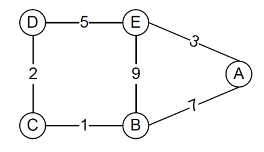
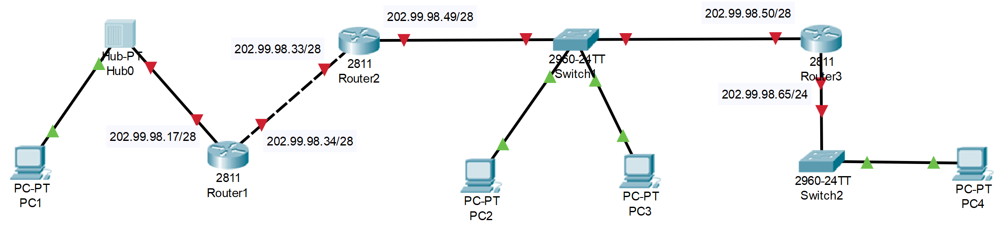

## 作业五：

---

1711361 刘炼 物联网工程

#### 问题1：

如右图所示，假设结点最初只知道到邻居的代价（相邻结点之间的代价值已在图中标出），请回答如下问题：

(1)   使用距离向量算法，给出稳态情况下C结点保持的距离向量表（无毒性逆转）。

(2)   在（1）的基础上，通过改变C、D之间的链路代价，使B、C之间构成一个暂时的直接环路，请给出C、D之间链路代价的最小改变？ 

(3)   使用毒性逆转方法，可以在一定程度上解决（2）中的问题。请根据题中给出的原始网络结构图及代价值，使用毒性逆转方法，重新给出稳态情况下C结点保持的距离向量表，并解释如何解决（2）中的问题。

(4)   毒性逆转方法在解决计数到无穷问题时存在什么局限性？RIP协议中增加了什么限制，来克服毒性逆转方法在解决计数到无穷问题时的局限性？OSPF协议和BGP协议是否存在环路问题，给出简单说明。

#### 解答

（1）因为距离向量算法只知道相邻结点的信息，所以只需要计算B、C、D的表格信息，此时不考虑毒性逆转，所以距离向量表为：

| Cost |      | TO   |      |      |      |      |
| ---- | ---- | ---- | ---- | ---- | ---- | ---- |
|      |      | A    | B    | C    | D    | E    |
| FROM | B    | 7    | 0    | 1    | 3    | 8    |
|      | C    | 8    | 1    | 0    | 2    | 7    |
|      | D    | 8    | 3    | 2    | 0    | 5    |

（2）

根据相应的分析，当C、D之间链路代价发生改变时，假设其代价为$x$，那么此时的情况为：

对于B而言，其对应的相应路径信息应该如下所示

| 目的结点 | 下一结点 | 距离 |
| -------- | -------- | ---- |
| A        | A        | 1    |
| B        | 直接     | 0    |
| C        | C        | 1    |
| D        | C        | 3    |
| E        | C        | 8    |

此时，B向C发送相应的向量信息，而此时作为对比的C、D之间的距离代价为：$x$

故应该有这样的结果，即： $x \gt 3+1 = 4$， 故而$x$至少为5，那么最小代价即为： 5-2 = 3

（3）

稳定情况下C的距离向量表应该变为：

| Cost |      | TO   |          |      |          |          |
| ---- | ---- | ---- | -------- | ---- | -------- | -------- |
|      |      | A    | B        | C    | D        | E        |
| FROM | B    | 7    | 0        | 1    | $\infty$ | $\infty$ |
|      | C    | 8    | 1        | 0    | 2        | 7        |
|      | D    | 8    | $\infty$ | 2    | 0        | 5        |

其解决方法为：路由器从某个接口上接收到某个网段的路由信息之后，并不是不往回发送信息了，而是发送，只不过是将这个网段的跳数设为无限大，再发送出去。

具体操作为：当B向C发送相应的相应的连接信息的时候，应该发送为；

| 目的结点 | 下一结点 | 距离     |
| -------- | -------- | -------- |
| A        | A        | 1        |
| B        | 直接     | 0        |
| C        | C        | $\infty$ |
| D        | C        | $\infty$ |
| E        | C        | $\infty$ |

（4）

局限性：由于距离向量表值存储了相邻结点，因此如果涉及到多个结点构成环路的问题，毒性逆转方法难以察觉到，并因此而难以解决路由环路的问题。

RIP协议中采用了限制路径最大“距离”对策，设置了最大“距离”为16，即经过的路由器个数==不超过15个==，从一定程度上解决了计数到无穷问题时的局限性。

对于OSPF协议：由于该协议采用的是状态链路算法，实际上从本质上而言是使用dijkstra算法，能够根据链路状态知道全局的信息，而以自己为根节点建立SPF树，并根据产生的树，利用dijkstra算法，产生的一定是无环路径。

对于BGP协议而言，其也是不会产生环路的。因为BGP协议也是根据全局的情况来进行相应的处理，并且利用AS-PATH来进行相应的检测，会丢弃包含本地AS的数据报，从而避免了环路的产生。

#### 问题2：

一个单位的IP互联网由路由器、交换机、集线器和主机组成，结构如下图所示。该互联网采用RIP路由协议，为路由器分配的IP地址已标记在相应接口旁。请回答以下问题（涉及到的IP地址和掩码，请使用点分十进制表示法表示）。

(1)  请为主机PC1、PC2、PC3和PC4分配IP地址和掩码，并给出依据。

(2)  该IP互联网采用RIP路由协议，请写出路由器Router1和Router2初始路由表。

(3)  如果在该网络初始化后，首先由Router2向路由器Router1发起路由更新消息，请写出Router2更新消息的主要内容。同时，写出Router1更新后的路由表。

(4)  经过一定时间后，路由器的路由表逐渐达到稳态。请写出Router1和Router2的稳态路由表。

#### 解答

（1）

+ PC1： 202.99.98.18/28 由于其和相应的路由器处于同一网络(202.99.98.16/28)中，掩码应该为28位(255.255.255.240)，需要保证IP地址前28位相同，故设置如下

+ PC2 :  202.99.98.51/28 由于其和相应的路由器处于同一网络(202.99.98.32/28)中，掩码应该为28位(255.255.255.240)，需要保证IP地址前28位相同，故设置如下
+ PC3 :  202.99.98.52/28 由于其和相应的路由器处于同一网络(202.99.98.48/28)中，掩码应该为28位(255.255.255.240)，需要保证IP地址前28位相同，故设置如下
+ PC4:   202.99.98.66/24 由于其和相应的路由器处于同一网络(202.99.98.64/24)中，掩码应该为24位(255.255.255.0)，需要保证IP地址前24位相同，且不能和前面的网络重合，故需要如上设置。

（2）

对于router1 而言，其初始路由表为：

| 目的网络     | 子网掩码        | 下一跳路由选择 | HOPS |
| ------------ | --------------- | -------------- | ---- |
| 202.99.98.16 | 255.255.255.240 | 直接投递       | 1    |
| 202.99.98.32 | 255.255.255.240 | 直接投递       | 1    |
|              |                 |                |      |

对于router2而言，其初始路由表为：

| 目的网络     | 子网掩码        | 下一跳路由选项 | hops |
| ------------ | --------------- | -------------- | ---- |
| 202.99.98.48 | 255.255.255.240 | 直接投递       | 1    |
| 202.99.98.64 | 255.255.255.240 | 直接投递       | 1    |

（3）

由于Router3还未发起更新信息到Router2，Router2想Router1发送的主要更新信息就是问题（2）中所写的路由表项，那么显然的，需要更新的就是网络202.99.98.48/28的信息。

Router2更新消息的主要内容

| 目的网络     | 子网掩码        | hops |
| ------------ | --------------- | ---- |
| 202.99.98.48 | 255.255.255.240 | 1    |
| 202.99.98.64 | 255.255.255.240 | 1    |

所以Router1更新后的路由表如下

| 目的网络     | 子网掩码        | 下一跳路由选项 |      |
| ------------ | --------------- | -------------- | ---- |
| 202.99.98.16 | 255.255.255.240 | 直接投递       | 1    |
| 202.99.98.32 | 255.255.255.240 | 直接投递       | 1    |
| 202.99.98.48 | 255.255.255.240 | 202.99.98.33   | 2    |

（4）Router1的稳态路由表为：

|   目的网络   |    子网掩码     | 下一跳路由选项 |      |
| :----------: | :-------------: | :------------: | ---- |
| 202.99.98.16 | 255.255.255.240 |    直接投递    | 1    |
| 202.99.98.32 | 255.255.255.240 |    直接投递    | 1    |
| 202.99.98.48 | 255.255.255.240 |  202.99.98.33  | 2    |
| 202.99.98.0  |  255.255.255.0  |  202.99.98.33  | 3    |
|              |                 |                |      |

Router2的稳定路由表为：  

|   目的网络   |    子网掩码     | 下一跳路由选项 | hops |
| :----------: | :-------------: | :------------: | ---- |
| 202.99.98.16 | 255.255.255.240 |  202.99.98.34  | 2    |
| 202.99.98.32 | 255.255.255.240 |    直接投递    | 1    |
| 202.99.98.48 | 255.255.255.240 |    直接投递    | 1    |
| 202.99.98.0  |  255.255.255.0  |  202.99.98.50  | 2    |

#### 问题3：

Traceroute（或Tracert）命令可以用于获取源主机到目的主机的路径信息，但该命令有时可能会返回在Internet拓扑中不存在的路径，例如第i跳可能与第i+1跳之间可能没有连接，试解释发生这种情况的原因。

#### 解答

由于利用traceroute 命令获取源主机到目的主机的路径信息时，实际上利用的是ICMP报文协议，发送过程中，实际上是由发送到的每个路由器决定发送到下一个是具体的哪个路由器的，因此，如果在过程中，路由状态发生变化，中间某个或某些路由表项发生变化，那么在其中某一个路由器进行处理的时候，就会发送到其它可达到最终目的网络的另一条路由路径，因而可能会到达其它的路由器。其实质是，每一次ICMP报文的转发路径不是确定的，故第i 跳和第i+1跳之间可能没有连接。

#### 问题4：

假设有一个自治域，该自治域中包含8个IP网络，IP地址前缀分别为203.132.30.0/24, 203.132.31.0/24, 203.132.32.0/24, 203.132.33.0/24, 203.132.34.0/24, 203.132.35.0/24, 203.132.36.0/24, 203.132.37.0/24。如果采用CIDR机制，该自治域的BGP网关应该向其他自治域通告怎样的可达网络信息？

#### 解答

根据CIDR机制，进行路由聚合，根据分析，可以将其分为三组进行聚合，聚合结果为：

| 原网络          | 聚合网络        |
| --------------- | --------------- |
| 203.132.30.0/24 | 203.132.30.0/23 |
| 203.132.31.0/24 | 203.132.30.0/23 |
| 203.132.32.0/24 | 203.132.32.0/22 |
| 203.132.33.0/24 | 203.132.32.0/22 |
| 203.132.34.0/24 | 203.132.32.0/22 |
| 203.132.35.0/24 | 203.132.32.0/22 |
| 203.132.36.0/24 | 203.132.36.0/23 |
| 203.132.37.0/24 | 203.132.36.0/23 |

故，实际上可以将包含的8个IP网络聚合为3个相应网络，那么告知的信息应该为：

| 网络            | NEXT HOP                       | AS PATH            |
| --------------- | ------------------------------ | ------------------ |
| 203.132.30.0/23 | 该自治域中某一边界路由器接口IP | 转发经过的AS序列号 |
| 203.132.32.0/22 | 该自治域中某一边界路由器接口IP | 转发经过的AS序列号 |
| 203.132.36.0/23 | 该自治域中某一边界路由器接口IP | 转发经过的AS序列号 |

