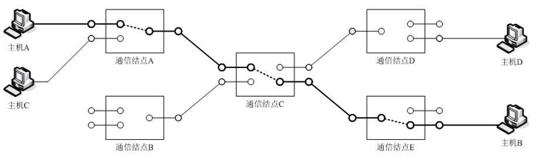

[TOC]

# 网络技术与应用

---

## 第一章：计算机网络的基本概念

### 计算机网络的概念

#### 计算机网络的组成部件

计算机网络是利用通信线路将具有独立功能的计算机连接起来而形成的计算机集合，计算机之间借助于通信线路传递信息，共享软件、硬件和数据等资源，其是     建立在通信网络基础之上，以资源共享和在线通信为目的 。

其大体示意可以如下图所示：

其组成部件包括：主机、通信设备和传输介质

+ 主机：信息资源和网络服务的载体，是对终端处理设备的统称  。其中，一般的模式有两种，分别是（Client - Server ）客户-服务器模式和（Peer - Peer )对等计算模式
+ 通信设备：接收源主机或其他通信设备传入的数据，在对数据进行处理后转发给下一通信设备或目的主机 。一般的处理包括差错校验和路由选择等。其是位于计算机网络路径的交叉口，指挥数据按照正确的路径前进  
+ 传输介质：用于互联主机和通信设备，通信设备和通信设备。其中的传输链路是指传输介质在主机和通信设备之间（或通信设备和通信设备之间）形成的数据传输信道。一般分为有线和无线两种；
  + 有线：非屏蔽双绞线、屏蔽双绞线、同轴电缆、光纤
  + 无线：短波信道、微波信道、红外信道、卫星信道

#### 物理网络与互联网络

物理网络： 在一种物理网络中，连网主机和通信设备通常遵循共同的网络协议和行动准则。它们拥有的相同的地址形式、使用相同的数据格式、运行相同的路由选择算法、采用相同的差错处理方式……  

按照覆盖的地理范围对其进行分类：

+ 广域网（WAN，Wide Area Network)

  + 覆盖的地理范围从几十公里到几千公里

  + 通常利用公用网络（如公用数据网、公用电话网、卫星通信网等）进行组建

  + 如：ATM、帧中继、DDN

+ 城域网（MAN，Metropolitan Area Network)

  + 覆盖的地理范围为几十公里

  + 如：FDDI、交换式以太网

+ 局域网（LAN，Local Area Network）

  + 覆盖有限的地理范围

  + 要求：传输速率高（10Mbps~10Gbps）、误码率低（低于10-8）

  + 通常由一个单位或组织建设和拥有，易于维护和管理

  + 如：以太网、令牌环网、令牌总线网

互联网络（Internetwork)，又称为互联网（Internet），其定义为：将物理网络相互联接而形成的计算机网络，是网络的网络。其实际目的是：屏蔽各种物理网络的差异，为用户提供统一的、通用的服务。

### 存储转发与包交换

#### 线路交换

工作过程：在交换数据信息前，通过控制信息在两台主机之间建立一条实际的物理信道。本次通信“独占”该物理信道

优势：通信实时性强

劣势：不能充分利用信道带宽，通信成本较高

#### 存储转发

工作过程： 数据传输途中的通信结点接收整个数据。将数据短暂存储后选择合适的路径转发给下一个通信结点（或目的主机）

要求： 需要在传输的数据中增加目的地址和源地址信息，以便中间结点路由选择  

#### 包交换

原理：将大块的用户数据分割成多个小块数据分别发送

目的：避免一台主机一次发送大量数据，致使另一主机长时间等待情况的发生

数据包：由分割后的小块数据与目的地址、源地址等控制信息组成

**包交换的特点**:

+ ==能充分利用信道带宽==
+ ==对缓存空间要求较低==
+ ==差错后数据重传量较小==

## 第二章：以太网原理和组网技术

### 共享式以太网的原理

共享式以太网是人们最早使用的以太网，也被称为传统以太网。一般有两种结构:**总线构型的共享式以太网**和**星形构型的共享式以太网**，具体如图:

#### 以太网中的数据帧

帧是以太网处理的数据基本单位，组成方式如图:

+ 前导码和帧前定界符：保证接收电路在目的地址字段到达前达到稳定状态

  + 前导码：56位的10101010…101010序列
  + 帧前定界符：8位的10101011序列

+ 目的地址与源地址：接收结点和发送结点的硬件地址

  + 硬件地址--MAC地址--物理地址--以太网地址
  + 由48位组成（例如：52-54-ab-31-ac-c6）
  + IEEE注册管理委员会负责分配
  + 单播地址（第1位为“0”）、多播地址（第1位为“1”）和广播地址（48位全“1”）

+ 长度/类型：数据字段的长度或上层协议类型

  + 长度：小于0800H
  + 类型：大于或等于0800H

+ 数据：用于携带上层传下来的数据

  + 最长1500字节，最短46字节

  + 不足46字节的需要填充

+ 帧校验码：验证帧的正确性

  + 32位CRC校验（Cyclic Redundancy Check 循环冗余校验）
  + $G(X) = X^{32}+X^{26}+X^{23}+X^{22}+X^{16}+X^{12}+X^{10}+X{10}+X^8+X^7+X^5+X^4+X^3+X+1$

#### ==CSMA/CD介质访问控制方法==

其发送流程可以简要表示为：先听后发，边听边发，冲突停止，延迟重发

冲突后的随机延迟

​     截断式二进制指数退避算法  ： $\tau = r \times \alpha$

+ $r$在${0,1,2,...,2^k-1}$中随机选择
+ $k = min{n,10}$
+ $\alpha$:冲突窗口

重发次数越大，后退延迟可选择的范围越大，选择到较长延迟的可能性越大

接收流程：

需要进行地址匹配，其中地址匹配的方式是采用hash来进行的，如果匹配失败则需要丢弃。

冲突窗口与帧最小长度

==问题==:如果帧太短，有可能造成有些结点检测不到冲突，这是由于发送信号传遍整个共享信道需要一定的时间。故而需要确定一个冲突窗口，表示从发送一帧开始到检测到冲突发生所需的最长时间。

计算方式如下：

$$\tau = \frac{L_{max}}{V} \quad \frac{l_{min}}{v}\ge 2\tau = 2 \times \frac{L_{max}}{V} \quad \rightarrow L_{max} \le \frac{l_{min} \times V}{2v}$$

其中，$v$代表传输速率，$L_{max}$代表覆盖范围，$l_{min}$代表最小帧长度,$V$代表电磁波在共享介质中的传播速度。故而，粗略计算出以太网的最小帧长度为：512bits，即64个字节，排除掉其它的部分，故而数据至少需要46字节。

### 以太网的传输介质

主要包括，同轴电缆，非屏蔽双绞线，屏蔽双绞线，光缆。

#### 同轴电缆

+ 优点：较优的频率和抗干扰特性，传输距离远。技术成熟

+ 缺点：电缆硬、折曲困难、重量重
+ 同轴电缆不适合用于楼宇内的结构化布线

#### 非屏蔽双绞线

+ 优点：尺寸小（直径0.43cm）、重量轻、容易弯曲、连接牢固、价格便宜、容易安装和维护  

+ 缺点：抗干扰性较差，带宽较窄，传输距离短
+ 非屏蔽双绞线适合用于楼宇内的结构化布线

#### 屏蔽双绞线

+ 优点：抗干扰的能力强，尺寸和重量与UTP相当  
+ 缺点：安装不合适会引入外接干扰

#### 光缆

+ 优点：抗干扰能力强、传输速率高、传输损耗低、传输距离远

+ 缺点：价格相对较高，安装比较困难
+ 分类：单模光纤、多模光纤

### 以太网的相关标准

### 组网所需的器件和设备

主要需要以太网集线器、网络接口卡和电缆（如非屏蔽双绞线）

#### 以太网集线器

功能：

+ 以太网的集中连接点
+ 放大接收到的信号
+ 通过网络传播信号

不具备的功能：

+ 过滤
+ 路经检测或交换
+ 不同速率的集线器级联

#### 网络接口卡

实现计算机与局域网传输介质之间的物理连接和电信号匹配，接收和执行计算机送来的各种控制命令，完成物理层功能

按照使用的介质访问控制方法，实现共享网络的介质访问控制、信息帧的发送与接收、差错校验等数据链路层的基本功能

提供数据缓存能力，实现无盘工作站的复位和引导

 可以看到，网卡主要实现了物理层和链路层的一些相关功能

#### 非屏蔽双绞线

包括直通UTP电缆和交叉UTP电缆。主机的1、2引脚连接发送线，3、6引连接接收线，而集线器普通端口的1/2引脚连接接收线，3、6引脚连接发送线，故而主机与集线器采用直通UTP电缆，而集线器之间采用交叉UTP电缆，具体如图

## 第三章：交换与虚拟局域网

### 交换式以太网的提出

传统的共享式以太网的问题：

+ 覆盖的地理范围有限
+ 网络总带宽容量固定
+ 不能支持多种速率

### 以太网交换机的工作原理

通过交换机端口的多个并发连接，实现多借点之间数据的并发传输。

#### 数据转发方式

1. 存储转发交换（主流交换方式）
2. 直接交换
3. 碎片隔离

#### 地址学习

利用“地址学习”法动态简历和维护端口/MAC地址映射表（如果不在则广播，设置相应时间段的刷新）

#### 信息过滤

交换机需要对传过来的信息进行相应的处理，查看是否需要对其进行过滤，同时还检查每个帧，并给予帧中的目的地址做出是否转发或转发到何处的决定。

### 虚拟局域网

所谓的虚拟局域网，就是将局域网上的用户或结点划分成若干个“逻辑工作组”，逻辑组的用户或结点可以根据功能、部门、应用等因素划分，无需考虑它们所在的物理位置。

VLAN划分方法分为静态VLAN划分和动态VLAN划分两种，其中动态VLAN划分方法又包括基于MAC地址、基于互联层协议、基于IP组播、基于策略等多种方式。

#### 基于端口的静态VLAN划分方法

网络管理员静态地将交换机上的端口划分给某个VLAN，从而把终端系统划分成为不同的部分，实现不同逻辑组之间的相互隔离。

#### 基于MAC地址的VLAN划分方法

以MAC地址为基础划分VLAN ，网络管理员可以通过指定具有哪些MAC地址的计算机属于哪个VLAN进行配置。这样，如果计算机从一个位置移动到另一个位置，连接的端口从一个换到另一个，只要计算机的MAC地址不变，它仍将属于原VLAN的成员，不需网络管理员对交换机软件进行重新配置。

#### 基于互联层的VLAN划分方法

根据互联层使用的协议（如IP,IPX），互联层的地址定义VLAN中的成员，基于互联层的VLAN划分方法特别适合于针对具体应用和服务组织用户，用户可以在网络内部自有移动，而不用重新配置交换机。

#### IEEE 802.1q协议与VLAN数据流的处理过程

IEEE 802.1q通过添加标记的方式扩展标准数据帧的结构，从而达到数据帧携带VLAN信息的目的。添加一个802.1q标记（4B），包括标记协议标识符（TPID）占用2B，只是所采用的协议的协议类型；和标记控制信息（TCI）包含VLAN的具体信息。

### VLAN的优点

1. 减少网络管理开销
2. 控制广播地址
3. 提供较好的网络安全性
4. 利用现有的集线器以节省开支

## 第四章：无线局域网组网技术

### 无线局域网的传输介质

#### 无线传输与有线传输的区别

+ 无线传输信号衰减变化多样
+ 无线传输易受干扰
+ 无线传输具有多径传播特性

#### 无线传输技术

扩频技术：希望主机的发送功率小，抗干扰能力强。

香农定理

$$C = B \times log_2{(1+\frac{S}{N})}$$

其中，C为信道的容量（最大传输速率，单位为b/s）；B是信道的宽度（单位 Hz）；S为平均信号功率（单位为W）；N为平均噪声功率。故而可以通过扩展信道的带宽，达到降低主机发送功率和提高系统抗干扰性的目的

无线局域网采用的扩频技术主要有两种：一种是跳频扩频（FHSS），另一种是直接序列扩频（DSSS）。

FHSS将可以利用的频带划分成多个子频带，每个子频带带宽相同，互不重叠。

DSSS方法，发送方首先将需要发送的每个信号与一个伪随机码进行异或，然后再将异或操作径调制后发送出去。

正交频分复用技术（OFDM）：充分利用了正交函数的特性，是一种多载波调频技术。将整个信道分成若干正交的子信道，将高速数据信号转换成并行的低速子数据流。 --> 节省带宽，提高频谱利用率。

多入多出技术：将多径传播特性作为一个有利因素充分利用，进而提高系统的传输速度、效率和可靠性。

### 802.11体系结构

IEEE 802.11无线局域网可以形成基本服务集和扩展服务集，其基本组成部分有：

+ 无线主机
+ 无线访问接入点（AP）
+ 分布式系统（DS）

IBSS（独立基本服务集）和BSS（基本服务集）使用一个基本服务集标识符BBSID标识。扩展服务集（ESS）使用SSID标识。

与AP关联的方式：

+ 如果AP希望向结点关联，那么AP向结点发送信号帧，然后结点向希望关联的AP发送关联请求帧，AP会送关联。
+ 如果结点A要连接某个AP，那么首先A发送AP探测广播帧，然后AP进行相应，结点再进行选择，发送相应请求，AP回送响应帧。

### 介质控制访问方法和帧结构

## 第五章：互联网与IP

## 第六章：IP数据包

## 第七章：IP地址与ARP

## 第八章：路由器与路由选择

## 第九章：IPv6

## 第十章：TCP 与 UDP

## 第十一章：应用程序交互模型

## 第十二章：域名系统

## 第十三章：Web服务

## 第十四章：电子邮件系统

## 第十五章：网络安全

## 第十六章：网络接入技术

