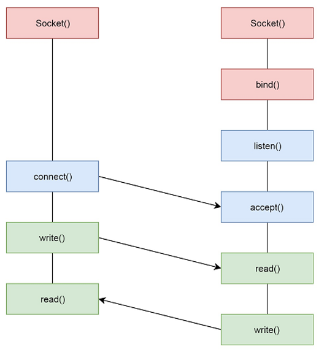
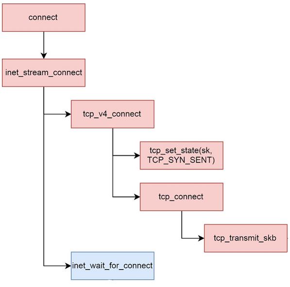

[TOC]

# 操作系统

## 概论

## 引导

## 进程

## 内存管理

## 输入输出设备

## 文件系统

## 进程间通信

### 进程通信的需求

#### 数据传输 

一个进程需要将它的数据发送给另一个进程（Web服务，进程查询数据库）

#### 事件通知

一个进程需要向另一个或一组进程发送消息，通知它们发生了某种事件（进程终止时需要通知父进程）

#### 资源共享

多个进程之间共享同类资源（互斥和共享）

#### 进程控制

有些进程希望完全控制另一个进程的执行，即能够拦截另一个进程的陷入和异常，并能够及时知道另一个进程的状态改变

### 进程如何通信

#### 管道模型

管道的方式是将上一个进程的输出信息作为下一个进程的输入信息，在shell 中常用。管道分为命名管道和匿名管道，其在linux终端中都有相应的例子。

+ 命名管道 mkfifo pipe_name 以内存文件形式出现，例如 echo "hello world" > pipe_name 表示将'hello world'这一字符串写入到pipe_name 这一管道中（这里管道是有名称的）
+ 匿名管道 cmd1 argv1 | cmd2 argv2 | cmd3 argv3 表明从1->2->3信息输入和输出。

采用管道模型实现IPC（进程通信）：通信频率高，通信量大（缓冲区有限）

##### 匿名管道：

建立匿名管道的函数原型

```c
int pipe(int fd[2]);//fd[0]表示读取端进程，fd[1]表示写入端进程

//pipe对应的系统调用
SYSCALL_DEFINE2(pipe2,int __user * ,fildes,int flags)
{
    struct file *file[2];int fd[2];int error;
    error = __do_pipe_flags(fd,files,flags);
    if(!error){
        if(unlikely(copy_to_user(fildes,fd,sizeof(fd))))
        {
            error = -EFAULT;
        }
        else{
            fd_install(fd[0],files[0]);
            //将文件描述符与file结构关联
            fd_install(fd[1],files[1]);
        }
    }
    return error;
}

static int __do_pipe_flags(int *fd,struct file **files,int flags)
{
    int error;
    int fdw,fdr;
    error = create_pipe_files(files,flags);
    //创建了管道以及2个file结构（file 和pipe缓冲区建立联系）
    error = get_unused_fd_flags(flags);
    fdr = error;
    error = get_unused_fd_flags(flags);
    //获得了两个未使用的文件描述符
    fdw = error;
    fd[0] = fdr;//read file source
    fd[1] = fdw;//write file destination
    return 0;
}

const struct file_operations pipefifo_fops = {
    .open = fifo_open,
    .llseek = no_llseek,
    .read_iter = pipe_read,
    .write_iter = pipe_write,
    .poll = pipe_poll,
    .unlocked_ioctl = pipe_ioctl,
    .release = pipe_release,
    .fasync = pipe_fasync
};

static struct file_system_type pipe_fs_type{
    .name = "pipefs",.mount = pipefs_mount,.kill_sb = kill_anon_super
};

static int __init init_pipe_fs(void)
{
    int err = register_filesystem(&pipe_fs_type);
    if(!err){
        pipe_mnt = kern_mount(&pipe_fs_type);
    }
}

static struct inode * get_pipe_inode(void)
{
    struct inode *inode = new_inode_pseudo(pipe_mnt->mnt_sb);
    struct pipe_inode_info *pipe;
    inode->i_ino = get_next_ino();
    pipe = alloc_pipe_info();
    
    pipe->readers = pipe->writes = 1;
    inode->i_fop = &pipefifo_fops;
    return inode;
}
```

问题；在进行fork时，创建的子线程会完全复制父进程的数据结构，即fd[2]也会被复制，这样父子进程就可以通过fd操作匿名管道进行相互通信。为了避免混乱，可以让一个进程关闭读fd,另一个关闭写fd

具体流程：

1. shell 首先创建子进程A，建立管道，其中shell保留读，进程A保留写
2. shell 然后创建子进程B，这时shell保存读的fd也被复制到子进程B中，即shell和B都可以读管道
3. shell 主动关闭读取端fd，这时就形成了A写B读的形式
4. 最后将管道的两端和输入输出关联起来 dup2(fd[0],STDIN_FILONO) dup2(fd[1],STDOUT_FILONO)


##### 命名管道

命名管道在shell中采用mkfifo 命令进行创建，若使用代码则会通过Glibc提供的库函数，其本质最终还是会创建inode -> path(dentry) -> file -> fd

#### 消息队列模型

该模型类比于邮件，需要对消息格式进行定义，进程间发送消息采用固定内存大小的数据单元（消息体）

消息队列的程式化操作：

+ 使用msgget()创建消息队列，该函数需要一个重要参数**key**，用来标识消息队列的唯一性，实现方式是ftok(inode)->key，即指定一个文件，用其inode来生成key，或者采用IPC_PRIVATE这一私有key
+ 使用msgsnd()发送消息，该函数第一个参数为**key**，第二个是消息体，第三个是消息的长度（消息体只规定了最大长度），最后是一些标志位
+ 使用msgrcv()接收信息，该函数第一个参数为**key**，第二个是消息体，第三个是可接受的最大长度，第四个是消息类型，最后是一些标志位

#### 信号

OS内核与进程之间的通信模式

+ 信号触发的动机：
  + 内核发现一个系统事件，例如除0错误或者子进程退出
  + 一个进程调用kill命令，请求OS发送信号给目标进程，例如调试、挂起、恢复或超时等等。
+ 信号接收的机制（进程收到内核发送的信号）
  + 忽略信号
  + 终止本进程
  + 用一个定义的用户态信号处理函数去捕捉信号

#### 共享内存模型（同步和互斥）

+ 管道模型、消息队列模型以及信号都是端到端且数据传输量较小的IPC，有些庆幸需要多进程写作，且数据交换量较大 -> **共享内存模型**
+ 每个进程有独立的虚拟访问空间，映射到不同的物理内存中，即不同进程访问同一虚拟内存，本质访问的物理内存不同
+ **如果每个进程拿出一块虚拟地址，映射到相同的物理地址，这样一个进程写入的东西，另一个进程就可以读出，不需要发送多个消息**


进程可以调用shmget()创建共享内存，在System V模式下，创建IPC对象都是xxget()

该函数的第一个参数是**key**，用于唯一确定共享内存对象，第二个参数是共享内存的大小

若一个进程想访问该共享内存，需要调用shmat()将其加载到自己的虚拟地址中，该函数第一个参数为共享内存对象的**key**，第二个参数是加载到的地址（通常为NULL,让内核去加载）

采用共享内存的进程就类比于进程内的多线程，需要同步和互斥机制（**信号量**）

##### 共享内存模式（信号量）！！！

P操作 -> 申请资源操作

V操作 -> 归还资源操作

进程可以通过semget()来创建一组信号量，该函数第一个参数是信号量组的key（唯一标识），第二个参数是该信号量组的信号量数目（每种共享资源均应有多少个信号量）。 初始化：利用semctl()来初始化信号量的资源数目

```c
int semctl(int semid 信号量组,int semnum 信号量在组中位置，int cmd,union semun args);

union semun{int val;struct semid_ds *buf;
           unsigned short int *array;struct seminfo *__buf};
```

信号量的PV操作在进程中统一为semop()

```c
int semop (int semid, struct sembuf semoparray[],size_t numops);

struct sembuf{
    short sem_num;//信号量组中对应的序号
    short sem_op;//信号量值在一次操作中的改变量
    short sem_flg;
}
```

`sem_op`负值代表请求sem_op绝对值的资源量，(P操作)，若sem_op的绝对值小于sem_num对应的semnum对象中的val值，val = val +sem_op；否则进程将被挂起直至足够的资源。是正值则表示归还相应的资源量（V操作），val = val +sem_op，并唤醒所有等待此信号量的进程。

==作业==：用上述API实现生产者--消费者问题

```c
struct shm_data {int data[256];int datalength;};
//定义了共享内存大小
union semnu{int val;struct semid_ds *buf;
           unsigned short int*array; struct seminfo*__buf;};
//信号量对应的共享资源大小

int get_shmid(){};//创建一个共享内存对象，大小为256。返回信号量组
int get_semaphoreid(){};//创建信号量组对象，并获得其id
int semaphore_init(int semid){};//初始化操作，设置信号量对应总资源
int semaphore_p(int semid){};//信号量中的P操作
int semaphore_v(int semid){};//信号量中的V操作


int shmid = get_shmid();//创建共享内存
int semid = get_semaphoreid();//创建信号量组对象
int buf = semaphore_init(semid);//获得信号量资源数

Producer(semid)//生产者进程
{
    while(1)
    {
        produce an item in nextp;//生产相应的资源
        semaphore_v(semid);//将生产的资源放入共享内存中
    }
}

Consumer(semid)
{
    while(1)
    {
        semaphore_p(semid);//进行P操作，消耗共享内存中的资源
        consume an item from sharememory ;//消费取出的相应资源
    }
}
```


#### ~~socket套接字~~（请查看计网）

#### 总结：

+ (单机) 进程间通信通常分为：
  + 管道模型（匿名，命名）
  + 消息队列模型
  + 信号
  + 共享内存
+ （多机）进程间通信
  + socket机制
  + RPC机制

## 计算机网络系统

回顾：同一设备中的进程间通信：

+ 信号： $进程 \rightarrow OS内核 \rightarrow 进程$
+ 管道： $进程 \to 内存文件系统（pipe对象） \to 进程$
+ 共享内存： $进程 \to 映射到相同的物理内存 \to 进程$
+ 消息队列：$进程\to 内存文件系统（消息队列对象） \to 进程$

但是对于不同设备的进程间通信，显然，只有消息队列是可能的。

### Socket 编程



整体的socket 编程的结构如图所示，其中connect() 和 accept()是传输过程中的相应连接，而实际上在下层中，有相应的read() 和 write()在两端进行读写

```c
int socket(int domain, int type, int protocol);
//用于创建一个socket 文件描述符，即用户态和内核态接口
//socket 是在网络的应用层和传输层之间的一个接口，在操作系统上，即
//应用层运行在用户态，而传输层运行在内核态（操作系统中）

//参数domain 表示使用什么IP层协议，例如 AF_INET -> IPv4
//AF_INET6表示IPv6

//参数type 表示socket 类型， SOCK_STREAM 表示TCP，
//SOCK_DGRAM 表示UDP

//参数prototype 表示协议
//IPPROTO_TCP  IPPROTO_UDP
int serv_sock = socket(AF_INET,SOCK_STREAM,IPPROTO_TCP)
    
```

```c
SYSCALL_DEFINE3(socket, int family,int type,int protocol)
{
    int retval;
     struct socket *sock;  int flags; ......  
     if (SOCK_NONBLOCK != O_NONBLOCK && 
        (flags & SOCK_NONBLOCK))    
         flags = (flags & ~SOCK_NONBLOCK) | O_NONBLOCK; 
     retval = sock_create(family, type, protocol, &sock); ......  
     retval = sock_map_fd(sock, flags & (O_CLOEXEC | O_NONBLOCK));......  
      return retval;
}
```

socket_create 获得一个socket *sock 对象，sock_map_fd 创建了sock关联的文件描述符retval，用户态操作retval，其本质是操作内核态的sock

socket 函数会关联serv_sock 文件描述符和inet_stream_ops 结构，后续调用bind , listen 其本质是调用inet_bind,inet_listen，指明IP协议创建socket的函数为inet_create()

```c
int bind(int sockfd, const struct sockaddr *addr,socklen_t addrlen)
{
   struct sockaddr_in serv_addr;
	memset(&serv_addr, 0, sizeof(serv_addr));  //每个字节都用0填充
	serv_addr.sin_family = AF_INET;                //使用IPv4地址
	serv_addr.sin_addr.s_addr = inet_addr("127.0.0.1"); //具体IP地址
	serv_addr.sin_port = htons(1234);                //端口号 
	bind(serv_sock, (struct sockaddr*)&serv_addr, 			sizeof(serv_addr));
}
struct in_addr{__be32 s_addr;}
```

TCP/IP协议规定网络字节顺序采用==大端模式==进行编址，计算机设备的采用哪种模式由CPU处理器决定(Intel 采用小端模式)

#### bind函数(服务器端)

```c
SYSCALL_DEFINE3(bind, int, fd, struct sockaddr __user *, umyaddr, int, addrlen){  
   struct socket *sock;  struct sockaddr_storage address;  
   int err, fput_needed;  
   sock = sockfd_lookup_light(fd, &err, &fput_needed);  
   if (sock) {
        err = move_addr_to_kernel(umyaddr, addrlen, &address);    
        if (err >= 0)   
             err = sock->ops->bind(sock, (struct sockaddr *)&address, addrlen);    
       fput_light(sock->file, fput_needed);  //说明socket和文件系统有关联
   }  
   return err;}

int inet_bind(struct socket *sock, struct sockaddr *uaddr, int addr_len){  
  struct sockaddr_in *addr = (struct sockaddr_in *)uaddr;  
  struct sock *sk = sock->sk;  //下面是内核网络协议栈的操作 (tcp_prot)
  struct inet_sock *inet = inet_sk(sk);  //强制类型转换, 后面会分析
  struct net *net = sock_net(sk);  
  unsigned short snum;...... snum = ntohs(addr->sin_port);......//网络  主机
  inet->inet_rcv_saddr = inet->inet_saddr = addr->sin_addr.s_addr; 
  if ((snum || !inet->bind_address_no_port) &&   //检测端口是否冲突 (占用) 
                                     sk->sk_prot->get_port(sk, snum)) {...... }  
  inet->inet_sport = htons(inet->inet_num); //主机  网络
  inet->inet_daddr = 0;  inet->inet_dport = 0;  
  sk_dst_reset(sk);}


```

•**sockfd_lookup_light**函数完成了从文件描述符到**socket**   *sock

•**move_addr_to_kernel**函数完成了将**sockaddr**从用户态拷贝到内核态

•**通过**sock**调用**bind**,**其本质是调用了**inet_stream_ops**结构中声明的**inet_bind**函数

#### listen函数(服务器端)

```c
int listen(int sockfd, int backlog)
//等待客户端的连接 (e.g., listen(serv_sock, 20);)
//参数backlog表示最多同时连接的数目
SYSCALL_DEFINE2(listen, int, fd, int, backlog){  
  struct socket *sock;  int err, fput_needed;  int somaxconn;  
  sock = sockfd_lookup_light(fd, &err, &fput_needed);  
  if (sock) {    
       somaxconn = sock_net(sock->sk)->core.sysctl_somaxconn;  //系统上限   
       if ((unsigned int)backlog > somaxconn)  backlog = somaxconn;   
       err = sock->ops->listen(sock, backlog);  //调用inet_listen()
       fput_light(sock->file, fput_needed);  
  }  
  return err;}

int inet_listen(struct socket *sock, int backlog){  
  struct sock *sk = sock->sk; //进入内核网络栈  
  unsigned char old_state;  int err;  
  old_state = sk->sk_state;   
  if (old_state != TCP_LISTEN) err = inet_csk_listen_start(sk, backlog);
  sk->sk_max_ack_backlog = backlog;
}

```

如果当前socket不处于TCP监听状态，则调用函数进入监听状态，否则，直接更新允许的客户端最大连接数

```c
int inet_csk_listen_start(struct sock *sk, int backlog){  
   struct inet_connection_sock *icsk = inet_csk(sk); 
   struct inet_sock *inet = inet_sk(sk);  int err = -EADDRINUSE;  
   reqsk_queue_alloc(&icsk->icsk_accept_queue);  
   sk->sk_max_ack_backlog = backlog;  
   sk->sk_ack_backlog = 0;  
   inet_csk_delack_init(sk);  
   sk_state_store(sk, TCP_LISTEN);  
   ......  //对icsk和inet的操作
}
/*
inet_connection_sock涉及非常多的内容 (流量控制和拥塞控制), 需要时会进一步分析, icsk->icsk_accept_queue队列将保存已经建立完3次握手的连接 (established), listen函数会为其分配内存空间, 最后listen函数会设置socket的状态为TCP_LISTEN
*/
```

**inet_csk**函数的作用是将**sock**指针强制转换成**inet_connection_sock**指针

**其本质是**:**tcp_sock**结构第一个成员为**inet_connection_sock**对象,

​         **inet_connection_sock**结构第一个成员为**对象**

​         **inet_sock**结构第一个成员为**sock**对象,而初始化套接字时

​         **sock** *****sk其实指向的是**tcp_sock**对象 **(TCP**套接字)

```c
struct sockaddr_in serv_addr;
memset(&serv_addr, 0, sizeof(serv_addr));  //每个字节都用0填充
serv_addr.sin_family = AF_INET;                 //使用IPv4地址
serv_addr.sin_addr.s_addr = inet_addr(“127.0.0.1”); //服务器端IP
serv_addr.sin_port = htons(1234);                 //服务器端端口号
connect(sock, (struct sockaddr*)&serv_addr, sizeof(serv_addr));

int connect(int sockfd, const struct sockaddr *addr, socklen_t addrlen)
//向服务器端发起连接 (TCP三次握手!!)
//参数sockfd是客户端建立的socket对象
//参数addr包含了服务器端的IP地址和端口号
//参数addrlen表示sockaddr结构的大小

```

##### 第一次握手

```c
switch (sock->state) { 
 ......  
 case SS_UNCONNECTED:    //只有处于未连接状态才会建立连接  
     err = sk->sk_prot->connect(sk, uaddr, addr_len);    
     sock->state = SS_CONNECTING;//上面connect完成不代表连接完成
     break;  
}
//connect 调用 inet_stream_connect 函数，并根据此实现操作
```



