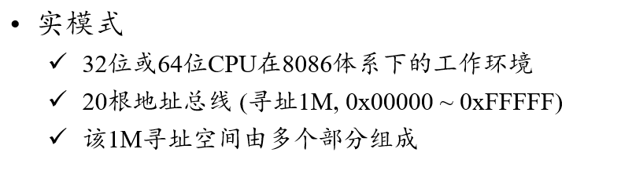
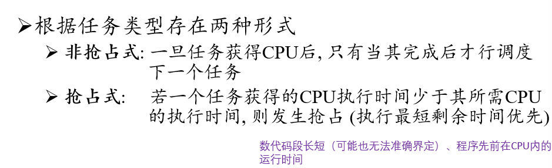
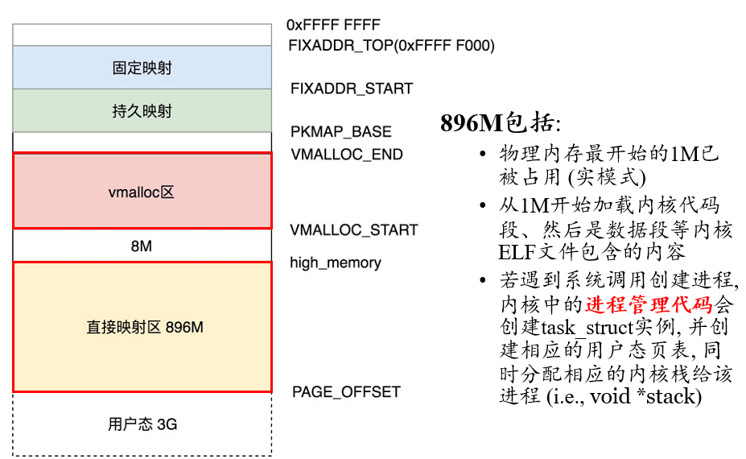
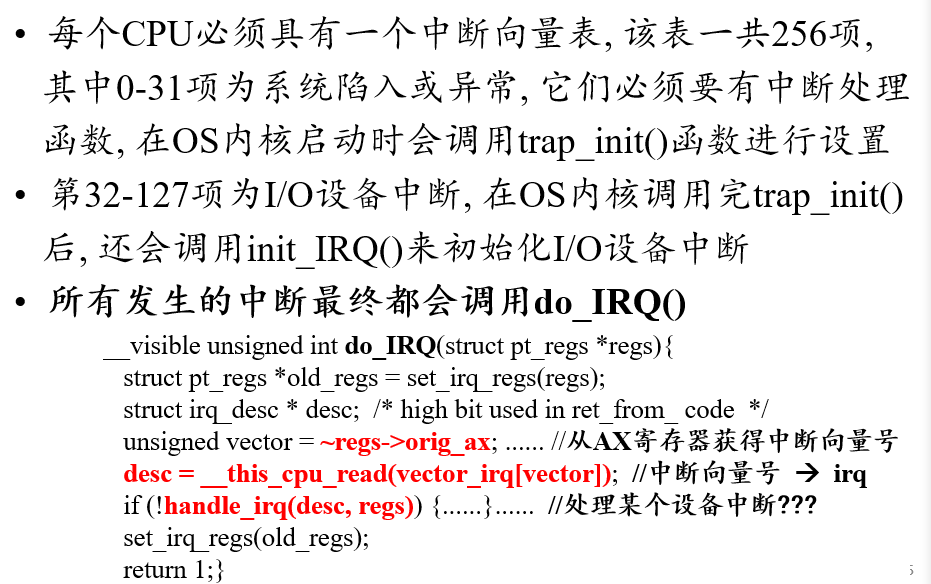
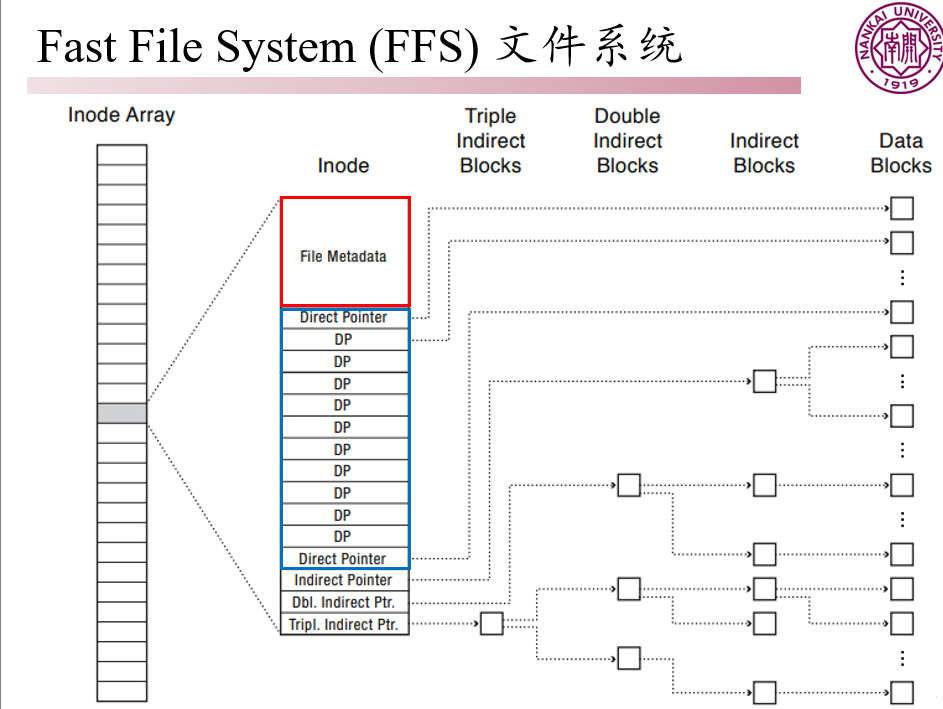

[TOC]

# 操作系统

## 概论

冯·诺依曼体系结构示意图


分为南北桥，北桥被用来处理高速信号，处理CPU，内存和南桥芯片的通信。而南桥被用来处理低速信号，负责I/O总线之间的通信

#### 冯·诺依曼体系结构特点：可编程、计算和存储分离

1. 采用指令和数据存储在一起的结构
2. 存储器是按地址访问、线性编址的空间
3. 指令由操作码和地址码组成
4. 指令在CPU的运算单元处理
5. 控制流由指令流产生

#### x86架构基础知识


对于一个程序而言，一般分为代码段，数据段和堆栈段，其具体结构为：


#### 函数调用的操作


#### 函数返回


### 操作系统

操作系统是一个系统控制程序，一个资源管理器

#### 内容大纲：


#### 操作系统的特征：

1. 并发：同时存在多个运行的程序（进程），需要OS管理和调度
2. 共享：互斥共享，某种资源只能同时被一个进程独享；同时访问：允许在一段时间内由多个进程交替访问
3. 虚拟：利用多道程序设计技术，让每个进程和每个用户觉得有一个处理器(CPU)专门为他服务。
4. 异步：进程执行不是一贯到底，而是走走停停且执行速度不可预知。

##### 分类：


## 引导

内存为什么要分段？

+ 便于迅速寻址访问
+ 8086体系中使用CS:IP进行定位（CS<<4 + IP）
+ 80386中使用ECS:EIP进行定位

### 计算机启动过程

开机运行的第一个程序为：BIOS(base input & output system)

对其，需要解答这样几个问题：


同时，需要对操作系统的保护模式和实模式进行理解：



实模式下只有1MB的寻址空间，其寻址方式为之前8086定义的那样，可以看到实模式下的内存布局为：


可以看到，实际上BIOS代码只有64KB，而实际上其起始地址为0xFFFF0，故一开始的时候，会跳转到此位置。开始时，CPU的CS:IP寄存器被强制初始化为：0xF000:OxFFF0，BIOS会调用中断0x19 来检测计算机中断和软盘数，如果存在可用的磁盘，BIOS把它0盘0道1扇区的内容加载到0x7C00(一个扇区大小为512B,而刚好相应的位置也为512B)

#### Boot程序v2.0


#### loader程序

##### 检测硬件信息

OS内核程序需要硬件信息，但OS内核运行在保护模式下，loader需要调用BIOS中断来获取上述信息，解析物理地址信息

##### 处理器模式切换

BIOS运行的实模式 转换为 32位OS使用的保护模式 再转换为 64位操作系统使用的IA-32e模式。

##### 向内核传递数据

控制信息：控制内核程序的执行流程

硬件信息：为内核程序的初始化提供支持

##### 开启A20功能

##### 构建系统数据结构

代码段全局描述符表

数据段全局描述符表

局部描述符表

##### 中断和异常

中断描述表

##### 段页内存管理

##### 多任务机制


内核调用的系统简图如下


**重点！！！！**


## 进程

程序和进程的关系：程序实际上是一个文件，是用于创建进程的一个数据与指令的集合，其是由某种程序语言来刻画的，将程序编译形成可执行文件，然后CPU会根据此进行调度执行。当运行一个程序时，实际上是创建了一个进程，但是同一程序的多个运行对应了多个进程。

### 进程的定义

操作系统为正在运行的程序提供的抽象 ： 具体抽象为 ==地址空间 + 执行上下文 + 环境==，而对于一个好的程序抽象而言，其具体有 ： 

+ 轻量级且隐藏了具体实现
+ 易于使用的接口
+ 可以被实例化多次
+ 易于实现

从程序的进程的具体过程：


对于一个进程的内存布局：其可以参考上图，主要有这样几个段；

代码段，数据段和堆栈段，而可以知道，进程是内存分配的最小单元。

**进程的动作**：


进程实现这个动作：需要系统调用，因为这设计到了相应的硬件操作。


由于硬件资源有限，对于系统内部硬件资源的操作，只能由操作系统实现，此时使用操作系统直接对硬件进行操作，只能是小细腰的结构。

#### 系统调用

在进行系统调用的时候，实际上会从用户态陷入到内核态，其陷入过程可以理解为如下：

首先保存相应产生系统调用的参数和相关内容，然后通过call陷入内核，在内核态进行相应的处理，在内核态处理完之后，弹出相应产生系统调用的位置，然后从之前的位置开始继续执行。

#### 从一个进程到多个进程


**如何区分不同的进程？**

对于每个进程而言，其有对应的pid，根据其pid ，可以对其进行区分。

##### 进程控制块PCB(process control block)

对于任意一个进程，操作系统会维护一个进程控制块来描述进程的基本信息和运行状态，进而控制和管理进程

PCB应该包含的内容：


PCB是进程存在的唯一标志

##### 进程的生命周期


#### 父进程和子进程


##### 僵尸进程的销毁


**为什么要设计僵尸进程？它有危害吗？**

对于一个僵尸进程而言，其主要产生的原因是为了保存一些相应的内容。

由于子进程的结束和父进程的运行是一个异步过程，即父进程永远无法预测子进程 到底什么时候结束. 那么会不会因为父进程太忙来不及wait子进程，或者说不知道 子进程什么时候结束，而丢失子进程结束时的状态信息呢? 不会。因为UNⅨ提供了一种机制可以保证只要[父进程](https://baike.baidu.com/item/父进程)想知道子进程结束时的状态信息， 就可以得到。这种机制就是： 在每个进程退出的时候，[内核](https://baike.baidu.com/item/内核)释放该进程所有的资源，包括打开的文件，占用的内存等。但是仍然为其保留一定的信息（包括进程号the process ID，退出状态the termination status of the process，运行时间the amount of  CPU time taken by the process等）。直到[父进程](https://baike.baidu.com/item/父进程)通过wait / waitpid来取时才释放. 但这样就导致了问题，如果进程不调用wait / waitpid的话，那么保留的那段信息就不会释放，其进程号就会一直被占用，但是系统所能使用的进程号是有限的，如果大量的产生[僵尸进程](https://baike.baidu.com/item/僵尸进程)，将因为没有可用的进程号而导致系统不能产生新的进程. 此即为僵尸进程的危害，应当避免。

僵尸进程本身是没有危害的，但是如果不对其进行释放，其就会占用相应的硬件资源，如果出现大量的僵尸进程抢占了硬件资源，那么我们的计算机就由于资源不足而难以运行，这也是大多数利用僵尸进程攻击计算机和服务器的方式。

##### 进程的创建


**在程序中使用系统调用**：

windows: CreateProcess

linux(unix): int pid = fork()  //对于子进程而言，返回0,父进程则返回子进程的pid

##### 进程的管理

在unix(linux)操作系统中，通常使用这样几个函数来对所创建的进程进行管理：


> fork 函数实现的是创建一个子进程，而且其有两个返回值，对父进程返回子进程pid，而对子进程返回0
>
> exec函数实际上是通过参数来更换原来进程中的相应数据和代码段，其主要是用于子进程
>
> wait函数时等待当子进程退出时，返回相应的status，根据相应的状态，对其进行处理
>
> exit函数一般而言是用于进程的退出，但是退出不代表将进程销毁，进程这个时候会保存一个僵尸进程的数据结构，保存相应的信息
>
> kill函数会将进程的相应内容全部销毁，释放相应的资源

### 进程间切换

由于进程数量远比CPU核数多得多，因此，需要采用进程调度的方式，首先把握其目的：让每个进程都觉得自己独占CPU（硬件资源）。


下面根据相应的代码来进行具体的分析：


可以看到，对于相应的进程切换，其实质非常简单，只需要将当前正在运行的进程放入就绪态队列中，然后调用scheduler函数，进行相应的调度，然后将需要调用的下一个进程来进行切换即可。

如果scheduler()返回空，则代表所有进程都已经运行完毕，这个时候，会执行空转。但对于一台计算机而言，从开始而言，就会有第0号进程，这个进程从计算机开始运行到结束都一直存在，因此一般而言，不会出现这种情况。

#### 上下文切换


上下文切换，如图所示，分为这两种情况：第一种情况是陷入内核，第二种情况则是进程切换。

其主要可以理解为这样三个步骤：

1. 保存当前进程的PCB到内核的内存中
2. 加载下一个需要被调度的进程的PCB到内核的内存中
3. 根据新需要被调度的PCB，更新相应的寄存器，并更新PC地址

上下文切换具有==并发性和共享性==

#### ！！引入进程的目的

更好地使多道程序并发执行，提高资源利用率和系统吞吐量，增加并发程度。

#### ！！引入线程的目的

由于进程上下文切换的代价很大，同时，进程间的通信十分复杂，一般而言，不同的进程之间的资源是非共享的，每个进程独占自己的资源。但是，对于某些操作而言，需要共同使用一些资源进行处理：==减少程序在并发执行所付出的时空开销，提高OS的并发能力==

#### 进程和线程的关系


:arrow_right:引入线程后，进程将只作为除CPU外的系统资源的分配单元，线程则作为CPU调度单元（同一地址空间内的上下文切换代价较小）

线程的一些优点：提高了进程间的并发性，降低上下文切换代价，线程创建代价低，通信容易，可以利用多核。

每个线程就具有其TCB（thread control block)


### 进程间通信

这一块可以留到后面具体进行了解，暂且跳过

### 线程的生命周期

线程的生命周期与进程基本相同，也分为如图的五个状态


#### 线程的类型

线程主要按照相应的资源和创建分为；用户级和内核级线程，这两种线程具有不同的特点和各自的优势。


显然这两种线程的方式都不大合适，因此，考虑使用用户和内核结合型，来达到相应的结果：而对其的映射结果有，1对1 ， 多对1 ，多对多这三种不同的映射方式。

#### ！！理解用户态和系统态

+ 用户态程序的本质就是使用资源来完成某种功能
+ 系统态程序的本质就是管理资源进而更好地为用户服务

对于进程和线程的理解：

+ 进程：用户态程序所需资源的抽象集合
+ 线程：用户态程序提供功能的抽象集合

### 进程调度

#### 资源类型

对于计算机而言，实际上所有的程序都是在硬件上来进行运行的（也就是所有的进程都需要占用相应的资源来运行，计算机硬件的实质就是资源）

+ 可抢占式资源：OS可以很容易将进程A的某些资源收回，用于其它进程，并且过段时间可以将相等的资源再次分配给进程A
+ 非抢占式资源：OS不能很容易将进程A的某些资源收回，只能等待进程A主动放弃这些资源（e.g.读写磁盘内容）

可以知道的是，资源是有限的，无法满足所有进程同时的需要，因此需要对其进行相应的管理，对于不同资源类型：

**抢占式资源**,采取资源调度的方式，进程拥有资源的时间，并以此决定进程服务的顺序（是一种时分方式）

**非抢占式资源**，进程获得资源的数量，OS决定进程可以获得多少资源，这是一种空分的方式。

#### 操作系统中的资源调度


进程调度实质上是CPU调度，其是非阻塞的过程。

##### 类型分类：


实际上，对于不同类型的进程和线程，我们希望的是对其进行不同的调度等级，我们尽可能的是希望使用CPU密集型的进程（线程），而非经常性地调用I/O密集型的。

##### CPU资源调度指标


#### CPU资源调度策略

##### 先来先服务策略(FIFO/FICS)

是一种非抢占式调度，第一个到达的请求CPU的任务获得CPU资源

优点：实现简单，在实际应用过程中不需要进行复杂的调度操作，并且满足公平性 :arrow_right:调度公平

缺点：

1. 各项指标不高，很大受限制于进程的请求顺序
2. 头阻塞问题
   1. 后续较短的任务会被前期较长任务阻塞
   2. 前期大量的CPU密集型会阻塞后续的I/O密集型，反之亦然
3. 无法很好地支持交互式任务

##### 最短任务优先策略（Shortest Job First,SJF)

根据前面的指标，SJF试图最小化平均响应时间： 存在两种算法的形式



SJF存在的问题：

1. 由于很多问题是Online 问题，故无法得到最小的平均响应时间

2. 可能会“饿死”需要执行时间较长任务

3. 在实际中，无法准确估计任务执行时间

   

对于SJF的实现，一般采用的是红黑树进行实现，因为需要进行插入，删除和查找操作，达到一个平衡。

##### 轮询策略（Round Robin ， RR）

轮询策略的出发点：考虑公平性、避免任务饿死的策略


问题：

1. 在轮询策略中，有一个参数需要进行控制，即执行的CPU时间，会有这样的情况：
2. 如果任务所需执行时间差别不大的时候，那么调度显得意义不大，反而浪费资源
3. I/O密集型和CPU密集型任务所获得的时间相同，但是实际上这是不必要的  :arrow_right:不公平

#### CPU资源调度（基于优先级的策略）

##### 优先级调度（Priority Scheduling)


##### 多级队列调度（Multi-level Queue Scheduling)


##### 多级反馈队列调度（Multi-level Feedback Queue Scheduling)


##### 实时任务调度


#### 进程和线程相关数据结构

#### 进程和线程调度方式

linux下的代码可执行文件为：


问题：.rodata , .data , .bss这三者之间有什么区别？

其具体创建进程的过程为：


##### linux下多线程的代码


通过代码，我们可以这样理解多线程：


关于用户态和内核态 对于内存管理而言，内核态的内存是所有进程共享的。

##### 关于函数调用


而对于函数的返回而言：


##### 系统调用


## 内存管理

对于进程而言，对于内存资源，有两个需求：

1. 希望每个进程独享机器所有内存
2. 不希望进程之间互相访问（保护性）

因此，需要对相应的内存资源进行管理 ，涉及到内存管理机制。

#### 内存管理的目标


对于进程的内存布局，从虚拟内存的角度来看：

*虚拟地址从低到高（32位OS下，用户态3G,内核态1G)*,而更为重要的是： **不同进程的相同用户态虚拟地址会映射到不同的物理地址（隔离），不同进程的相同内核态虚拟地址会映射到相同的物理地址（共享）**

#### 虚拟内存到物理内存的映射

##### 分段映射机制


一些问题： 

1. 分段映射能否解决利用率低（10 + 70 + 30 > 100）的问题？
2. 是否存在不同进程的段指向同一段物理内存？

##### 分页映射机制

内存管理单元（MMU -> memory management unit)

包含与地址映射有关的所有组件，分段映射的段控制寄存器，分页映射的页表寄存器、高速缓冲存储器（TLB）

分页机制：


页内偏移量是12位的原因为： 页大小为$4KB = 2^{12} bytes$

**问题**：页表存储的位置和占用内存大小？


分页映射机制中所出现的问题：


针对第一个问题：引入了高速缓冲存储器TLB

针对第二个问题，引入了二级分页机制


虽然看起来引入了二级页表，所需内存变大了，但是实际上：


对于64为操作系统而言，目前只使用了其中的48位进行选址，相应地，会将二级分页机制变为四级分页机制


##### 段页结合映射机制


##### 反向页表映射机制

动机：

+ 每个进程都存在一个页表
+ 进程运行中使用的内存页通常不多，因此使用的页表项通常是稀疏的

#### 进程创建与写入时复制

当进程刚开始创建的时候，他们虽然都具有一个单独的虚拟内存空间，但其映射到的物理空间是相同的，此时虚拟页均标记为 COW

+ 当P1或P2写栈操作时，它们对应的栈虚拟页均不再是COW
+ 当P2执行exec()时，P2会被分配新的页表映射关系，所以虚拟页也均不再是COW

#### linux进程的内存管理


#### Linux进程内核代码 :arrow_right:内核态

**内核态的虚拟内存和某一个进程无关，所有进程通过系统调用进入内核后的虚拟内存是相同的**

**内核态仍然使用的是虚拟内存**




#### 缺页操作


##### 页换入操作的具体步骤


##### 页换出操作


#### 页面替换算法


##### Bleady 异常

在先进先出算法(FIFO)——选择装入最早的页面置换的过程中，可以通过链表来表示各页的装入时间先后。FIFO的性能较差，因为较早调入的页往往是经常被访问的页，这些页在FIFO算法下被反复调入和调出，并且有Belady现象。所谓Belady现象是指：采用FIFO算法时，如果对一个进程未分配它所要求的全部页面，有时就会出现分配的页面数增多但缺页率反而提高的异常现象。

对于OPT算法而言，其本质上是贪心算法，同时也是离线算法，显然这个算法是不可能的，这只是一个不可达到的最优解情况。其策略是：替换其未来被访问的时间距离当前时间最远的那一个页面。

LRU算法是通过过去拟合将来，其本质是换出未使用时间最长的，需要考虑内存开销，故一般对其做近似实现：

## 输入输出设备

计算机系统中的输入输出设备有很多，包括键盘，鼠标，显示器，网卡.......

在计算机系统中，CPU不直接和I/O设备打交道，它们之间存在一个叫做设备控制器的组件（中间件）


**输入输出设备分为块设备和字符设备**

1. 块设备中，将信息存储在固定大小的块中，比如硬盘，有相应的地址，可以进行寻址。
2. 发送或接受的是字节流，不用考虑任何块结构

若I/O设备传输的数据量较大，其设备控制器会设置**数据缓冲区**，只有缓冲区的数据达到阈值才会真正执行读写I/O设备。


##### 多种不同I/O模式

+ 阻塞I/O模式（同步）

+ 非阻塞I/O模式（同步）
+ 异步I/O模式

对比不同的I/O控制模式


#### DMA:直接内存存取技术


##### 用驱动程序屏蔽设备控制器差异

设备控制器不属于OS的一部分

每种设备控制器的寄存器、缓冲区的使用模式以及支持的指令都不同:arrow_right:OS需要将它们的差异进行屏蔽

设备驱动程序属于OS的一部分，它既包含面向I/O设备控制器的代码，又包括对OS统一的接口。


#### 用文件系统屏蔽驱动程序差异

设备控制器:arrow_right:驱动程序(OS):arrow_right:文件系统（用户）

在文件系统中实现了对用户使用接口的统一，在linux 中，所有I/O设备都需要在/dev文件夹下创建一个设备文件

+ 设备文件也具有inode
+ inode不关联任何存储介质上的数据
+ inode关联了该文件对应设备的驱动程序
+ 设备文件分为块设备文件和字符设备文件
+ 用户可以通过操作/dev/X来操作相应设备

##### 补充：linux文件权限

对于linux 而言，其一般具有三种文件权限:

r,w,x  其分别为读权限read 4 , 写权限write 2 和 操作权限 execute 1

b/c 代表块/字符设备，数字代表主/次设备号，主设备号代表驱动，linux支持多个i/p设备共用一个设备驱动，因此次设备号确定了具体是哪个设备 - 代表文件，d代表目录。

故而，可以利用相应指令查看文件设备驱动：


对于windows而言，其添加新设备时，首先要看该设备有没有相应的驱动程序，如果没有则需要安装，否则该设备无法显示。

##### linux添加设备流程

linux安装驱动程序本质是加载一个内核模块（**设备驱动程序以内核模块形式展现**）

linux可以使用lsmod查看已有驱动程序，insmod加载新的驱动程序，然后在/dev目录下使用， mknod filename(设备名) type(c/b) major（驱动号）

linux中有个守护进程udev，当有设备插入系统时，其会执行上述过程，并在/dev目录下创建一个设备文件

当设备文件创建成功后，用户除了通过o/w/r等文件API操作设备外，还可以使用ioctl对设备属性修改和配置。


I/O设备工作要素总结：


#### I/O设备中断处理


##### 中断向量



I/O设备具有自己的中断行为，用抽象中断信号irq表示

==系统初始化时，会调用_assign_irq_vector()，该函数的功能是将抽象中断信号irq与某个CPU的中断向量表中的表项建立映射关系（i.e.,vector_irq)===

通过得到的中断向量号，（具体的抽象中断信号irq及其中断描述结构irq_desc结构，并最终调用handle_irq():arrow_right:_handle_irq_event_percpu()函数，进行相应的处理。

##### 设备中断向量处理


## 文件系统


#### 磁盘相关知识回顾


### 文件系统建立

#### 建立目的

+ 对于运行的进程而言，内存仅能暂存数据，如果希望结束后数据依然保存，就需要保存在外部存储中（磁盘）
+ 为了方便管理磁盘上的数据，引入了文件系统，磁盘数据将以文件的形式进行存储。

#### 相应要求

需要有严格的组织形式，需要能够对应查询（名字:arrow_right: 位置），通常还需要有缓存，需要便于管理（层次结构），需要对正在使用的文件进行维护。

#### 核心组件：文件+ 目录

##### 文件

1. 元数据：由操作系统添加的信息，包括文件大小，文件创建者，文件修改时间，访问权限等（Inode，Index node)
2. 应用数据（data）：用户产生的具体数据
3. 磁盘数据将以文件的形式进行存储
4. 文件创建时必须命名，进程会根据文件名来访问文件内容
5. 文件名 = (编码名字) + 扩展名

##### 目录

1. 绝对路径： 从根目录开始到文件
2. 相对路径： 从当前工作目录开始到文件
3. 将一个文件名映射到某个文件或目录为==硬连接==
4. 将一个文件名映射到另一个文件名为==符号链接==

#### 文件和卷的关系

卷是指将一系列物理资源块形成的逻辑存储设备

挂载： 将某个卷与某个文件系统建立连接

其本质是将文件系统中的某个路径与被挂载的卷的根目录建立映射关系

#### 对文件的基本操作

创建文件，写文件，读文件，删除文件，在文件中添加新内容

其本质是将文件名与磁盘块进行映射

##### 代码举例


#### 设计磁盘文件系统的挑战

1. 高性能
2. 普适性
3. 持久性
4. 可靠性

### 磁盘文件系统

磁盘文件系统存储在磁盘上，采用分区方式将磁盘进行划分，磁盘的0盘0面1扇区为引导扇区MBR(master boot record)，紧跟在后面的是磁盘分区表，每个分区的第一个块是启动块，由MBR在分区时填入，系统启动时执行MBR过程中，会执行每个分区的启动块。


##### 建立索引  ： 一般按照树形结构

##### 空闲地址映射 ： 快速分配机制 -> bitmap实现

##### 局部性原理 : 相同文件的靠近内容防止在相近磁盘块

#### 分配方式讨论

##### 1. 连续分配方式


##### 2. 链表方式


#####  3. FAT文件系统==File Allocation Table==


具体展示：


##### FAT优缺点


##### FFS文件系统（Fast File System)

采用树形-多级索引方式

+ 每个文件是非对称的树，根节点Inode，所有节点大小均固定
+ 多级索引可以很好的支持大体积文件和小体积文件
+ 新颖的空闲地址映射和局部性分配

**超级块：指明文件系统的关键参数**

+ 文件系统类型
+ 块大小
+ inode array 的起始位置和长度
+ 空闲块的起始位置


1. **每一个Inode块是一个Inode Array**
2. **Inode数组中每个节点是Inode**
3. **Inode包含文件的元数据，12个数据块指针以及3个间接指针**



**FFS文件系统特点**


**FFS读文件操作**


#### NTFS(ext4): 引入新概念Extents

**Extents可以用来存放连续的块，树形结构： header + entry**


具体结构为：


对于NTFS而言，其包含了这样几个部分：

超级块， 块组描述符表，块位图块，inode位图块，inode列表，数据块


一般而言，采取的备份方式为：


#### 硬链接和符号链接的存储格式

##### 硬链接

与原始文件共用一个inode，inode不能跨文件系统:arrow_right:硬链接不能跨文件系统


##### 符号链接

具有独立的inode ，访问符号链接文件，其实是访问指向的另一个文件，可以跨文件系统。


#### 虚拟文件系统

虚拟文件系统（VirtualFileSystem,VFS）:隐藏了各种硬件的具体细节，把文件系统操作和不同文件系统的具体实现细节分离了开来，为所有的设备提供了统一的接口，VFS提供了多达数十种不同的文件系统。虚拟文件系统可以分为逻辑文件系统和设备驱动程序。逻辑文件系统指Linux所支持的文件系统，如ext2,fat等，设备驱动程序指为每一种硬件控制器所编写的设备驱动程序模块。 

　在 VFS 上面，是对诸如 open、close、read 和 write 之类的函数的一个通用 API 抽象。在 VFS 下面是文件系统抽象，它定义了上层函数的实现方式。它们是给定文件系统（超过 50 个）的插件。文件系统的源代码可以在 ./linux/fs 中找到。
　　文件系统层之下是缓冲区缓存，它为文件系统层提供了一个通用函数集（与具体文件系统无关）。这个缓存层通过将数据保留一段时间（或者随即预先读取数据以便在需要是就可用）优化了对物理设备的访问。缓冲区缓存之下是设备驱动程序，它实现了特定物理设备的接口。
      因此，用户和进程不需要知道文件所在的文件系统类型，而只需要象使用 Ext2  文件系统中的文件一样使用它们。

虚拟文件系统时磁盘文件系统的镜像，其实质上是将整个文件系统用一种虚拟化的过程进行了逻辑结构上的统一。

对于虚拟文件系统而言，首先需要进行挂载，即OS想使用磁盘文件系统必须在内核中注册过，将各分区通过挂载到目录来访问实际的磁盘分区。

对于挂载而言，其实际上是进行了mount系统调用

### 进程通信的需求

#### 数据传输 

一个进程需要将它的数据发送给另一个进程（Web服务，进程查询数据库）

#### 事件通知

一个进程需要向另一个或一组进程发送消息，通知它们发生了某种事件（进程终止时需要通知父进程）

#### 资源共享

多个进程之间共享同类资源（互斥和共享）

#### 进程控制

有些进程希望完全控制另一个进程的执行，即能够拦截另一个进程的陷入和异常，并能够及时知道另一个进程的状态改变

### 进程如何通信

#### 管道模型

管道的方式是将上一个进程的输出信息作为下一个进程的输入信息，在shell 中常用。管道分为命名管道和匿名管道，其在linux终端中都有相应的例子。

+ 命名管道 mkfifo pipe_name 以内存文件形式出现，例如 echo "hello world" > pipe_name 表示将'hello world'这一字符串写入到pipe_name 这一管道中（这里管道是有名称的）
+ 匿名管道 cmd1 argv1 | cmd2 argv2 | cmd3 argv3 表明从1->2->3信息输入和输出。

采用管道模型实现IPC（进程通信）：通信频率高，通信量大（缓冲区有限）

##### 匿名管道：

建立匿名管道的函数原型

```c
int pipe(int fd[2]);//fd[0]表示读取端进程，fd[1]表示写入端进程

//pipe对应的系统调用
SYSCALL_DEFINE2(pipe2,int __user * ,fildes,int flags)
{
    struct file *file[2];int fd[2];int error;
    error = __do_pipe_flags(fd,files,flags);
    if(!error){
        if(unlikely(copy_to_user(fildes,fd,sizeof(fd))))
        {
            error = -EFAULT;
        }
        else{
            fd_install(fd[0],files[0]);
            //将文件描述符与file结构关联
            fd_install(fd[1],files[1]);
        }
    }
    return error;
}

static int __do_pipe_flags(int *fd,struct file **files,int flags)
{
    int error;
    int fdw,fdr;
    error = create_pipe_files(files,flags);
    //创建了管道以及2个file结构（file 和pipe缓冲区建立联系）
    error = get_unused_fd_flags(flags);
    fdr = error;
    error = get_unused_fd_flags(flags);
    //获得了两个未使用的文件描述符
    fdw = error;
    fd[0] = fdr;//read file source
    fd[1] = fdw;//write file destination
    return 0;
}

const struct file_operations pipefifo_fops = {
    .open = fifo_open,
    .llseek = no_llseek,
    .read_iter = pipe_read,
    .write_iter = pipe_write,
    .poll = pipe_poll,
    .unlocked_ioctl = pipe_ioctl,
    .release = pipe_release,
    .fasync = pipe_fasync
};

static struct file_system_type pipe_fs_type{
    .name = "pipefs",.mount = pipefs_mount,.kill_sb = kill_anon_super
};

static int __init init_pipe_fs(void)
{
    int err = register_filesystem(&pipe_fs_type);
    if(!err){
        pipe_mnt = kern_mount(&pipe_fs_type);
    }
}

static struct inode * get_pipe_inode(void)
{
    struct inode *inode = new_inode_pseudo(pipe_mnt->mnt_sb);
    struct pipe_inode_info *pipe;
    inode->i_ino = get_next_ino();
    pipe = alloc_pipe_info();
    
    pipe->readers = pipe->writes = 1;
    inode->i_fop = &pipefifo_fops;
    return inode;
}
```

问题；在进行fork时，创建的子线程会完全复制父进程的数据结构，即fd[2]也会被复制，这样父子进程就可以通过fd操作匿名管道进行相互通信。为了避免混乱，可以让一个进程关闭读fd,另一个关闭写fd

具体流程：

1. shell 首先创建子进程A，建立管道，其中shell保留读，进程A保留写
2. shell 然后创建子进程B，这时shell保存读的fd也被复制到子进程B中，即shell和B都可以读管道
3. shell 主动关闭读取端fd，这时就形成了A写B读的形式
4. 最后将管道的两端和输入输出关联起来 dup2(fd[0],STDIN_FILONO) dup2(fd[1],STDOUT_FILONO)


##### 命名管道

命名管道在shell中采用mkfifo 命令进行创建，若使用代码则会通过Glibc提供的库函数，其本质最终还是会创建inode -> path(dentry) -> file -> fd

#### 消息队列模型

该模型类比于邮件，需要对消息格式进行定义，进程间发送消息采用固定内存大小的数据单元（消息体）

消息队列的程式化操作：

+ 使用msgget()创建消息队列，该函数需要一个重要参数**key**，用来标识消息队列的唯一性，实现方式是ftok(inode)->key，即指定一个文件，用其inode来生成key，或者采用IPC_PRIVATE这一私有key
+ 使用msgsnd()发送消息，该函数第一个参数为**key**，第二个是消息体，第三个是消息的长度（消息体只规定了最大长度），最后是一些标志位
+ 使用msgrcv()接收信息，该函数第一个参数为**key**，第二个是消息体，第三个是可接受的最大长度，第四个是消息类型，最后是一些标志位

#### 信号

OS内核与进程之间的通信模式

+ 信号触发的动机：
  + 内核发现一个系统事件，例如除0错误或者子进程退出
  + 一个进程调用kill命令，请求OS发送信号给目标进程，例如调试、挂起、恢复或超时等等。
+ 信号接收的机制（进程收到内核发送的信号）
  + 忽略信号
  + 终止本进程
  + 用一个定义的用户态信号处理函数去捕捉信号

#### 共享内存模型（同步和互斥）

+ 管道模型、消息队列模型以及信号都是端到端且数据传输量较小的IPC，有些庆幸需要多进程写作，且数据交换量较大 -> **共享内存模型**
+ 每个进程有独立的虚拟访问空间，映射到不同的物理内存中，即不同进程访问同一虚拟内存，本质访问的物理内存不同
+ **如果每个进程拿出一块虚拟地址，映射到相同的物理地址，这样一个进程写入的东西，另一个进程就可以读出，不需要发送多个消息**


进程可以调用shmget()创建共享内存，在System V模式下，创建IPC对象都是xxget()

该函数的第一个参数是**key**，用于唯一确定共享内存对象，第二个参数是共享内存的大小

若一个进程想访问该共享内存，需要调用shmat()将其加载到自己的虚拟地址中，该函数第一个参数为共享内存对象的**key**，第二个参数是加载到的地址（通常为NULL,让内核去加载）

采用共享内存的进程就类比于进程内的多线程，需要同步和互斥机制（**信号量**）

##### 共享内存模式（信号量）！！！

P操作 -> 申请资源操作

V操作 -> 归还资源操作

进程可以通过semget()来创建一组信号量，该函数第一个参数是信号量组的key（唯一标识），第二个参数是该信号量组的信号量数目（每种共享资源均应有多少个信号量）。 初始化：利用semctl()来初始化信号量的资源数目

```c
int semctl(int semid 信号量组,int semnum 信号量在组中位置，int cmd,union semun args);

union semun{int val;struct semid_ds *buf;
           unsigned short int *array;struct seminfo *__buf};
```

信号量的PV操作在进程中统一为semop()

```c
int semop (int semid, struct sembuf semoparray[],size_t numops);

struct sembuf{
    short sem_num;//信号量组中对应的序号
    short sem_op;//信号量值在一次操作中的改变量
    short sem_flg;
}
```

`sem_op`负值代表请求sem_op绝对值的资源量，(P操作)，若sem_op的绝对值小于sem_num对应的semnum对象中的val值，val = val +sem_op；否则进程将被挂起直至足够的资源。是正值则表示归还相应的资源量（V操作），val = val +sem_op，并唤醒所有等待此信号量的进程。

==作业==：用上述API实现生产者--消费者问题

```c
struct shm_data {int data[256];int datalength;};
//定义了共享内存大小
union semnu{int val;struct semid_ds *buf;
           unsigned short int*array; struct seminfo*__buf;};
//信号量对应的共享资源大小

int get_shmid(){};//创建一个共享内存对象，大小为256。返回信号量组
int get_semaphoreid(){};//创建信号量组对象，并获得其id
int semaphore_init(int semid){};//初始化操作，设置信号量对应总资源
int semaphore_p(int semid){};//信号量中的P操作
int semaphore_v(int semid){};//信号量中的V操作


int shmid = get_shmid();//创建共享内存
int semid = get_semaphoreid();//创建信号量组对象
int buf = semaphore_init(semid);//获得信号量资源数

Producer(semid)//生产者进程
{
    while(1)
    {
        produce an item in nextp;//生产相应的资源
        semaphore_v(semid);//将生产的资源放入共享内存中
    }
}

Consumer(semid)
{
    while(1)
    {
        semaphore_p(semid);//进行P操作，消耗共享内存中的资源
        consume an item from sharememory ;//消费取出的相应资源
    }
}
```


#### ~~socket套接字~~（请查看计网）

#### 总结：

+ (单机) 进程间通信通常分为：
  + 管道模型（匿名，命名）
  + 消息队列模型
  + 信号
  + 共享内存
+ （多机）进程间通信
  + socket机制
  + RPC机制

## 计算机网络系统

回顾：同一设备中的进程间通信：

+ 信号： $进程 \rightarrow OS内核 \rightarrow 进程$
+ 管道： $进程 \to 内存文件系统（pipe对象） \to 进程$
+ 共享内存： $进程 \to 映射到相同的物理内存 \to 进程$
+ 消息队列：$进程\to 内存文件系统（消息队列对象） \to 进程$

但是对于不同设备的进程间通信，显然，只有消息队列是可能的。

### Socket 编程


整体的socket 编程的结构如图所示，其中connect() 和 accept()是传输过程中的相应连接，而实际上在下层中，有相应的read() 和 write()在两端进行读写

```c
int socket(int domain, int type, int protocol);
//用于创建一个socket 文件描述符，即用户态和内核态接口
//socket 是在网络的应用层和传输层之间的一个接口，在操作系统上，即
//应用层运行在用户态，而传输层运行在内核态（操作系统中）

//参数domain 表示使用什么IP层协议，例如 AF_INET -> IPv4
//AF_INET6表示IPv6

//参数type 表示socket 类型， SOCK_STREAM 表示TCP，
//SOCK_DGRAM 表示UDP

//参数prototype 表示协议
//IPPROTO_TCP  IPPROTO_UDP
int serv_sock = socket(AF_INET,SOCK_STREAM,IPPROTO_TCP)
    
```

```c
SYSCALL_DEFINE3(socket, int family,int type,int protocol)
{
    int retval;
     struct socket *sock;  int flags; ......  
     if (SOCK_NONBLOCK != O_NONBLOCK && 
        (flags & SOCK_NONBLOCK))    
         flags = (flags & ~SOCK_NONBLOCK) | O_NONBLOCK; 
     retval = sock_create(family, type, protocol, &sock); ......  
     retval = sock_map_fd(sock, flags & (O_CLOEXEC | O_NONBLOCK));......  
      return retval;
}
```

socket_create 获得一个socket *sock 对象，sock_map_fd 创建了sock关联的文件描述符retval，用户态操作retval，其本质是操作内核态的sock

socket 函数会关联serv_sock 文件描述符和inet_stream_ops 结构，后续调用bind , listen 其本质是调用inet_bind,inet_listen，指明IP协议创建socket的函数为inet_create()

```c
int bind(int sockfd, const struct sockaddr *addr,socklen_t addrlen)
{
   struct sockaddr_in serv_addr;
	memset(&serv_addr, 0, sizeof(serv_addr));  //每个字节都用0填充
	serv_addr.sin_family = AF_INET;                //使用IPv4地址
	serv_addr.sin_addr.s_addr = inet_addr("127.0.0.1"); //具体IP地址
	serv_addr.sin_port = htons(1234);                //端口号 
	bind(serv_sock, (struct sockaddr*)&serv_addr, 			sizeof(serv_addr));
}
struct in_addr{__be32 s_addr;}
```

TCP/IP协议规定网络字节顺序采用==大端模式==进行编址，计算机设备的采用哪种模式由CPU处理器决定(Intel 采用小端模式)

#### bind函数(服务器端)

```c
SYSCALL_DEFINE3(bind, int, fd, struct sockaddr __user *, umyaddr, int, addrlen){  
   struct socket *sock;  struct sockaddr_storage address;  
   int err, fput_needed;  
   sock = sockfd_lookup_light(fd, &err, &fput_needed);  
   if (sock) {
        err = move_addr_to_kernel(umyaddr, addrlen, &address);    
        if (err >= 0)   
             err = sock->ops->bind(sock, (struct sockaddr *)&address, addrlen);    
       fput_light(sock->file, fput_needed);  //说明socket和文件系统有关联
   }  
   return err;}

int inet_bind(struct socket *sock, struct sockaddr *uaddr, int addr_len){  
  struct sockaddr_in *addr = (struct sockaddr_in *)uaddr;  
  struct sock *sk = sock->sk;  //下面是内核网络协议栈的操作 (tcp_prot)
  struct inet_sock *inet = inet_sk(sk);  //强制类型转换, 后面会分析
  struct net *net = sock_net(sk);  
  unsigned short snum;...... snum = ntohs(addr->sin_port);......//网络  主机
  inet->inet_rcv_saddr = inet->inet_saddr = addr->sin_addr.s_addr; 
  if ((snum || !inet->bind_address_no_port) &&   //检测端口是否冲突 (占用) 
                                     sk->sk_prot->get_port(sk, snum)) {...... }  
  inet->inet_sport = htons(inet->inet_num); //主机  网络
  inet->inet_daddr = 0;  inet->inet_dport = 0;  
  sk_dst_reset(sk);}


```

•**sockfd_lookup_light**函数完成了从文件描述符到**socket**   *sock

•**move_addr_to_kernel**函数完成了将**sockaddr**从用户态拷贝到内核态

•**通过**sock**调用**bind**,**其本质是调用了**inet_stream_ops**结构中声明的**inet_bind**函数

#### listen函数(服务器端)

```c
int listen(int sockfd, int backlog)
//等待客户端的连接 (e.g., listen(serv_sock, 20);)
//参数backlog表示最多同时连接的数目
SYSCALL_DEFINE2(listen, int, fd, int, backlog){  
  struct socket *sock;  int err, fput_needed;  int somaxconn;  
  sock = sockfd_lookup_light(fd, &err, &fput_needed);  
  if (sock) {    
       somaxconn = sock_net(sock->sk)->core.sysctl_somaxconn;  //系统上限   
       if ((unsigned int)backlog > somaxconn)  backlog = somaxconn;   
       err = sock->ops->listen(sock, backlog);  //调用inet_listen()
       fput_light(sock->file, fput_needed);  
  }  
  return err;}

int inet_listen(struct socket *sock, int backlog){  
  struct sock *sk = sock->sk; //进入内核网络栈  
  unsigned char old_state;  int err;  
  old_state = sk->sk_state;   
  if (old_state != TCP_LISTEN) err = inet_csk_listen_start(sk, backlog);
  sk->sk_max_ack_backlog = backlog;
}

```

如果当前socket不处于TCP监听状态，则调用函数进入监听状态，否则，直接更新允许的客户端最大连接数

```c
int inet_csk_listen_start(struct sock *sk, int backlog){  
   struct inet_connection_sock *icsk = inet_csk(sk); 
   struct inet_sock *inet = inet_sk(sk);  int err = -EADDRINUSE;  
   reqsk_queue_alloc(&icsk->icsk_accept_queue);  
   sk->sk_max_ack_backlog = backlog;  
   sk->sk_ack_backlog = 0;  
   inet_csk_delack_init(sk);  
   sk_state_store(sk, TCP_LISTEN);  
   ......  //对icsk和inet的操作
}
/*
inet_connection_sock涉及非常多的内容 (流量控制和拥塞控制), 需要时会进一步分析, icsk->icsk_accept_queue队列将保存已经建立完3次握手的连接 (established), listen函数会为其分配内存空间, 最后listen函数会设置socket的状态为TCP_LISTEN
*/
```

**inet_csk**函数的作用是将**sock**指针强制转换成**inet_connection_sock**指针

**其本质是**:**tcp_sock**结构第一个成员为**inet_connection_sock**对象,

​         **inet_connection_sock**结构第一个成员为**对象**

​         **inet_sock**结构第一个成员为**sock**对象,而初始化套接字时

​         **sock** *****sk其实指向的是**tcp_sock**对象 **(TCP**套接字)

```c
struct sockaddr_in serv_addr;
memset(&serv_addr, 0, sizeof(serv_addr));  //每个字节都用0填充
serv_addr.sin_family = AF_INET;                 //使用IPv4地址
serv_addr.sin_addr.s_addr = inet_addr(“127.0.0.1”); //服务器端IP
serv_addr.sin_port = htons(1234);                 //服务器端端口号
connect(sock, (struct sockaddr*)&serv_addr, sizeof(serv_addr));

int connect(int sockfd, const struct sockaddr *addr, socklen_t addrlen)
//向服务器端发起连接 (TCP三次握手!!)
//参数sockfd是客户端建立的socket对象
//参数addr包含了服务器端的IP地址和端口号
//参数addrlen表示sockaddr结构的大小

```

##### 第一次握手

```c
switch (sock->state) { 
 ......  
 case SS_UNCONNECTED:    //只有处于未连接状态才会建立连接  
     err = sk->sk_prot->connect(sk, uaddr, addr_len);    
     sock->state = SS_CONNECTING;//上面connect完成不代表连接完成
     break;  
}
//connect 调用 inet_stream_connect 函数，并根据此实现操作
```


