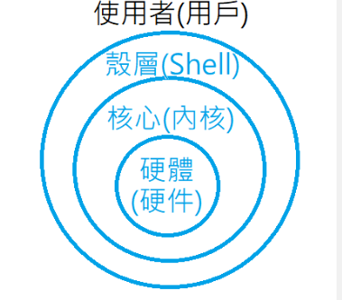
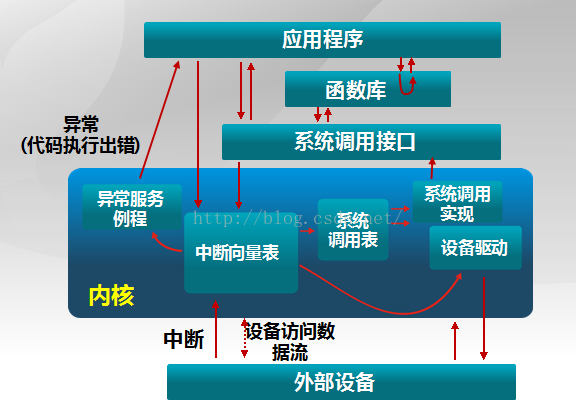
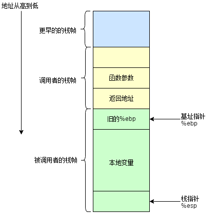
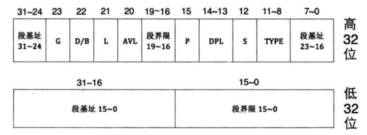
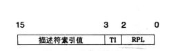
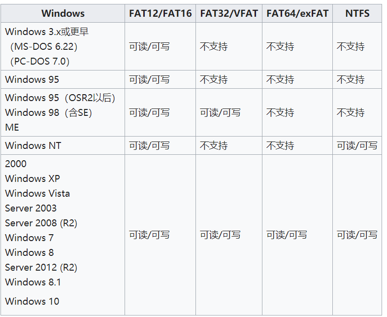

[TOC]

# 操作系统五十问

---

### 1. 并发和并行的区别？

如果某个系统支持两个或者多个动作（Action）**同时存在**，那么这个系统就是一个**并发系统**。如果某个系统支持两个或者多个动作**同时执行**，那么这个系统就是一个**并行系统**。并发系统与并行系统这两个定义之间的关键差异在于**“存在”**这个词。

在并发程序中可以同时拥有两个或者多个线程。这意味着，如果程序在单核处理器上运行，那么这两个线程将交替地换入或者换出内存。这些线程是同时“存在”的——每个线程都处于执行过程中的某个状态。如果程序能够并行执行，那么就一定是运行在多核处理器上。此时，程序中的每个线程都将分配到一个独立的处理器核上，因此可以同时运行。

能够得出结论——**“并行”概念是“并发”概念的一个子集**。也就是说，你可以编写一个拥有多个线程或者进程的并发程序，但如果没有多核处理器来执行这个程序，那么就不能以并行方式来运行代码。因此，凡是在求解单个问题时涉及多个执行流程的编程模式或者执行行为，都属于并发编程的范畴。

一般我们意义上的并发，是指存在多个线程或进程，系统通过调用，让你感受到每个进程（或者说多个线程）在同时执行的，但是实际上并不是，总而言之，并发是一种调度，它使得多个线程能够恰到好处的看似同时但实则有时间顺序地执行。

### 2. 什么是多道程序设计技术？

[多道程序设计](https://baike.baidu.com/item/多道程序设计)技术是指在内存同时放若干道程序，使它们在系统中并发执行，共享系统中的各种资源。当一道程序暂停执行时，CPU立即转去执行另一道程序。

[特点]：多道、宏观上并行（不同的作业分别在CPU和外设上执行）、微观上串行（在单CPU上交叉运行）。

[[多道批处理系统](https://baike.baidu.com/item/多道批处理系统)]：将[多道程序设计](https://baike.baidu.com/item/多道程序设计)技术应用于批处理系统，就形成多道批处理系统。

[多道程序设计](https://baike.baidu.com/item/多道程序设计)技术 对 操作系统的形成起到的作用：

操作系统在引入[多道程序设计](https://baike.baidu.com/item/多道程序设计)技术后，使得系统具有了多道，宏观上并行，微观上串行的特点。

[多道程序设计](https://baike.baidu.com/item/多道程序设计)主要是使OS能更好地对计算机进行管理 。

使计算机的硬件资源得到更充分的利用 。

在OS中引入[多道程序设计](https://baike.baidu.com/item/多道程序设计)技术带来的好处：

1. 提高CPU的利用率

2. 提高内存和I/O设备利用率

3. 增加系统[吞吐量](https://baike.baidu.com/item/吞吐量)

多道程序设计必须有[硬件基础](https://baike.baidu.com/item/硬件基础)作为保证，即内存。

所谓多道程序设计指的是允许多个程序同时进入一个计算机系统的[主存储器](https://baike.baidu.com/item/主存储器)并启动进行计算的方法。也就是说，计算机内存中可以同时存放多道（两个以上相互独立的）程序，它们都处于开始和结束之间。从宏观上看是并行的，[多道程序](https://baike.baidu.com/item/多道程序/8192392)都处于运行中，并且都没有运行结束；从微观上看是串行的，各道程序轮流使用CPU，交替执行。引入[多道程序设计技术](https://baike.baidu.com/item/多道程序设计技术)的根本目的是为了提高CPU的利用率，充分发挥计算机系统部件的[并行性](https://baike.baidu.com/item/并行性)，现代计算机系统都采用了多道程序设计技术。

实际上，这种多道程序设计的基础在很大程度上是虚拟内存的出现以及内存自身的扩大，只有在这种情况下，内存才能使得多个程序能够较好的运行在内存之中。

3.操作系统中内核与shell的关系

#### 操作系统

**操作系统**（英语： **O**perating **S**ystem，缩写： **OS**）是管理[电脑](https://zh.wikipedia.org/wiki/计算机)[硬体](https://zh.wikipedia.org/wiki/硬件)与[软体](https://zh.wikipedia.org/wiki/软件)资源的[系统软体](https://zh.wikipedia.org/wiki/系统软件)，同时也是电脑系统的核心与基石。操作系统需要处理如管理与组态[记忆体](https://zh.wikipedia.org/wiki/内存)、决定系统资源供需的优先次序、控制输入与输出装置、操作[网路](https://zh.wikipedia.org/wiki/计算机网络)与管理[档案系统](https://zh.wikipedia.org/wiki/文件系统)等基本事务。操作系统也提供一个让使用者与系统互动的操作介面。

操作系统的型态非常多样，不同机器安装的操作系统可从简单到复杂，可从[移动电话](https://zh.wikipedia.org/wiki/移动电话)的[嵌入式系统](https://zh.wikipedia.org/wiki/嵌入式系统)到[超级电脑](https://zh.wikipedia.org/wiki/超级计算机)的[大型操作系统](https://zh.wikipedia.org/wiki/超级计算机#.E6.93.8D.E4.BD.9C.E7.B3.BB.E7.BB.9F)。许多操作系统制造者对它涵盖范畴的定义也不尽一致，例如有些操作系统整合了[图形化使用者界面](https://zh.wikipedia.org/wiki/图形用户界面)，而有些仅使用[命令行界面](https://zh.wikipedia.org/wiki/命令行界面)，而将图形化使用者介面视为一种非必要的应用程式。

其主要功能有：进程管理，内存管理，文件系统，网络，安全，使用者界面和驱动程序等。

#### 内核

**核心**（英语：**Kernel**，又称**内核**）在[计算机科学](https://zh.wikipedia.org/wiki/計算機科學)中是一个用来管理[软体](https://zh.wikipedia.org/wiki/軟體)发出的资料[I/O](https://zh.wikipedia.org/wiki/I/O)（输入与输出）要求的电脑[程式](https://zh.wikipedia.org/wiki/程式)，将这些要求转译为资料处理的指令并交由[中央处理器](https://zh.wikipedia.org/wiki/中央處理器)（CPU）及[电脑](https://zh.wikipedia.org/wiki/電腦)中其他[电子元件](https://zh.wikipedia.org/wiki/電子元件)进行处理，是现代[作业系统](https://zh.wikipedia.org/wiki/操作系统)中最基本的部分。它是为众多[应用程式](https://zh.wikipedia.org/wiki/应用程序)提供对[电脑](https://zh.wikipedia.org/wiki/计算机)[硬体](https://zh.wikipedia.org/wiki/硬件)的安全存取的一部分[软体](https://zh.wikipedia.org/wiki/软件)，这种存取是有限的，并由核心决定一个[程式](https://zh.wikipedia.org/wiki/程序)在什么时候对某部分硬体操作多长时间。直接对硬体操作是非常复杂的。所以核心通常提供一种[硬体抽象](https://zh.wikipedia.org/wiki/硬件抽象)的方法，来完成这些操作。有了这个，通过[进程间通信](https://zh.wikipedia.org/wiki/进程间通信)机制及[系统调用](https://zh.wikipedia.org/wiki/系统调用)，应用行程可间接控制所需的硬体资源（特别是处理器及IO装置）。

##### 单核心

单核心结构在硬体之上，定义了一个高阶的抽象介面，应用一组[原语](https://zh.wikipedia.org/w/index.php?title=原语&action=edit&redlink=1)（或者叫[系统呼叫](https://zh.wikipedia.org/wiki/系统调用)（System call））来实现作业系统的功能，例如[进程管理](https://zh.wikipedia.org/wiki/进程管理)，[文件系统](https://zh.wikipedia.org/wiki/文件系统)，和[内存管理](https://zh.wikipedia.org/w/index.php?title=存储管理&action=edit&redlink=1)等等，这些功能由多个执行在核心态的[模组](https://zh.wikipedia.org/wiki/模块)来完成。

尽管每一个模组都是单独地服务这些操作，核心代码是高度整合的，而且难以编写正确。因为所有的模组都在同一个核心空间上执行，一个很小的bug都会使整个系统崩溃。然而，如果开发顺利，单核心结构就可以从执行效率上得到好处。

很多现代的单核心结构核心，如[Linux](https://zh.wikipedia.org/wiki/Linux内核)和[FreeBSD](https://zh.wikipedia.org/wiki/FreeBSD)核心，能够在执行时将模组调入执行，这就可以使扩充核心的功能变得更简单，也可以使核心的核心部分变得更简洁。

##### 混合核心

混合核心的设计理念来自微核心，只不过它让一些微核结构执行在用户空间的代码执行在核心空间，这样让核心的执行效率更高些。这是一种妥协做法，[微软](https://zh.wikipedia.org/wiki/微软)[视窗](https://zh.wikipedia.org/wiki/Windows)就是一个典型的例子。另外还有XNU，执行在[苹果](https://zh.wikipedia.org/wiki/苹果电脑)[Mac OS X](https://zh.wikipedia.org/wiki/Mac_OS_X)上的核心，也是一个混合核心。[林纳斯·托瓦兹](https://zh.wikipedia.org/wiki/林纳斯·托瓦兹)认为混合核心这种分类只是一种市场行销手法，因为它的架构实作与运作方式接近于宏核心。

#### shell

**壳层**（英语：**Shell**）在[电脑科学](https://zh.wikipedia.org/wiki/電腦科學)中指「为使用者提供使用者介面」的软体，通常指的是[命令列介面](https://zh.wikipedia.org/wiki/命令行界面)的解析器。一般来说，这个词是指[操作系统](https://zh.wikipedia.org/wiki/作業系統)中提供存取[核心](https://zh.wikipedia.org/wiki/内核)所提供之服务的程式。Shell也用于泛指所有为用户提供操作界面的程式，也就是程式和用户[互动](https://zh.wikipedia.org/w/index.php?title=交互&action=edit&redlink=1)的层面。因此与之相对的是[核心](https://zh.wikipedia.org/wiki/内核)（英语：**Kernel**），核心不提供和用户的互动功能。



故而，实际上shell 是对于外层用户的一层封装，一般而言，大多数程序都是通过它来实现对于内核的调用（当然如果自己的程序也进行了内核调用那就并非如此），但是一般而言，可以理解为，shell 是用户开启的进程的父进程，那么所有的系统调用也都是最初来自于shell。

更详尽的理解可以参考我的对于shell的相关实现： [stupid shell](https://github.com/leliyliu/project_implementation/tree/master/shell_in_c)

### 4. 中断，异常和系统调用的区别与联系

系统调用（system call）

应用程序主动向操作系统发出的服务请求

异常(exception)

非法指令或者其他原因导致当前指令执行失败   (如：内存出错)后的处理请求

中断(hardware interrupt)

来自硬件设备的处理请求



    源头
    
    中断：外设引起
    
    异常：应用程序意想不到的行为
    
    系统调用：应用程序请求操作系统提供服务
    
    响应方式
    
    中断：异步
    
    异常：同步
    
    系统调用：异步或同步


​    
​    
​    处理机制
​    
​    中断：持续，对用户应用程序是透明的
​    
​    异常：杀死或者重新执行意想不到的应用程序指令
​    
​    系统调用：等待和持续
​    
    接下来我们详细介绍一些中断的处理机制，处理机制包括硬件处理和软件处理
    
    硬件处理
    
    依据内部或者外部事件设置中断标志，然后依据中断向量调用相应的中断服务例程。
    
    软件处理
    
    首先进行现场保存（由编译器完成），然后进行中断服务处理（中断服务例程完成），接着清除中断标记（中断服务例程），最后进行现场恢复（编译器）。

### 5. 函数调用的具体过程

函数调用过程中，需要做这样几件事情：

在x86的计算机系统中，内存空间中的栈主要用于保存函数的参数，返回值，返回地址，本地变量等。一切的函数调用都要将不同的数据、地址压入或者弹出栈。因此，为了更好地理解函数的调用，我们需要先来看看栈是怎么工作的。

#### 栈帧

栈帧，也就是stack frame，其本质就是一种栈，只是这种栈专门用于保存函数调用过程中的各种信息（参数，返回地址，本地变量等）。栈帧有栈顶和栈底之分，其中栈顶的地址最低，栈底的地址最高，SP(栈指针)就是一直指向栈顶的。在x86-32bit中，我们用 `%ebp` 指向栈底，也就是基址指针；用 `%esp` 指向栈顶，也就是栈指针。下面是一个栈帧的示意图：



一般来说，我们将 `%ebp` 到 `%esp` 之间区域当做栈帧（也有人认为该从函数参数开始，不过这不影响分析）。并不是整个栈空间只有一个栈帧，每调用一个函数，就会生成一个新的栈帧。在函数调用过程中，我们将调用函数的函数称为“调用者(caller)”，将被调用的函数称为“被调用者(callee)”。在这个过程中，1）“调用者”需要知道在哪里获取“被调用者”返回的值；2）“被调用者”需要知道传入的参数在哪里，3）返回的地址在哪里。同时，我们需要保证在“被调用者”返回后，`%ebp`, `%esp` 等寄存器的值应该和调用前一致。因此，我们需要使用栈来保存这些数据。

#### 函数调用实例

```c
int MyFunction(int x, int y, int z)
{
    int a, b, c;
    a = 10;
    b = 5;
    c = 2;
    ...
}

int TestFunction()
{
    int x = 1, y = 2, z = 3;
    MyFunction1(1, 2, 3);
    ...
}
```

```asm
_MyFunction:
    push %ebp            ; //保存%ebp的值
    movl %esp, $ebp      ; //将%esp的值赋给%ebp，使新的%ebp指向栈顶
    movl -12(%esp), %esp ; //分配额外空间给本地变量
    movl $10, -4(%ebp)   ; 
    movl $5,  -8(%ebp)   ; 
    movl $2,  -12(%ebp)  ; 
```

此时调用者做了两件事情：第一，将被调用函数的参数按照从右到左的顺序压入栈中。第二，将返回地址压入栈中。这两件事都是调用者负责的，因此压入的栈应该属于调用者的栈帧。我们再来看看被调用者，它也做了两件事情：第一，将老的（调用者的） `%ebp` 压入栈，此时 `%esp` 指向它。第二，将 `%esp` 的值赋给 `%ebp`, `%ebp` 就有了新的值，它也指向存放老 `%ebp` 的栈空间。这时，它成了是函数 `MyFunction()` 栈帧的栈底。这样，我们就保存了“调用者”函数的 `%ebp`，并且建立了一个新的栈帧。

#### 函数返回

查看返回的汇编指令：

```assembly
_MyFunction:
    push %ebp
    movl %esp, %ebp
    movl -12(%esp), %esp
    ...
    mov %ebp, %esp
    pop %ebp
    ret
```

最后有一个 `ret` 指令，这个指令相当于 `pop + jump`。它首先将数据（返回地址）弹出栈并保存到 `%eip` 中，然后处理器根据这个地址无条件地跳到相应位置获取新的指令。

### 6. BIOS 和 bootloader 的区别与联系

BIOS 是硬件固化的自举程序，初始化硬件工作状态为主，BOOTLOADER 是为了启动系统而设计的载入程序。其实 BOOTLOADER 的工作应该由 BIOS 来完成，不过因为各种原因，这两个部分独立出来可以获得更好的自由度。

#### BIOS 

BIOS(basic input output system)：基本输入输出系统。它是一组固化到计算机内主板上一个ROM芯片上的程序 ，保存着计算机最重要的基本输入输出的程序、开机后自检程序和系统自启动程序，它可从CMOS中读写系统设置的具体信息。
  BIOS是连接软件与硬件的一座“桥梁”，是计算机的开启时运行的第一个程序，主要功能是为计算机提供最底层的、最直接的硬件设置和控制。BIOS的三个主要功能：

##### 自检及初始化程序，分为三个部分。

+ **加电自检**（POST）：

功能是检查计算机硬件是否良好，自检中如发现有错误，将按两种情况处理：对于严重故障（致命性故障）则停机，此时由于各种初始化操作还没完成，不能给出任何提示或信号；对于非严重故障则给出提示或声音报警信号，等待用户处理。

+ **初始化**：

创建中断向量、设置寄存器、对一些外部设备进行初始化和检测等，其中很重要的一部分是BIOS设置，主要是对硬件设置的一些参数，当计算机启动时会读取这些参数，并和实际硬件设置进行比较，如果不符合，会影响系统的启动。

+ **加载引导程序**：

功能是引导Dos或其他操作系统，此时会在硬盘读取引导记录，然后把计算机的控制权转交给引导记录，由引导记录（IPL与SPL）把操作系统装入电脑，在电脑启动成功后，BIOS的这部分任务就完成了。也就是说BIOS本身不能引导OS内核。

##### **程序服务处理；**

BIOS直接与计算机的I/O设备（Input/Output，即输入/输出设备）打交道，通过特定的数据端口发出命令，传送或者接受各种外部设备的数据，实现软件程序对硬件的直接操作。

##### 硬件中断处理；

开机时BIOS会告诉CPU各硬件设备的中断号，当用户发出使用某个设备的指令后，CPU就根据中断号使用相对应的硬件完成工作，再根据中断号跳回原来的工作。

> BIOS分为：Legacy BIOS 和 UEFI BIOS

#### BootLoader

Bootloader 一般分为两个阶段： boot 和 loader 

##### Boot

+ 硬件设备初始化。
+ 为加载Bootloader的第二阶段代码准备RAM空间。
+ 拷贝Bootloader的第二阶段代码到 RAM 空间中。
+ 设置好栈。
+ 跳转到第二阶段代码的C入口点。
+ 在第一阶段进行的硬件初始化一般包括：关闭WATCHDOG、关中断、设置CPU的速度和时钟频率、RAM初始化等。这些并不都是必需的，比如S3C2410/S3C2440的开发板所使用的U-Boot中，就将CPU的速度和时钟频率的设置放在第二阶段。甚至，将第二阶段的代码复制到RAM空间中也不是必需的，对于NORFlash等存储设备，完全可以在上面直接执行代码，只不过这相比在RAM中执行效率大为降低。

##### loader

+ 初始化本阶段要使用到的硬件设备
+ 检测系统内存映射(memory map)。
+ 将内核映像和根文件系统映像从Flash上读到RAM空间中。
+ 为内核设置启动参数。
+ 调用内核。

**引导程序**（英语：boot loader）位于[电脑](https://zh.wikipedia.org/wiki/電腦)或其他计算机应用上，是指引导[操作系统](https://zh.wikipedia.org/wiki/作業系統)的程序。引导程序引导方式及程序视应用机型种类而不同。例如在普通的[个人电脑](https://zh.wikipedia.org/wiki/个人电脑)上，引导程序通常分为两部分：第一阶段引导程序位于[主引导记录](https://zh.wikipedia.org/wiki/主引导记录)（MBR），用以引导位于某个[分区](https://zh.wikipedia.org/wiki/分区)上的第二阶段引导程序，如[NTLDR](https://zh.wikipedia.org/wiki/NTLDR)、[BOOTMGR](https://zh.wikipedia.org/wiki/Windows_Boot_Manager)和[GNU GRUB](https://zh.wikipedia.org/wiki/GNU_GRUB)等。

#### 联系

[BIOS](https://zh.wikipedia.org/wiki/BIOS)引导完成后，bootloader就接手初始化硬件设备、创建[存储器](https://zh.wikipedia.org/wiki/記憶體)空间的映射，以便为[操作系统](https://zh.wikipedia.org/wiki/作業系統)[内核](https://zh.wikipedia.org/wiki/内核)准备好正确的软硬件环境。

当电脑的电源打开，BIOS就会从[主板](https://zh.wikipedia.org/wiki/主機板)上的[ROM](https://zh.wikipedia.org/wiki/ROM)芯片运行，运行[加电自检](https://zh.wikipedia.org/wiki/加电自检)（POST），测试和初始化[CPU](https://zh.wikipedia.org/wiki/CPU)、[RAM](https://zh.wikipedia.org/wiki/RAM)、[直接存储器访问](https://zh.wikipedia.org/wiki/直接記憶體存取)控制器、[芯片组](https://zh.wikipedia.org/wiki/晶片組)、[键盘](https://zh.wikipedia.org/wiki/鍵盤)、[软盘](https://zh.wikipedia.org/wiki/軟碟)、[硬盘](https://zh.wikipedia.org/wiki/硬碟)等设备。当所有的Option ROM被加载后，BIOS就试图从引导设备（如[硬盘](https://zh.wikipedia.org/wiki/硬碟)、[软盘](https://zh.wikipedia.org/wiki/軟碟)、[光盘](https://zh.wikipedia.org/wiki/光碟)）加载[引导程序](https://zh.wikipedia.org/wiki/啟動程式)，由引导程序加载[操作系统](https://zh.wikipedia.org/wiki/作業系統)。BIOS也可从[网卡](https://zh.wikipedia.org/wiki/網卡)等设备引导。

具体内容可以再次参考PPT内容，BIOS首先从某个位置开始，然后进行硬件自检，自检之后开始从第0盘第0面第1个扇区加载程序，然后开始boot loader，boot阶段进行中段描述符的设定，loader阶段开始初始化内核并进行调用。

### 7. 保护模式与实模式的相关理解

实模式和保护模式都是CPU的工作模式，而CPU的工作模式是指CPU的寻址方式、寄存器大小等用来反应CPU在该环境下如何工作的概念。

#### 1. 实模式工作原理

实模式出现于早期8088CPU时期。当时由于CPU的性能有限，一共只有20位地址线（所以地址空间只有1MB），以及8个16位的通用寄存器，以及4个16位的段寄存器。所以为了能够通过这些16位的寄存器去构成20位的主存地址，必须采取一种特殊的方式。当某个指令想要访问某个内存地址时，它通常需要用下面的这种格式来表示：

　　(段基址：段偏移量)

　 其中第一个字段是段基址，它的值是由**段寄存器**提供的(一般来说，段寄存器有6种，分别为cs，ds，ss，es，fs，gs，这几种段寄存器都有自己的特殊意义，这里不做介绍)。

　 第二字段是段内偏移量，代表你要访问的这个内存地址距离这个段基址的偏移。它的值就是由通用寄存器来提供的，所以也是16位。那么两个16位的值如何组合成一个20位的地址呢？CPU采用的方式是把段寄存器所提供的段基址先向左移4位。这样就变成了一个20位的值，然后再与段偏移量相加。

即：

　　物理地址 = 段基址<<4 + 段内偏移

　　所以假设段寄存器中的值是0xff00，段偏移量为0x0110。则这个地址对应的真实物理地址是 0xff00<<4 + 0x0110 = 0xff110。

由上面的介绍可见，实模式的"实"更多地体现在其地址是真实的物理地址。

#### 2. 保护模式工作原理

随着CPU的发展，CPU的地址线的个数也从原来的20根变为现在的32根，所以可以访问的内存空间也从1MB变为现在4GB，寄存器的位数也变为32位。所以实模式下的内存地址计算方式就已经不再适合了。所以就引入了现在的保护模式，实现更大空间的，更灵活也**更安全**的内存访问。

在保护模式下，CPU的32条地址线全部有效，可寻址高达4G字节的物理地址空间; 但是我们的内存寻址方式还是得兼容老办法(这也是没办法的，有时候是为了方便，有时候是一种无奈)，即(段基址：段偏移量)的表示方式。当然此时CPU中的通用寄存器都要换成32位寄存器(除了段寄存器，原因后面再说)来保证寄存器能访问所有的4GB空间。

我们的偏移值和实模式下是一样的，就是变成了32位而已，而段值仍旧是存放在原来16位的段寄存器中，**但是这些段寄存器存放的却不再是段基址了**，毕竟之前说过实模式下寻址方式不安全，我们在保护模式下需要加一些限制，而这些限制可不是一个寄存器能够容纳的，于是我们把这些关于内存段的限制信息放在一个叫做**全局描述符表(GDT)**的结构里。全局描述符表中含有一个个表项，每一个表项称为**段描述符。**而段寄存器在保护模式下存放的便是相当于一个数组索引的东西，通过这个索引，可以找到对应的表项。段描述符存放了段基址、段界限、内存段类型属性(比如是数据段还是代码段,注意**一个段描述符只能用来定义一个内存段**)等许多属性,具体信息见下图



其中，段界限表示段边界的扩张最值，即最大扩展多少或最小扩展多少，用20位来表示，它的单位可以是字节，也可以是4KB，这是由G位决定的(G为1时表示单位为4KB)。

实际段界限边界值=(描述符中的段界限+1)*（段界限的单位大小(即字节或4KB))-1，如果偏移地址超过了段界限，CPU会抛出异常。

全局描述符表位于内存中，需要用专门的寄存器指向它后， CPU 才知道它在哪里。这个专门的寄存器便是**GDTR**(一个48位的寄存器),专门用来存储 GDT 的内存地址及大小。

最后我们再介绍一下一个新的概念：段的选择子。段寄存器 CS、 DS、 ES、 FS、 GS、 SS，在实模式下时，段中存储的是段基地址，即内存段的起始地址。 而在保护模式下时，由于段基址已经存入了段描述符中，所以段寄存器中再存放段基址是没有意义的，在段寄 存器中存入的是一个叫作选择子的东西。选择子“基本上”是个索引值，虽然它还有其他内容，不过作为初学者暂时忽略也没太大关系。由于段寄存器是 16 位，所以选择子也是 16 位，在其低 2 位即第 0～1 位， 用来存储 RPL，即请求特权级(有兴趣的可以了解一下，不想了解的忽略即可，跟用户态和内核态相关的)，可以表示 0、 1、 2、 3 四种特权级。在选择子的第 2 位是 TI 位，即 Table Indicator，用来指示选择子是在 GDT 中，还是 LDT 中索引描述符。 TI 为 0 表示在 GDT 中索引描述符， TI 为 1 表示在 LDT 中索引描述符。选择子的高 13 位，即第 3～15 位是 描述符的索引值，用此值在 GDT 中索引描述符。前面说过 GDT 相当于一个描述符数组，所以此选择子中的索引值就是 GDT 中的下标。选择子结构如下：



此外， 扩充的存储器分段管理机制和可选的存储器分页管理机制，不仅为存储器共享和保护提供了硬件支持，而且为实现虚拟存储器提供了硬件支持; 支持多任务，能够快速地进行任务切换(switch)和保护任务环境(context); 4个特权级和完善的特权检查机制，既能实现资源共享又能保证代码和数据的安全和保密及任务的隔离; 支持虚拟8086方式，便于执行8086程序。

### 8. NTFS文件系统理解

#### 文件系统

[文件系统]([https://zh.wikipedia.org/zh-cn/%E6%96%87%E4%BB%B6%E7%B3%BB%E7%BB%9F](https://zh.wikipedia.org/zh-cn/文件系统))

严格地说，文件系统是一套实现了[数据](https://zh.wikipedia.org/wiki/数据)的存储、分级组织、访问和获取等操作的[抽象数据类型](https://zh.wikipedia.org/wiki/抽象數據類型)（Abstract data type）。

一般而言，文件系统包括磁盘文件系统，光盘，闪存文件系统，数据库文件系统和网络文件系统。在这里我们主要讨论的是磁盘文件系统。

#### NTFS文件系统概念

文件系统是操作系统用于明确磁盘或分区上的文件的方法和数据结构，即在磁盘上组织文件的方法。文件系统是对应硬盘的分区的，而不是整个硬盘，不管是硬盘只有一个分区，还是几个分区，不同的分区可以有着不同的文件系统。

NTFS（New Technology File System）是运行在 Windows NT 操纵系统环境和Windows NT 高级服务器网络操作环境的文件系统，随着 Windows NT 操作系统的诞生而产生。NTFS 文件系统具有安全性高、稳定性好、不易产生文件碎片的优点，使得它成为主流的文件系统。




#### NTFS文件系统相关概念

- 分区：分区是磁盘的基本组成部分，被划分的磁盘一部分
- 卷：NTFS以卷为基础，卷建立在分区的基础上
- 当以NTFS来格式化磁盘分区时就创建了一个卷
- 簇：NTFS使用簇作为磁盘空间的分配和回收的基本单位
- 逻辑簇号(LCN)：对卷中所有的簇从头至尾进行编号
- 虚拟簇号(VCN)：对于文件内的所有簇进行编号
- 主文件表(\$MFT)：$MFT是卷的核心，存放着卷中所有数据，包括：定位和恢复文件的数据结构、引导程序数据和记录整个卷的分配分配状态的位图等
- 文件记录：NTFS不是将文件仅仅视为一个文本库或二进制数据，而是将文件作为许多属性和属性值的集合来处理；每个文件或文件夹在元文件\$MFT均有一个文件记录号
- 常驻属性：文件属性值能直接存储在$MFT记录中
- 非常驻属性：不能直接存储在\$MFT记录中，需要在\$MFT之外为其分配空间进行存储

具体内容参见该[blog](https://www.write-bug.com/article/1889.html)

以及[NTFS](https://zh.wikipedia.org/zh-cn/NTFS)

### 37. linux文件系统

#### Linux 的一切皆文件

Linux 中的各种事物比如像文档、目录（Mac OS X 和 Windows 系统下称之为文件夹）、键盘、监视器、硬盘、可移动媒体设备、打印机、调制解调器、虚拟终端，还有进程间通信（IPC）和网络通信等输入/输出资源都是定义在文件系统空间下的字节流。
一切都可看作是文件，其最显著的好处是对于上面所列出的输入/输出资源，只需要相同的一套 Linux 工具、实用程序和 API。你可以使用同一套api(read, write)和工具(cat , 重定向, 管道)来处理unix中大多数的资源.
设计一个系统的终极目标往往就是要找到原子操作，一旦锁定了原子操作，设计工作就会变得简单而有序。“文件”作为一个抽象概念，其原子操作非常简单，只有读和写，这无疑是一个非常好的模型。通过这个模型，API的设计可以化繁为简，用户可以使用通用的方式去访问任何资源，自有相应的中间件做好对底层的适配。
现代操作系统为解决信息能独立于进程之外被长期存储引入了文件，文件作为进程创建信息的逻辑单元可被多个进程并发使用。在 UNIX 系统中，操作系统为磁盘上的文本与图像、鼠标与键盘等输入设备及网络交互等 I/O 操作设计了一组通用 API，使他们被处理时均可统一使用字节流方式。换言之，UNIX 系统中除进程之外的一切皆是文件，而 Linux 保持了这一特性。为了便于文件的管理，Linux 还引入了目录（有时亦被称为文件夹）这一概念。目录使文件可被分类管理，且目录的引入使 Linux 的文件系统形成一个层级结构的目录树

> 在linux系统中，一切都是文件，理解文件系统，对于学习Linux来说是一个非常必要的前提

更具体的了解，可以参考： 

[linux文件系统](https://juejin.im/post/5b8ba9e26fb9a019c372e100)


### 