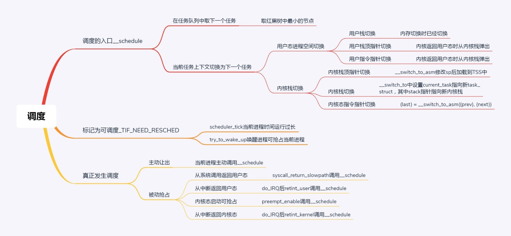
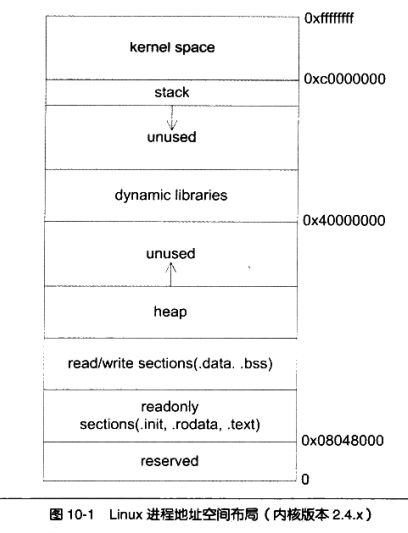
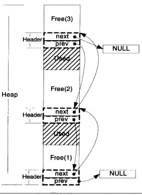
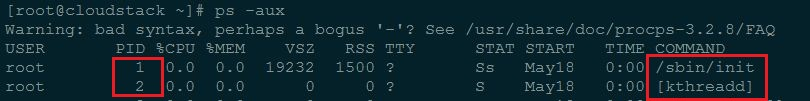
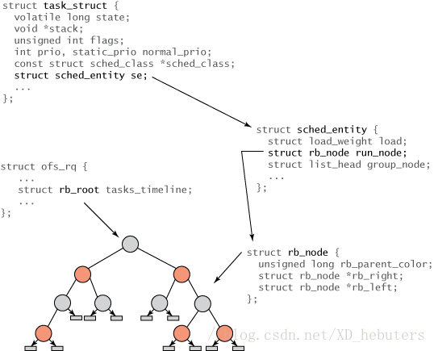
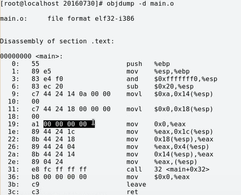
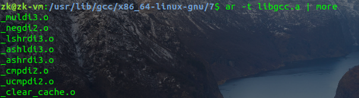
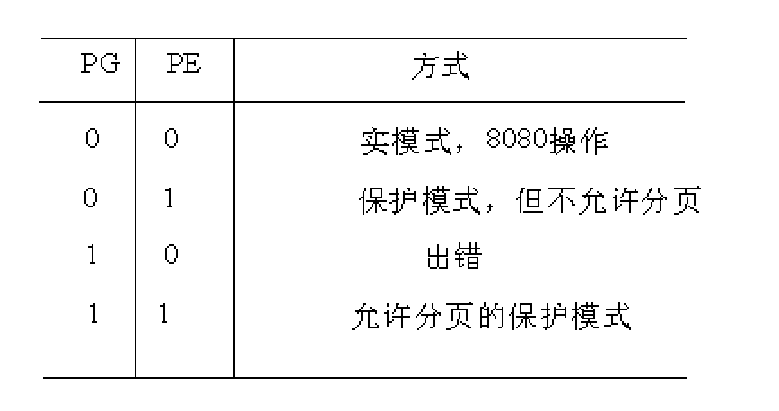

[TOC]

# 操作系统五十问

---

关于linux 系统结构，请参考这篇博客[Linux系统结构详解](https://dwz.cn/Jsc4V4Sz)



### 1. 并发和并行的区别？

如果某个系统支持两个或者多个动作（Action）**同时存在**，那么这个系统就是一个**并发系统**。如果某个系统支持两个或者多个动作**同时执行**，那么这个系统就是一个**并行系统**。并发系统与并行系统这两个定义之间的关键差异在于**“存在”**这个词。

在并发程序中可以同时拥有两个或者多个线程。这意味着，如果程序在单核处理器上运行，那么这两个线程将交替地换入或者换出内存。这些线程是同时“存在”的——每个线程都处于执行过程中的某个状态。如果程序能够并行执行，那么就一定是运行在多核处理器上。此时，程序中的每个线程都将分配到一个独立的处理器核上，因此可以同时运行。

能够得出结论——**“并行”概念是“并发”概念的一个子集**。也就是说，你可以编写一个拥有多个线程或者进程的并发程序，但如果没有多核处理器来执行这个程序，那么就不能以并行方式来运行代码。因此，凡是在求解单个问题时涉及多个执行流程的编程模式或者执行行为，都属于并发编程的范畴。

一般我们意义上的并发，是指存在多个线程或进程，系统通过调用，让你感受到每个进程（或者说多个线程）在同时执行的，但是实际上并不是，总而言之，并发是一种调度，它使得多个线程能够恰到好处的看似同时但实则有时间顺序地执行。

### 2. 什么是多道程序设计技术？

[多道程序设计](https://baike.baidu.com/item/多道程序设计)技术是指在内存同时放若干道程序，使它们在系统中并发执行，共享系统中的各种资源。当一道程序暂停执行时，CPU立即转去执行另一道程序。

[特点]：多道、宏观上并行（不同的作业分别在CPU和外设上执行）、微观上串行（在单CPU上交叉运行）。

[[多道批处理系统](https://baike.baidu.com/item/多道批处理系统)]：将[多道程序设计](https://baike.baidu.com/item/多道程序设计)技术应用于批处理系统，就形成多道批处理系统。

[多道程序设计](https://baike.baidu.com/item/多道程序设计)技术 对 操作系统的形成起到的作用：

操作系统在引入[多道程序设计](https://baike.baidu.com/item/多道程序设计)技术后，使得系统具有了多道，宏观上并行，微观上串行的特点。

[多道程序设计](https://baike.baidu.com/item/多道程序设计)主要是使OS能更好地对计算机进行管理 。

使计算机的硬件资源得到更充分的利用 。

在OS中引入[多道程序设计](https://baike.baidu.com/item/多道程序设计)技术带来的好处：

1. 提高CPU的利用率

2. 提高内存和I/O设备利用率

3. 增加系统[吞吐量](https://baike.baidu.com/item/吞吐量)

多道程序设计必须有[硬件基础](https://baike.baidu.com/item/硬件基础)作为保证，即内存。

所谓多道程序设计指的是允许多个程序同时进入一个计算机系统的[主存储器](https://baike.baidu.com/item/主存储器)并启动进行计算的方法。也就是说，计算机内存中可以同时存放多道（两个以上相互独立的）程序，它们都处于开始和结束之间。从宏观上看是并行的，[多道程序](https://baike.baidu.com/item/多道程序/8192392)都处于运行中，并且都没有运行结束；从微观上看是串行的，各道程序轮流使用CPU，交替执行。引入[多道程序设计技术](https://baike.baidu.com/item/多道程序设计技术)的根本目的是为了提高CPU的利用率，充分发挥计算机系统部件的[并行性](https://baike.baidu.com/item/并行性)，现代计算机系统都采用了多道程序设计技术。

实际上，这种多道程序设计的基础在很大程度上是虚拟内存的出现以及内存自身的扩大，只有在这种情况下，内存才能使得多个程序能够较好的运行在内存之中。

3.操作系统中内核与shell的关系

#### 操作系统

**操作系统**（英语： **O**perating **S**ystem，缩写： **OS**）是管理[电脑](https://zh.wikipedia.org/wiki/计算机)[硬体](https://zh.wikipedia.org/wiki/硬件)与[软体](https://zh.wikipedia.org/wiki/软件)资源的[系统软体](https://zh.wikipedia.org/wiki/系统软件)，同时也是电脑系统的核心与基石。操作系统需要处理如管理与组态[记忆体](https://zh.wikipedia.org/wiki/内存)、决定系统资源供需的优先次序、控制输入与输出装置、操作[网路](https://zh.wikipedia.org/wiki/计算机网络)与管理[档案系统](https://zh.wikipedia.org/wiki/文件系统)等基本事务。操作系统也提供一个让使用者与系统互动的操作介面。

操作系统的型态非常多样，不同机器安装的操作系统可从简单到复杂，可从[移动电话](https://zh.wikipedia.org/wiki/移动电话)的[嵌入式系统](https://zh.wikipedia.org/wiki/嵌入式系统)到[超级电脑](https://zh.wikipedia.org/wiki/超级计算机)的[大型操作系统](https://zh.wikipedia.org/wiki/超级计算机#.E6.93.8D.E4.BD.9C.E7.B3.BB.E7.BB.9F)。许多操作系统制造者对它涵盖范畴的定义也不尽一致，例如有些操作系统整合了[图形化使用者界面](https://zh.wikipedia.org/wiki/图形用户界面)，而有些仅使用[命令行界面](https://zh.wikipedia.org/wiki/命令行界面)，而将图形化使用者介面视为一种非必要的应用程式。

其主要功能有：进程管理，内存管理，文件系统，网络，安全，使用者界面和驱动程序等。

#### 内核

**核心**（英语：**Kernel**，又称**内核**）在[计算机科学](https://zh.wikipedia.org/wiki/計算機科學)中是一个用来管理[软体](https://zh.wikipedia.org/wiki/軟體)发出的资料[I/O](https://zh.wikipedia.org/wiki/I/O)（输入与输出）要求的电脑[程式](https://zh.wikipedia.org/wiki/程式)，将这些要求转译为资料处理的指令并交由[中央处理器](https://zh.wikipedia.org/wiki/中央處理器)（CPU）及[电脑](https://zh.wikipedia.org/wiki/電腦)中其他[电子元件](https://zh.wikipedia.org/wiki/電子元件)进行处理，是现代[作业系统](https://zh.wikipedia.org/wiki/操作系统)中最基本的部分。它是为众多[应用程式](https://zh.wikipedia.org/wiki/应用程序)提供对[电脑](https://zh.wikipedia.org/wiki/计算机)[硬体](https://zh.wikipedia.org/wiki/硬件)的安全存取的一部分[软体](https://zh.wikipedia.org/wiki/软件)，这种存取是有限的，并由核心决定一个[程式](https://zh.wikipedia.org/wiki/程序)在什么时候对某部分硬体操作多长时间。直接对硬体操作是非常复杂的。所以核心通常提供一种[硬体抽象](https://zh.wikipedia.org/wiki/硬件抽象)的方法，来完成这些操作。有了这个，通过[进程间通信](https://zh.wikipedia.org/wiki/进程间通信)机制及[系统调用](https://zh.wikipedia.org/wiki/系统调用)，应用行程可间接控制所需的硬体资源（特别是处理器及IO装置）。

##### 单核心

单核心结构在硬体之上，定义了一个高阶的抽象介面，应用一组[原语](https://zh.wikipedia.org/w/index.php?title=原语&action=edit&redlink=1)（或者叫[系统呼叫](https://zh.wikipedia.org/wiki/系统调用)（System call））来实现作业系统的功能，例如[进程管理](https://zh.wikipedia.org/wiki/进程管理)，[文件系统](https://zh.wikipedia.org/wiki/文件系统)，和[内存管理](https://zh.wikipedia.org/w/index.php?title=存储管理&action=edit&redlink=1)等等，这些功能由多个执行在核心态的[模组](https://zh.wikipedia.org/wiki/模块)来完成。

尽管每一个模组都是单独地服务这些操作，核心代码是高度整合的，而且难以编写正确。因为所有的模组都在同一个核心空间上执行，一个很小的bug都会使整个系统崩溃。然而，如果开发顺利，单核心结构就可以从执行效率上得到好处。

很多现代的单核心结构核心，如[Linux](https://zh.wikipedia.org/wiki/Linux内核)和[FreeBSD](https://zh.wikipedia.org/wiki/FreeBSD)核心，能够在执行时将模组调入执行，这就可以使扩充核心的功能变得更简单，也可以使核心的核心部分变得更简洁。

##### 混合核心

混合核心的设计理念来自微核心，只不过它让一些微核结构执行在用户空间的代码执行在核心空间，这样让核心的执行效率更高些。这是一种妥协做法，[微软](https://zh.wikipedia.org/wiki/微软)[视窗](https://zh.wikipedia.org/wiki/Windows)就是一个典型的例子。另外还有XNU，执行在[苹果](https://zh.wikipedia.org/wiki/苹果电脑)[Mac OS X](https://zh.wikipedia.org/wiki/Mac_OS_X)上的核心，也是一个混合核心。[林纳斯·托瓦兹](https://zh.wikipedia.org/wiki/林纳斯·托瓦兹)认为混合核心这种分类只是一种市场行销手法，因为它的架构实作与运作方式接近于宏核心。

#### shell

**壳层**（英语：**Shell**）在[电脑科学](https://zh.wikipedia.org/wiki/電腦科學)中指「为使用者提供使用者介面」的软体，通常指的是[命令列介面](https://zh.wikipedia.org/wiki/命令行界面)的解析器。一般来说，这个词是指[操作系统](https://zh.wikipedia.org/wiki/作業系統)中提供存取[核心](https://zh.wikipedia.org/wiki/内核)所提供之服务的程式。Shell也用于泛指所有为用户提供操作界面的程式，也就是程式和用户[互动](https://zh.wikipedia.org/w/index.php?title=交互&action=edit&redlink=1)的层面。因此与之相对的是[核心](https://zh.wikipedia.org/wiki/内核)（英语：**Kernel**），核心不提供和用户的互动功能。


故而，实际上shell 是对于外层用户的一层封装，一般而言，大多数程序都是通过它来实现对于内核的调用（当然如果自己的程序也进行了内核调用那就并非如此），但是一般而言，可以理解为，shell 是用户开启的进程的父进程，那么所有的系统调用也都是最初来自于shell。

更详尽的理解可以参考我的对于shell的相关实现： [stupid shell](https://github.com/leliyliu/project_implementation/tree/master/shell_in_c)

### 4. 中断，异常和系统调用的区别与联系

系统调用（system call）

应用程序主动向操作系统发出的服务请求

异常(exception)

非法指令或者其他原因导致当前指令执行失败   (如：内存出错)后的处理请求

中断(hardware interrupt)

来自硬件设备的处理请求


    源头
    
    中断：外设引起
    
    异常：应用程序意想不到的行为
    
    系统调用：应用程序请求操作系统提供服务
    
    响应方式
    
    中断：异步
    
    异常：同步
    
    系统调用：异步或同步


​    
​    
​    处理机制
​    
​    中断：持续，对用户应用程序是透明的
​    
​    异常：杀死或者重新执行意想不到的应用程序指令
​    
​    系统调用：等待和持续
​    
​    接下来我们详细介绍一些中断的处理机制，处理机制包括硬件处理和软件处理
​    
​    硬件处理
​    
​    依据内部或者外部事件设置中断标志，然后依据中断向量调用相应的中断服务例程。
​    
​    软件处理
​    
​    首先进行现场保存（由编译器完成），然后进行中断服务处理（中断服务例程完成），接着清除中断标记（中断服务例程），最后进行现场恢复（编译器）。

### 5. 函数调用的具体过程

函数调用过程中，需要做这样几件事情：

在x86的计算机系统中，内存空间中的栈主要用于保存函数的参数，返回值，返回地址，本地变量等。一切的函数调用都要将不同的数据、地址压入或者弹出栈。因此，为了更好地理解函数的调用，我们需要先来看看栈是怎么工作的。

#### 栈帧

栈帧，也就是stack frame，其本质就是一种栈，只是这种栈专门用于保存函数调用过程中的各种信息（参数，返回地址，本地变量等）。栈帧有栈顶和栈底之分，其中栈顶的地址最低，栈底的地址最高，SP(栈指针)就是一直指向栈顶的。在x86-32bit中，我们用 `%ebp` 指向栈底，也就是基址指针；用 `%esp` 指向栈顶，也就是栈指针。下面是一个栈帧的示意图：


一般来说，我们将 `%ebp` 到 `%esp` 之间区域当做栈帧（也有人认为该从函数参数开始，不过这不影响分析）。并不是整个栈空间只有一个栈帧，每调用一个函数，就会生成一个新的栈帧。在函数调用过程中，我们将调用函数的函数称为“调用者(caller)”，将被调用的函数称为“被调用者(callee)”。在这个过程中，1）“调用者”需要知道在哪里获取“被调用者”返回的值；2）“被调用者”需要知道传入的参数在哪里，3）返回的地址在哪里。同时，我们需要保证在“被调用者”返回后，`%ebp`, `%esp` 等寄存器的值应该和调用前一致。因此，我们需要使用栈来保存这些数据。

#### 函数调用实例

```c
int MyFunction(int x, int y, int z)
{
    int a, b, c;
    a = 10;
    b = 5;
    c = 2;
    ...
}

int TestFunction()
{
    int x = 1, y = 2, z = 3;
    MyFunction1(1, 2, 3);
    ...
}
```

```asm
_MyFunction:
    push %ebp            ; //保存%ebp的值
    movl %esp, $ebp      ; //将%esp的值赋给%ebp，使新的%ebp指向栈顶
    movl -12(%esp), %esp ; //分配额外空间给本地变量
    movl $10, -4(%ebp)   ; 
    movl $5,  -8(%ebp)   ; 
    movl $2,  -12(%ebp)  ; 
```

此时调用者做了两件事情：第一，将被调用函数的参数按照从右到左的顺序压入栈中。第二，将返回地址压入栈中。这两件事都是调用者负责的，因此压入的栈应该属于调用者的栈帧。我们再来看看被调用者，它也做了两件事情：第一，将老的（调用者的） `%ebp` 压入栈，此时 `%esp` 指向它。第二，将 `%esp` 的值赋给 `%ebp`, `%ebp` 就有了新的值，它也指向存放老 `%ebp` 的栈空间。这时，它成了是函数 `MyFunction()` 栈帧的栈底。这样，我们就保存了“调用者”函数的 `%ebp`，并且建立了一个新的栈帧。

#### 函数返回

查看返回的汇编指令：

```assembly
_MyFunction:
    push %ebp  
    movl %esp, %ebp 
    movl -12(%esp), %esp
    ...
    mov %ebp, %esp 重新回到caller
    pop %ebp 
    ret 
```

最后有一个 `ret` 指令，这个指令相当于 `pop + jump`。它首先将数据（返回地址）弹出栈并保存到 `%eip` 中，然后处理器根据这个地址无条件地跳到相应位置获取新的指令。

### 6. BIOS 和 bootloader 的区别与联系

BIOS 是硬件固化的自举程序，初始化硬件工作状态为主，BOOTLOADER 是为了启动系统而设计的载入程序。其实 BOOTLOADER 的工作应该由 BIOS 来完成，不过因为各种原因，这两个部分独立出来可以获得更好的自由度。

#### BIOS 

BIOS(basic input output system)：基本输入输出系统。它是一组固化到计算机内主板上一个ROM芯片上的程序 ，保存着计算机最重要的基本输入输出的程序、开机后自检程序和系统自启动程序，它可从CMOS中读写系统设置的具体信息。
  BIOS是连接软件与硬件的一座“桥梁”，是计算机的开启时运行的第一个程序，主要功能是为计算机提供最底层的、最直接的硬件设置和控制。BIOS的三个主要功能：

##### 自检及初始化程序，分为三个部分。

+ **加电自检**（POST）：

功能是检查计算机硬件是否良好，自检中如发现有错误，将按两种情况处理：对于严重故障（致命性故障）则停机，此时由于各种初始化操作还没完成，不能给出任何提示或信号；对于非严重故障则给出提示或声音报警信号，等待用户处理。

+ **初始化**：

创建中断向量、设置寄存器、对一些外部设备进行初始化和检测等，其中很重要的一部分是BIOS设置，主要是对硬件设置的一些参数，当计算机启动时会读取这些参数，并和实际硬件设置进行比较，如果不符合，会影响系统的启动。

+ **加载引导程序**：

功能是引导Dos或其他操作系统，此时会在硬盘读取引导记录，然后把计算机的控制权转交给引导记录，由引导记录（IPL与SPL）把操作系统装入电脑，在电脑启动成功后，BIOS的这部分任务就完成了。也就是说BIOS本身不能引导OS内核。

##### **程序服务处理；**

BIOS直接与计算机的I/O设备（Input/Output，即输入/输出设备）打交道，通过特定的数据端口发出命令，传送或者接受各种外部设备的数据，实现软件程序对硬件的直接操作。

##### 硬件中断处理；

开机时BIOS会告诉CPU各硬件设备的中断号，当用户发出使用某个设备的指令后，CPU就根据中断号使用相对应的硬件完成工作，再根据中断号跳回原来的工作。

> BIOS分为：Legacy BIOS 和 UEFI BIOS

#### BootLoader

Bootloader 一般分为两个阶段： boot 和 loader 

##### Boot

+ 硬件设备初始化。
+ 为加载Bootloader的第二阶段代码准备RAM空间。
+ 拷贝Bootloader的第二阶段代码到 RAM 空间中。
+ 设置好栈。
+ 跳转到第二阶段代码的C入口点。
+ 在第一阶段进行的硬件初始化一般包括：关闭WATCHDOG、关中断、设置CPU的速度和时钟频率、RAM初始化等。这些并不都是必需的，比如S3C2410/S3C2440的开发板所使用的U-Boot中，就将CPU的速度和时钟频率的设置放在第二阶段。甚至，将第二阶段的代码复制到RAM空间中也不是必需的，对于NORFlash等存储设备，完全可以在上面直接执行代码，只不过这相比在RAM中执行效率大为降低。

##### loader

+ 初始化本阶段要使用到的硬件设备
+ 检测系统内存映射(memory map)。
+ 将内核映像和根文件系统映像从Flash上读到RAM空间中。
+ 为内核设置启动参数。
+ 调用内核。

**引导程序**（英语：boot loader）位于[电脑](https://zh.wikipedia.org/wiki/電腦)或其他计算机应用上，是指引导[操作系统](https://zh.wikipedia.org/wiki/作業系統)的程序。引导程序引导方式及程序视应用机型种类而不同。例如在普通的[个人电脑](https://zh.wikipedia.org/wiki/个人电脑)上，引导程序通常分为两部分：第一阶段引导程序位于[主引导记录](https://zh.wikipedia.org/wiki/主引导记录)（MBR），用以引导位于某个[分区](https://zh.wikipedia.org/wiki/分区)上的第二阶段引导程序，如[NTLDR](https://zh.wikipedia.org/wiki/NTLDR)、[BOOTMGR](https://zh.wikipedia.org/wiki/Windows_Boot_Manager)和[GNU GRUB](https://zh.wikipedia.org/wiki/GNU_GRUB)等。

#### 联系

[BIOS](https://zh.wikipedia.org/wiki/BIOS)引导完成后，bootloader就接手初始化硬件设备、创建[存储器](https://zh.wikipedia.org/wiki/記憶體)空间的映射，以便为[操作系统](https://zh.wikipedia.org/wiki/作業系統)[内核](https://zh.wikipedia.org/wiki/内核)准备好正确的软硬件环境。

当电脑的电源打开，BIOS就会从[主板](https://zh.wikipedia.org/wiki/主機板)上的[ROM](https://zh.wikipedia.org/wiki/ROM)芯片运行，运行[加电自检](https://zh.wikipedia.org/wiki/加电自检)（POST），测试和初始化[CPU](https://zh.wikipedia.org/wiki/CPU)、[RAM](https://zh.wikipedia.org/wiki/RAM)、[直接存储器访问](https://zh.wikipedia.org/wiki/直接記憶體存取)控制器、[芯片组](https://zh.wikipedia.org/wiki/晶片組)、[键盘](https://zh.wikipedia.org/wiki/鍵盤)、[软盘](https://zh.wikipedia.org/wiki/軟碟)、[硬盘](https://zh.wikipedia.org/wiki/硬碟)等设备。当所有的Option ROM被加载后，BIOS就试图从引导设备（如[硬盘](https://zh.wikipedia.org/wiki/硬碟)、[软盘](https://zh.wikipedia.org/wiki/軟碟)、[光盘](https://zh.wikipedia.org/wiki/光碟)）加载[引导程序](https://zh.wikipedia.org/wiki/啟動程式)，由引导程序加载[操作系统](https://zh.wikipedia.org/wiki/作業系統)。BIOS也可从[网卡](https://zh.wikipedia.org/wiki/網卡)等设备引导。

具体内容可以再次参考PPT内容，BIOS首先从某个位置开始，然后进行硬件自检，自检之后开始从第0盘第0面第1个扇区加载程序，然后开始boot loader，boot阶段进行中段描述符的设定，loader阶段开始初始化内核并进行调用。

### 7. 保护模式与实模式的相关理解

实模式和保护模式都是CPU的工作模式，而CPU的工作模式是指CPU的寻址方式、寄存器大小等用来反应CPU在该环境下如何工作的概念。

#### 1. 实模式工作原理

实模式出现于早期8088CPU时期。当时由于CPU的性能有限，一共只有20位地址线（所以地址空间只有1MB），以及8个16位的通用寄存器，以及4个16位的段寄存器。所以为了能够通过这些16位的寄存器去构成20位的主存地址，必须采取一种特殊的方式。当某个指令想要访问某个内存地址时，它通常需要用下面的这种格式来表示：

　　(段基址：段偏移量)

　 其中第一个字段是段基址，它的值是由**段寄存器**提供的(一般来说，段寄存器有6种，分别为cs，ds，ss，es，fs，gs，这几种段寄存器都有自己的特殊意义，这里不做介绍)。

　 第二字段是段内偏移量，代表你要访问的这个内存地址距离这个段基址的偏移。它的值就是由通用寄存器来提供的，所以也是16位。那么两个16位的值如何组合成一个20位的地址呢？CPU采用的方式是把段寄存器所提供的段基址先向左移4位。这样就变成了一个20位的值，然后再与段偏移量相加。

即：

　　物理地址 = 段基址<<4 + 段内偏移

　　所以假设段寄存器中的值是0xff00，段偏移量为0x0110。则这个地址对应的真实物理地址是 0xff00<<4 + 0x0110 = 0xff110。

由上面的介绍可见，实模式的"实"更多地体现在其地址是真实的物理地址。

#### 2. 保护模式工作原理

随着CPU的发展，CPU的地址线的个数也从原来的20根变为现在的32根，所以可以访问的内存空间也从1MB变为现在4GB，寄存器的位数也变为32位。所以实模式下的内存地址计算方式就已经不再适合了。所以就引入了现在的保护模式，实现更大空间的，更灵活也**更安全**的内存访问。

在保护模式下，CPU的32条地址线全部有效，可寻址高达4G字节的物理地址空间; 但是我们的内存寻址方式还是得兼容老办法(这也是没办法的，有时候是为了方便，有时候是一种无奈)，即(段基址：段偏移量)的表示方式。当然此时CPU中的通用寄存器都要换成32位寄存器(除了段寄存器，原因后面再说)来保证寄存器能访问所有的4GB空间。

我们的偏移值和实模式下是一样的，就是变成了32位而已，而段值仍旧是存放在原来16位的段寄存器中，**但是这些段寄存器存放的却不再是段基址了**，毕竟之前说过实模式下寻址方式不安全，我们在保护模式下需要加一些限制，而这些限制可不是一个寄存器能够容纳的，于是我们把这些关于内存段的限制信息放在一个叫做**全局描述符表(GDT)**的结构里。全局描述符表中含有一个个表项，每一个表项称为**段描述符。**而段寄存器在保护模式下存放的便是相当于一个数组索引的东西，通过这个索引，可以找到对应的表项。段描述符存放了段基址、段界限、内存段类型属性(比如是数据段还是代码段,注意**一个段描述符只能用来定义一个内存段**)等许多属性,具体信息见下图


其中，段界限表示段边界的扩张最值，即最大扩展多少或最小扩展多少，用20位来表示，它的单位可以是字节，也可以是4KB，这是由G位决定的(G为1时表示单位为4KB)。

实际段界限边界值=(描述符中的段界限+1)*（段界限的单位大小(即字节或4KB))-1，如果偏移地址超过了段界限，CPU会抛出异常。

全局描述符表位于内存中，需要用专门的寄存器指向它后， CPU 才知道它在哪里。这个专门的寄存器便是**GDTR**(一个48位的寄存器),专门用来存储 GDT 的内存地址及大小。

最后我们再介绍一下一个新的概念：段的选择子。段寄存器 CS、 DS、 ES、 FS、 GS、 SS，在实模式下时，段中存储的是段基地址，即内存段的起始地址。 而在保护模式下时，由于段基址已经存入了段描述符中，所以段寄存器中再存放段基址是没有意义的，在段寄 存器中存入的是一个叫作选择子的东西。选择子“基本上”是个索引值，虽然它还有其他内容，不过作为初学者暂时忽略也没太大关系。由于段寄存器是 16 位，所以选择子也是 16 位，在其低 2 位即第 0～1 位， 用来存储 RPL，即请求特权级(有兴趣的可以了解一下，不想了解的忽略即可，跟用户态和内核态相关的)，可以表示 0、 1、 2、 3 四种特权级。在选择子的第 2 位是 TI 位，即 Table Indicator，用来指示选择子是在 GDT 中，还是 LDT 中索引描述符。 TI 为 0 表示在 GDT 中索引描述符， TI 为 1 表示在 LDT 中索引描述符。选择子的高 13 位，即第 3～15 位是 描述符的索引值，用此值在 GDT 中索引描述符。前面说过 GDT 相当于一个描述符数组，所以此选择子中的索引值就是 GDT 中的下标。选择子结构如下：


此外， 扩充的存储器分段管理机制和可选的存储器分页管理机制，不仅为存储器共享和保护提供了硬件支持，而且为实现虚拟存储器提供了硬件支持; 支持多任务，能够快速地进行任务切换(switch)和保护任务环境(context); 4个特权级和完善的特权检查机制，既能实现资源共享又能保证代码和数据的安全和保密及任务的隔离; 支持虚拟8086方式，便于执行8086程序。

### 8. NTFS文件系统理解

#### 文件系统

[文件系统]([https://zh.wikipedia.org/zh-cn/%E6%96%87%E4%BB%B6%E7%B3%BB%E7%BB%9F](https://zh.wikipedia.org/zh-cn/文件系统))

严格地说，文件系统是一套实现了[数据](https://zh.wikipedia.org/wiki/数据)的存储、分级组织、访问和获取等操作的[抽象数据类型](https://zh.wikipedia.org/wiki/抽象數據類型)（Abstract data type）。

一般而言，文件系统包括磁盘文件系统，光盘，闪存文件系统，数据库文件系统和网络文件系统。在这里我们主要讨论的是磁盘文件系统。

#### NTFS文件系统概念

文件系统是操作系统用于明确磁盘或分区上的文件的方法和数据结构，即在磁盘上组织文件的方法。文件系统是对应硬盘的分区的，而不是整个硬盘，不管是硬盘只有一个分区，还是几个分区，不同的分区可以有着不同的文件系统。

NTFS（New Technology File System）是运行在 Windows NT 操纵系统环境和Windows NT 高级服务器网络操作环境的文件系统，随着 Windows NT 操作系统的诞生而产生。NTFS 文件系统具有安全性高、稳定性好、不易产生文件碎片的优点，使得它成为主流的文件系统。


#### NTFS文件系统相关概念

- 分区：分区是磁盘的基本组成部分，被划分的磁盘一部分
- 卷：NTFS以卷为基础，卷建立在分区的基础上
- 当以NTFS来格式化磁盘分区时就创建了一个卷
- 簇：NTFS使用簇作为磁盘空间的分配和回收的基本单位
- 逻辑簇号(LCN)：对卷中所有的簇从头至尾进行编号
- 虚拟簇号(VCN)：对于文件内的所有簇进行编号
- 主文件表(\$MFT)：$MFT是卷的核心，存放着卷中所有数据，包括：定位和恢复文件的数据结构、引导程序数据和记录整个卷的分配分配状态的位图等
- 文件记录：NTFS不是将文件仅仅视为一个文本库或二进制数据，而是将文件作为许多属性和属性值的集合来处理；每个文件或文件夹在元文件\$MFT均有一个文件记录号
- 常驻属性：文件属性值能直接存储在$MFT记录中
- 非常驻属性：不能直接存储在\$MFT记录中，需要在\$MFT之外为其分配空间进行存储

具体内容参见该[blog](https://www.write-bug.com/article/1889.html)

以及[NTFS](https://zh.wikipedia.org/zh-cn/NTFS)

### 9.对给出的boot源码进行分析

#### boot1.0

```assembly
org	0x7c00	

BaseOfStack	equ	0x7c00  ;起始地址0x7c00

Label_Start:

	mov	ax,	cs
	mov	ds,	ax
	mov	es,	ax
	mov	ss,	ax
	mov	sp,	BaseOfStack
;加载段，cs ds es ss 
;sp 堆栈指针寄存器


;=======	clear screen

	mov	ax,	0600h
	mov	bx,	0700h
	mov	cx,	0
	mov	dx,	0184fh
	int	10h

;=======	set focus

	mov	ax,	0200h
	mov	bx,	0000h
	mov	dx,	0000h
	int	10h

;=======	display on screen : Start Booting......

	mov	ax,	1301h
	mov	bx,	000fh
	mov	dx,	0000h
	mov	cx,	10
	push	ax
	mov	ax,	ds
	mov	es,	ax
	pop	ax
	mov	bp,	StartBootMessage
	int	10h

;=======	reset floppy

	xor	ah,	ah
	xor	dl,	dl
	int	13h

	jmp	$

StartBootMessage:	db	"NKU Boot"

;=======	fill zero until whole sector

	times	510 - ($ - $$)	db	0
	dw	0xaa55


```


#### boot2.0

```assembly
org	0x7c00	

BaseOfStack	equ	0x7c00

BaseOfLoader	equ	0x1000
OffsetOfLoader	equ	0x00

RootDirSectors	equ	14
SectorNumOfRootDirStart	equ	19
SectorNumOfFAT1Start	equ	1
SectorBalance	equ	17	

	jmp	short Label_Start
	nop
	BS_OEMName	db	'MINEboot'
	BPB_BytesPerSec	dw	512
	BPB_SecPerClus	db	1
	BPB_RsvdSecCnt	dw	1
	BPB_NumFATs	db	2
	BPB_RootEntCnt	dw	224
	BPB_TotSec16	dw	2880
	BPB_Media	db	0xf0
	BPB_FATSz16	dw	9
	BPB_SecPerTrk	dw	18
	BPB_NumHeads	dw	2
	BPB_HiddSec	dd	0
	BPB_TotSec32	dd	0
	BS_DrvNum	db	0
	BS_Reserved1	db	0
	BS_BootSig	db	0x29
	BS_VolID	dd	0
	BS_VolLab	db	'boot loader'
	BS_FileSysType	db	'FAT12   '

Label_Start:

	mov	ax,	cs
	mov	ds,	ax
	mov	es,	ax
	mov	ss,	ax
	mov	sp,	BaseOfStack

;=======	clear screen

	mov	ax,	0600h
	mov	bx,	0700h
	mov	cx,	0
	mov	dx,	0184fh
	int	10h

;=======	set focus

	mov	ax,	0200h
	mov	bx,	0000h
	mov	dx,	0000h
	int	10h

;=======	display on screen : Start Booting......

	mov	ax,	1301h
	mov	bx,	000fh
	mov	dx,	0000h
	mov	cx,	10
	push	ax
	mov	ax,	ds
	mov	es,	ax
	pop	ax
	mov	bp,	StartBootMessage
	int	10h

;=======	reset floppy

	xor	ah,	ah
	xor	dl,	dl
	int	13h

;=======	search loader.bin
	mov	word	[SectorNo],	SectorNumOfRootDirStart

Lable_Search_In_Root_Dir_Begin:

	cmp	word	[RootDirSizeForLoop],	0
	jz	Label_No_LoaderBin
	dec	word	[RootDirSizeForLoop]	
	mov	ax,	00h
	mov	es,	ax
	mov	bx,	8000h
	mov	ax,	[SectorNo]
	mov	cl,	1
	call	Func_ReadOneSector
	mov	si,	LoaderFileName
	mov	di,	8000h
	cld
	mov	dx,	10h
	
Label_Search_For_LoaderBin:

	cmp	dx,	0
	jz	Label_Goto_Next_Sector_In_Root_Dir
	dec	dx
	mov	cx,	11

Label_Cmp_FileName:

	cmp	cx,	0
	jz	Label_FileName_Found
	dec	cx
	lodsb	
	cmp	al,	byte	[es:di]
	jz	Label_Go_On
	jmp	Label_Different

Label_Go_On:
	
	inc	di
	jmp	Label_Cmp_FileName

Label_Different:

	and	di,	0ffe0h
	add	di,	20h
	mov	si,	LoaderFileName
	jmp	Label_Search_For_LoaderBin

Label_Goto_Next_Sector_In_Root_Dir:
	
	add	word	[SectorNo],	1
	jmp	Lable_Search_In_Root_Dir_Begin
	
;=======	display on screen : ERROR:No LOADER Found

Label_No_LoaderBin:

	mov	ax,	1301h
	mov	bx,	008ch
	mov	dx,	0100h
	mov	cx,	21
	push	ax
	mov	ax,	ds
	mov	es,	ax
	pop	ax
	mov	bp,	NoLoaderMessage
	int	10h
	jmp	$

;=======	found loader.bin name in root director struct

Label_FileName_Found:

	mov	ax,	RootDirSectors
	and	di,	0ffe0h
	add	di,	01ah
	mov	cx,	word	[es:di]
	push	cx
	add	cx,	ax
	add	cx,	SectorBalance
	mov	ax,	BaseOfLoader
	mov	es,	ax
	mov	bx,	OffsetOfLoader
	mov	ax,	cx

Label_Go_On_Loading_File:
	push	ax
	push	bx
	mov	ah,	0eh
	mov	al,	'.'
	mov	bl,	0fh
	int	10h
	pop	bx
	pop	ax

	mov	cl,	1
	call	Func_ReadOneSector
	pop	ax
	call	Func_GetFATEntry
	cmp	ax,	0fffh
	jz	Label_File_Loaded
	push	ax
	mov	dx,	RootDirSectors
	add	ax,	dx
	add	ax,	SectorBalance
	add	bx,	[BPB_BytesPerSec]
	jmp	Label_Go_On_Loading_File

Label_File_Loaded:
	
	jmp	BaseOfLoader:OffsetOfLoader

;=======	read one sector from floppy

Func_ReadOneSector:
	
	push	bp
	mov	bp,	sp
	sub	esp,	2
	mov	byte	[bp - 2],	cl
	push	bx
	mov	bl,	[BPB_SecPerTrk]
	div	bl
	inc	ah
	mov	cl,	ah
	mov	dh,	al
	shr	al,	1
	mov	ch,	al
	and	dh,	1
	pop	bx
	mov	dl,	[BS_DrvNum]
Label_Go_On_Reading:
	mov	ah,	2
	mov	al,	byte	[bp - 2]
	int	13h
	jc	Label_Go_On_Reading
	add	esp,	2
	pop	bp
	ret

;=======	get FAT Entry

Func_GetFATEntry:

	push	es
	push	bx
	push	ax
	mov	ax,	00
	mov	es,	ax
	pop	ax
	mov	byte	[Odd],	0
	mov	bx,	3
	mul	bx
	mov	bx,	2
	div	bx
	cmp	dx,	0
	jz	Label_Even
	mov	byte	[Odd],	1

Label_Even:

	xor	dx,	dx
	mov	bx,	[BPB_BytesPerSec]
	div	bx
	push	dx
	mov	bx,	8000h
	add	ax,	SectorNumOfFAT1Start
	mov	cl,	2
	call	Func_ReadOneSector
	
	pop	dx
	add	bx,	dx
	mov	ax,	[es:bx]
	cmp	byte	[Odd],	1
	jnz	Label_Even_2
	shr	ax,	4

Label_Even_2:
	and	ax,	0fffh
	pop	bx
	pop	es
	ret

;=======	tmp variable

RootDirSizeForLoop	dw	RootDirSectors
SectorNo		dw	0
Odd			db	0

;=======	display messages

StartBootMessage:	db	"NKU Start"
NoLoaderMessage:	db	"ERROR:No LOADER Found"
LoaderFileName:		db	"LOADER  BIN",0

;=======	fill zero until whole sector

	times	510 - ($ - $$)	db	0
	dw	0xaa55


```

#### loader

```assembly
org	10000h
	jmp	Label_Start

%include	"fat12.inc"

BaseOfKernelFile	equ	0x00
OffsetOfKernelFile	equ	0x100000

BaseTmpOfKernelAddr	equ	0x00
OffsetTmpOfKernelFile	equ	0x7E00

MemoryStructBufferAddr	equ	0x7E00

[SECTION gdt]

LABEL_GDT:		dd	0,0
LABEL_DESC_CODE32:	dd	0x0000FFFF,0x00CF9A00
LABEL_DESC_DATA32:	dd	0x0000FFFF,0x00CF9200

GdtLen	equ	$ - LABEL_GDT
GdtPtr	dw	GdtLen - 1
	dd	LABEL_GDT

SelectorCode32	equ	LABEL_DESC_CODE32 - LABEL_GDT
SelectorData32	equ	LABEL_DESC_DATA32 - LABEL_GDT

[SECTION gdt64]

LABEL_GDT64:		dq	0x0000000000000000
LABEL_DESC_CODE64:	dq	0x0020980000000000
LABEL_DESC_DATA64:	dq	0x0000920000000000

GdtLen64	equ	$ - LABEL_GDT64
GdtPtr64	dw	GdtLen64 - 1
		dd	LABEL_GDT64

SelectorCode64	equ	LABEL_DESC_CODE64 - LABEL_GDT64
SelectorData64	equ	LABEL_DESC_DATA64 - LABEL_GDT64

[SECTION .s16]
[BITS 16]

Label_Start:

	mov	ax,	cs
	mov	ds,	ax
	mov	es,	ax
	mov	ax,	0x00
	mov	ss,	ax
	mov	sp,	0x7c00

;=======	display on screen : Start Loader......

	mov	ax,	1301h
	mov	bx,	000fh
	mov	dx,	0200h		;row 2
	mov	cx,	12
	push	ax
	mov	ax,	ds
	mov	es,	ax
	pop	ax
	mov	bp,	StartLoaderMessage
	int	10h

;=======	open address A20
	push	ax
	in	al,	92h
	or	al,	00000010b
	out	92h,	al
	pop	ax

	cli

	db	0x66
	lgdt	[GdtPtr]	

	mov	eax,	cr0
	or	eax,	1
	mov	cr0,	eax

	mov	ax,	SelectorData32
	mov	fs,	ax
	mov	eax,	cr0
	and	al,	11111110b
	mov	cr0,	eax

	sti

;=======	reset floppy

	xor	ah,	ah
	xor	dl,	dl
	int	13h

;=======	search kernel.bin
	mov	word	[SectorNo],	SectorNumOfRootDirStart

Lable_Search_In_Root_Dir_Begin:

	cmp	word	[RootDirSizeForLoop],	0
	jz	Label_No_LoaderBin
	dec	word	[RootDirSizeForLoop]	
	mov	ax,	00h
	mov	es,	ax
	mov	bx,	8000h
	mov	ax,	[SectorNo]
	mov	cl,	1
	call	Func_ReadOneSector
	mov	si,	KernelFileName
	mov	di,	8000h
	cld
	mov	dx,	10h
	
Label_Search_For_LoaderBin:

	cmp	dx,	0
	jz	Label_Goto_Next_Sector_In_Root_Dir
	dec	dx
	mov	cx,	11

Label_Cmp_FileName:

	cmp	cx,	0
	jz	Label_FileName_Found
	dec	cx
	lodsb	
	cmp	al,	byte	[es:di]
	jz	Label_Go_On
	jmp	Label_Different

Label_Go_On:
	
	inc	di
	jmp	Label_Cmp_FileName

Label_Different:

	and	di,	0FFE0h
	add	di,	20h
	mov	si,	KernelFileName
	jmp	Label_Search_For_LoaderBin

Label_Goto_Next_Sector_In_Root_Dir:
	
	add	word	[SectorNo],	1
	jmp	Lable_Search_In_Root_Dir_Begin
	
;=======	display on screen : ERROR:No KERNEL Found

Label_No_LoaderBin:

	mov	ax,	1301h
	mov	bx,	008Ch
	mov	dx,	0300h		;row 3
	mov	cx,	21
	push	ax
	mov	ax,	ds
	mov	es,	ax
	pop	ax
	mov	bp,	NoLoaderMessage
	int	10h
	jmp	$

;=======	found loader.bin name in root director struct

Label_FileName_Found:
	mov	ax,	RootDirSectors
	and	di,	0FFE0h
	add	di,	01Ah
	mov	cx,	word	[es:di]
	push	cx
	add	cx,	ax
	add	cx,	SectorBalance
	mov	eax,	BaseTmpOfKernelAddr	;BaseOfKernelFile
	mov	es,	eax
	mov	bx,	OffsetTmpOfKernelFile	;OffsetOfKernelFile
	mov	ax,	cx

Label_Go_On_Loading_File:
	push	ax
	push	bx
	mov	ah,	0Eh
	mov	al,	'.'
	mov	bl,	0Fh
	int	10h
	pop	bx
	pop	ax

	mov	cl,	1
	call	Func_ReadOneSector
	pop	ax

;;;;;;;;;;;;;;;;;;;;;;;	
	push	cx
	push	eax
	push	fs
	push	edi
	push	ds
	push	esi

	mov	cx,	200h
	mov	ax,	BaseOfKernelFile
	mov	fs,	ax
	mov	edi,	dword	[OffsetOfKernelFileCount]

	mov	ax,	BaseTmpOfKernelAddr
	mov	ds,	ax
	mov	esi,	OffsetTmpOfKernelFile

Label_Mov_Kernel:	;------------------
	
	mov	al,	byte	[ds:esi]
	mov	byte	[fs:edi],	al

	inc	esi
	inc	edi

	loop	Label_Mov_Kernel

	mov	eax,	0x1000
	mov	ds,	eax

	mov	dword	[OffsetOfKernelFileCount],	edi

	pop	esi
	pop	ds
	pop	edi
	pop	fs
	pop	eax
	pop	cx
;;;;;;;;;;;;;;;;;;;;;;;	

	call	Func_GetFATEntry
	cmp	ax,	0FFFh
	jz	Label_File_Loaded
	push	ax
	mov	dx,	RootDirSectors
	add	ax,	dx
	add	ax,	SectorBalance

	jmp	Label_Go_On_Loading_File

Label_File_Loaded:
		
	mov	ax, 0B800h
	mov	gs, ax
	mov	ah, 0Fh				; 0000: 黑底    1111: 白字
	mov	al, 'G'
	mov	[gs:((80 * 0 + 39) * 2)], ax	; 屏幕第 0 行, 第 39 列。

KillMotor:
	
	push	dx
	mov	dx,	03F2h
	mov	al,	0	
	out	dx,	al
	pop	dx

;=======	get memory address size type

	mov	ax,	1301h
	mov	bx,	000Fh
	mov	dx,	0400h		;row 4
	mov	cx,	24
	push	ax
	mov	ax,	ds
	mov	es,	ax
	pop	ax
	mov	bp,	StartGetMemStructMessage
	int	10h

	mov	ebx,	0
	mov	ax,	0x00
	mov	es,	ax
	mov	di,	MemoryStructBufferAddr	

Label_Get_Mem_Struct:

	mov	eax,	0x0E820
	mov	ecx,	20
	mov	edx,	0x534D4150
	int	15h
	jc	Label_Get_Mem_Fail
	add	di,	20

	cmp	ebx,	0
	jne	Label_Get_Mem_Struct
	jmp	Label_Get_Mem_OK

Label_Get_Mem_Fail:

	mov	ax,	1301h
	mov	bx,	008Ch
	mov	dx,	0500h		;row 5
	mov	cx,	23
	push	ax
	mov	ax,	ds
	mov	es,	ax
	pop	ax
	mov	bp,	GetMemStructErrMessage
	int	10h
	jmp	$

Label_Get_Mem_OK:
	
	mov	ax,	1301h
	mov	bx,	000Fh
	mov	dx,	0600h		;row 6
	mov	cx,	29
	push	ax
	mov	ax,	ds
	mov	es,	ax
	pop	ax
	mov	bp,	GetMemStructOKMessage
	int	10h	

;=======	get SVGA information

	mov	ax,	1301h
	mov	bx,	000Fh
	mov	dx,	0800h		;row 8
	mov	cx,	23
	push	ax
	mov	ax,	ds
	mov	es,	ax
	pop	ax
	mov	bp,	StartGetSVGAVBEInfoMessage
	int	10h

	mov	ax,	0x00
	mov	es,	ax
	mov	di,	0x8000
	mov	ax,	4F00h

	int	10h

	cmp	ax,	004Fh

	jz	.KO
	
;=======	Fail

	mov	ax,	1301h
	mov	bx,	008Ch
	mov	dx,	0900h		;row 9
	mov	cx,	23
	push	ax
	mov	ax,	ds
	mov	es,	ax
	pop	ax
	mov	bp,	GetSVGAVBEInfoErrMessage
	int	10h

	jmp	$

.KO:

	mov	ax,	1301h
	mov	bx,	000Fh
	mov	dx,	0A00h		;row 10
	mov	cx,	29
	push	ax
	mov	ax,	ds
	mov	es,	ax
	pop	ax
	mov	bp,	GetSVGAVBEInfoOKMessage
	int	10h

;=======	Get SVGA Mode Info

	mov	ax,	1301h
	mov	bx,	000Fh
	mov	dx,	0C00h		;row 12
	mov	cx,	24
	push	ax
	mov	ax,	ds
	mov	es,	ax
	pop	ax
	mov	bp,	StartGetSVGAModeInfoMessage
	int	10h


	mov	ax,	0x00
	mov	es,	ax
	mov	si,	0x800e

	mov	esi,	dword	[es:si]
	mov	edi,	0x8200

Label_SVGA_Mode_Info_Get:

	mov	cx,	word	[es:esi]

;=======	display SVGA mode information

	push	ax
	
	mov	ax,	00h
	mov	al,	ch
	call	Label_DispAL

	mov	ax,	00h
	mov	al,	cl	
	call	Label_DispAL
	
	pop	ax

;=======
	
	cmp	cx,	0FFFFh
	jz	Label_SVGA_Mode_Info_Finish

	mov	ax,	4F01h
	int	10h

	cmp	ax,	004Fh

	jnz	Label_SVGA_Mode_Info_FAIL	

	add	esi,	2
	add	edi,	0x100

	jmp	Label_SVGA_Mode_Info_Get
		
Label_SVGA_Mode_Info_FAIL:

	mov	ax,	1301h
	mov	bx,	008Ch
	mov	dx,	0D00h		;row 13
	mov	cx,	24
	push	ax
	mov	ax,	ds
	mov	es,	ax
	pop	ax
	mov	bp,	GetSVGAModeInfoErrMessage
	int	10h

Label_SET_SVGA_Mode_VESA_VBE_FAIL:

	jmp	$

Label_SVGA_Mode_Info_Finish:

	mov	ax,	1301h
	mov	bx,	000Fh
	mov	dx,	0E00h		;row 14
	mov	cx,	30
	push	ax
	mov	ax,	ds
	mov	es,	ax
	pop	ax
	mov	bp,	GetSVGAModeInfoOKMessage
	int	10h

;=======	set the SVGA mode(VESA VBE)

	mov	ax,	4F02h
	mov	bx,	4180h	;========================mode : 0x180 or 0x143
	int 	10h

	cmp	ax,	004Fh
	jnz	Label_SET_SVGA_Mode_VESA_VBE_FAIL

;=======	init IDT GDT goto protect mode 

	cli			;======close interrupt

	db	0x66
	lgdt	[GdtPtr]

;	db	0x66
;	lidt	[IDT_POINTER]

	mov	eax,	cr0
	or	eax,	1
	mov	cr0,	eax	

	jmp	dword SelectorCode32:GO_TO_TMP_Protect

[SECTION .s32]
[BITS 32]

GO_TO_TMP_Protect:

;=======	go to tmp long mode

	mov	ax,	0x10
	mov	ds,	ax
	mov	es,	ax
	mov	fs,	ax
	mov	ss,	ax
	mov	esp,	7E00h

	call	support_long_mode
	test	eax,	eax

	jz	no_support

;=======	init temporary page table 0x90000

	mov	dword	[0x90000],	0x91007
	mov	dword	[0x90800],	0x91007		

	mov	dword	[0x91000],	0x92007

	mov	dword	[0x92000],	0x000083

	mov	dword	[0x92008],	0x200083

	mov	dword	[0x92010],	0x400083

	mov	dword	[0x92018],	0x600083

	mov	dword	[0x92020],	0x800083

	mov	dword	[0x92028],	0xa00083

;=======	load GDTR

	db	0x66
	lgdt	[GdtPtr64]
	mov	ax,	0x10
	mov	ds,	ax
	mov	es,	ax
	mov	fs,	ax
	mov	gs,	ax
	mov	ss,	ax

	mov	esp,	7E00h

;=======	open PAE

	mov	eax,	cr4
	bts	eax,	5
	mov	cr4,	eax

;=======	load	cr3

	mov	eax,	0x90000
	mov	cr3,	eax

;=======	enable long-mode

	mov	ecx,	0C0000080h		;IA32_EFER
	rdmsr

	bts	eax,	8
	wrmsr

;=======	open PE and paging

	mov	eax,	cr0
	bts	eax,	0
	bts	eax,	31
	mov	cr0,	eax

	jmp	SelectorCode64:OffsetOfKernelFile

;=======	test support long mode or not

support_long_mode:

	mov	eax,	0x80000000
	cpuid
	cmp	eax,	0x80000001
	setnb	al	
	jb	support_long_mode_done
	mov	eax,	0x80000001
	cpuid
	bt	edx,	29
	setc	al
support_long_mode_done:
	
	movzx	eax,	al
	ret

;=======	no support

no_support:
	jmp	$

;=======	read one sector from floppy

[SECTION .s16lib]
[BITS 16]

Func_ReadOneSector:
	
	push	bp
	mov	bp,	sp
	sub	esp,	2
	mov	byte	[bp - 2],	cl
	push	bx
	mov	bl,	[BPB_SecPerTrk]
	div	bl
	inc	ah
	mov	cl,	ah
	mov	dh,	al
	shr	al,	1
	mov	ch,	al
	and	dh,	1
	pop	bx
	mov	dl,	[BS_DrvNum]
Label_Go_On_Reading:
	mov	ah,	2
	mov	al,	byte	[bp - 2]
	int	13h
	jc	Label_Go_On_Reading
	add	esp,	2
	pop	bp
	ret

;=======	get FAT Entry

Func_GetFATEntry:

	push	es
	push	bx
	push	ax
	mov	ax,	00
	mov	es,	ax
	pop	ax
	mov	byte	[Odd],	0
	mov	bx,	3
	mul	bx
	mov	bx,	2
	div	bx
	cmp	dx,	0
	jz	Label_Even
	mov	byte	[Odd],	1

Label_Even:

	xor	dx,	dx
	mov	bx,	[BPB_BytesPerSec]
	div	bx
	push	dx
	mov	bx,	8000h
	add	ax,	SectorNumOfFAT1Start
	mov	cl,	2
	call	Func_ReadOneSector
	
	pop	dx
	add	bx,	dx
	mov	ax,	[es:bx]
	cmp	byte	[Odd],	1
	jnz	Label_Even_2
	shr	ax,	4

Label_Even_2:
	and	ax,	0FFFh
	pop	bx
	pop	es
	ret

;=======	display num in al

Label_DispAL:

	push	ecx
	push	edx
	push	edi
	
	mov	edi,	[DisplayPosition]
	mov	ah,	0Fh
	mov	dl,	al
	shr	al,	4
	mov	ecx,	2
.begin:

	and	al,	0Fh
	cmp	al,	9
	ja	.1
	add	al,	'0'
	jmp	.2
.1:

	sub	al,	0Ah
	add	al,	'A'
.2:

	mov	[gs:edi],	ax
	add	edi,	2
	
	mov	al,	dl
	loop	.begin

	mov	[DisplayPosition],	edi

	pop	edi
	pop	edx
	pop	ecx
	
	ret


;=======	tmp IDT

IDT:
	times	0x50	dq	0
IDT_END:

IDT_POINTER:
		dw	IDT_END - IDT - 1
		dd	IDT

;=======	tmp variable

RootDirSizeForLoop	dw	RootDirSectors
SectorNo		dw	0
Odd			db	0
OffsetOfKernelFileCount	dd	OffsetOfKernelFile

DisplayPosition		dd	0

;=======	display messages

StartLoaderMessage:	db	"Start Loader"
NoLoaderMessage:	db	"ERROR:No KERNEL Found"
KernelFileName:		db	"KERNEL  BIN",0
StartGetMemStructMessage:	db	"Start Get Memory Struct."
GetMemStructErrMessage:	db	"Get Memory Struct ERROR"
GetMemStructOKMessage:	db	"Get Memory Struct SUCCESSFUL!"

StartGetSVGAVBEInfoMessage:	db	"Start Get SVGA VBE Info"
GetSVGAVBEInfoErrMessage:	db	"Get SVGA VBE Info ERROR"
GetSVGAVBEInfoOKMessage:	db	"Get SVGA VBE Info SUCCESSFUL!"

StartGetSVGAModeInfoMessage:	db	"Start Get SVGA Mode Info"
GetSVGAModeInfoErrMessage:	db	"Get SVGA Mode Info ERROR"
GetSVGAModeInfoOKMessage:	db	"Get SVGA Mode Info SUCCESSFUL!"

```

### 10.一个进程的内存布局

一般而言，对于一个进程的典型布局为：



在用户空间里，也有许多地址区间有特权的地位，一般来讲，应用程序使用的内存空间里有如下“默认”的区域。

> **栈：** 栈用于维护函数调用的上下文，离开了栈，函数调用就无法实现，栈通常在用户空间的最高地址处分配，通常有数兆字节的大小。
>
> **堆：** 堆是用来容纳应用程序动态分配的内存区域，当程序使用 malloc 或者 new 分配内存的时候，得到的内存会来自堆里。堆通常存在栈的下方（低地址方向），在某些时候，堆也可能没有固定统一的存储区域。堆一般比栈大很多，可以有几十至数百兆字节的容量。
>
> **可执行文件映像：** 存储着可执行文件在内存里的映像，由装载器在装载时将可执行文件的内存读取或映射到这里。
>
> **保留区：** 保留区并不是一个单一的内存区域，而是对内存中受到保护而禁止访问的内存区域的总称：例如大多数操作系统中，极小的地址通常都是不允许访问的，如 NULL，C 语言将无效指针赋值为 0 也是这个考虑。
>
> **动态链接库映射区：** 这个区域用于映射装载的动态链接库。在 Linux 下，如果可执行文件依赖其它共享库，那么系统就会为它在从 0x40000000 开始的地址分配相应的空间，并将共享库载入该空间。
> 剩下的还有以下几部份组成：
> （1）代码段
> （2）初始化数据段（数据段）
> （3）未初始化数据段（BSS 段）

#### 代码段

代码段中存放可执行的指令，在内存中，为了保证不会因为堆栈溢出被覆盖，将其放在了堆栈段下面（从上图可以看出）。通常来讲代码段是共享的，这样多次反复执行的指令只需要在内存中驻留一个副本即可，比如 C 编译器，文本编辑器等。代码段一般是只读的，程序执行时不能随意更改指令，也是为了进行隔离保护。

#### 初始化数据段

初始化数据段有时就称之为数据段。数据段是一个程序虚拟地址空间的一部分，包括一全局变量和静态变量，这些变量在编程时就已经被初始化。数据段是可以修改的，不然程序运行时变量就无法改变了，这一点和代码段不同。

数据段可以细分为初始化只读区和初始化读写区。这一点和编程中的一些特殊变量吻合。比如全局变量 int global  n = 1就被放在了初始化读写区，因为 global 是可以修改的。而 const int m = 2  就会被放在只读区，很明显，m 是不能修改的。

#### 未初始化数据段

未初始化数据段有时称之为 BSS 段，BSS 是英文 Block Started by Symbol 的简称，BSS  段属于静态内存分配。存放在这里的数据都由内核初始化为 0。未初始化数据段从数据段的末尾开始，存放有全部的全局变量和静态变量并被，默认初始化为  0，或者代码中没有显式初始化。比如 static int i; 或者全局 int j; 都会被放到BSS段。

#### 栈

 栈 (stack) 是现代计算机程序里最为重要的概念之一，几乎每一个程序都使用了栈，没有栈就没有函数，没有局部变量，也就没有我们如今能够看见的所有的计算机语言。在解释为什么栈会如此重要之前，让我们来先了解一下传统的栈的定义：

 在经典的计算机科学中，栈被定义为一个特殊的容器，用户可以将数据压入栈中(入栈,push，也可以将已经压入栈中的数据弹出(出栈,  pop)，但栈这个容器必须遵守一条规则：先入栈的数据后出栈(First In Last Out,  FIFO)，多多少少像叠成一叠的书：先叠上去的书在最下面：因此要最后才能取出。

 在计算机系统中，栈则是一个具有以上属性的动态内存区域。程序可以将数据压入栈中,也可以将数据从栈顶弹出。压栈操作使得栈增大,而弹出操作使栈减小。

 在经典的操作系统里，栈总是向下增长的。

栈在程序运行中具有举足轻重的地位。最重要的，栈保存了一个函数调用所需要的维护信息，这常常被称为堆栈帧(Stack Frame)或活动记录(Activate Record)，堆栈帧一般包括如下几方面内容：

> **1、函数的返回地址和参数。**
> **2、临时变量:包括函数的非静态局部变量以及编译器自动生成的其他临时变量。**
> **3、保存的上下文:包括在函数调用前后需要保持不变的寄存器。**

#### 堆

相对于栈，堆这片内存面临着一个稍微复杂的行为模式：在任意时刻，程序可能发出请求，要么申请一段内存，要么释放一段已经申请过的内存，而且申请的大小从几个字节到数 GB 都是有可能的，我们不能假设程序会一次申请多少堆空间，因此，堆的管理显得较为复杂。

##### 为什么需要堆

> 光有栈，对于面向过程的程序设计还远远不够，因为栈上的数据在函数返回的时候就会被释放掉，所以无法将数据传递至函数外部。而全局变量没有办法动态地产生，只能在编译的时候定义，有很多情况下缺乏表现力，在这种情况下，堆（Heap）是一种唯一的选择。

**一个申请堆的例子**

```c
int main()
{
    char *p = (char*) malloc(233);
    free(p);
    return 0;
}
```

在第 3 行用 malloc 申请了 233 个字节的空间之后，程序可以自由地使用这 233个字节，直到程序用free函数释放它。

###### malloc的实现

有一种做法是，把进程的内存管理交给操作系统内核去做，既然内核管理着进程的地址空间，那么如果它提供一个系统调用，可以让程序使用这个系统调用申请内存，不就可以了吗？

当然这是一种理论上可行的做法，但实际上这样做的性能比较差，原因在于每次程序申请或者释放堆空间都需要进行系统调用。

我们知道系统调用的性能开销是很大的，当程序对堆的操作比较频繁时，这样做的结果是会严重影响程序的性能的。

**比较好的做法就是：程序向操作系统申请一块适当大小的堆空间，然后由程序自己管理这块空间，而具体来讲，管理着堆空间分配的往往是程序的运行库。**

#### Linux	进程堆管理

由第一节可知，进程的地址空间中，除了可执行文件，共享库和栈之外，剩余的未分配的空间都可以用来作为堆空间。

Linux 系统下，提供两种堆空间分配方式，两个系统调用：brk() 系统调用 和 mmap() 系统调用

这两种方式分配的都是虚拟内存，没有分配物理内存。在第一次访问已分配的虚拟地址空间的时候，发生缺页中断，操作系统负责分配物理内存，然后建立虚拟内存和物理内存之间的映射关系。

在标准 C 库中，提供了malloc/free函数分配释放内存，这两个函数底层是由 brk，mmap，munmap 这些系统调用实现的。

##### **brk() 系统调用**

> C 语言形式声明：int brk() {void* end_data_segment;}
> brk() 的作用实际上就是设置进程数据段的结束地址，即它可以扩大或者缩小数据段（Linux 下数据段和 BBS 合并在一起统称数据段）。
> 如果我们将数据段的结束地址向高地址移动，那么扩大的那部分空间就可以被我们使用，把这块空间拿过来使用作为堆空间是最常见的做法。

##### **mmap() 系统调用**

> 和 Windows 系统下的 VirtualAlloc 很相似，它的作用就是向操作系统申请一段虚拟地址空间，（堆和栈中间，称为文件映射区域的地方）这块虚拟地址空间可以映射到某个文件。
> glibc 的 malloc 函数是这样处理用户的空间请求的：对于小于 128KB  的请求来说，它会在现有的堆空间里面，按照堆分配算法为它分配一块空间并返回；对于大于128KB 的请求来说，它会使用 mmap()  函数为它分配一块匿名空间，然后在这个匿名空间中为用户分配空间。

声明如下：

```cpp
void* mmap{
    void* start;
    size_t length;
    int prot;
    int flags;
    int fd;
    off_t offset;
}
```

> mmap 前两个参数分别用于指定需要申请的空间的起始地址和长度，如果起始地址设置 0，那么 Linux 系统会自动挑选合适的起始地址。
> prot/flags 参数：用于设置申请的空间的权限（可读，可写，可执行）以及映射类型（文件映射，匿名空间等）。
> 最后两个参数用于文件映射时指定的文件描述符和文件偏移的。


了解了 Linux 系统对于堆的管理之后，可以再来详细这么一个问题，那就是 malloc 到底一次能够申请的最大空间是多少？

为了回答这个问题，就不得不再回头仔细研究一下之前的图一。我们可以看到在有共享库的情况下，留给堆可以用的空间还有两处。第一处就是从 BSS 段结束到 0x40 000 000 即大约 1GB 不到的空间；

第二处是从共享库到栈的这块空间，大约是 2GB 不到。这两块空间大小都取决于栈、共享库的大小和数量。

于是可以估算到 malloc 最大的申请空间大约是 2GB 不到。（Linux 内核 2.4 版本）。

还有其它诸多因素会影响 malloc 的最大空间大小，比如系统的资源限制（ulimit），物理内存和交换空间的总和等。mmap 申请匿名空间时，系统会为它在内存或交换空间中预留地址，但是申请的空间大小不能超过空闲内存+空闲交换空间的总和。


### 堆分配算法

> 1、空闲链表法（即调用 malloc 分配）：
> 就是把堆中各个空闲的块按照链表的方式连接起来，当用户请求一块空间的时候，可以遍历整个列表，直到找到合适大小的块并且将它拆分；当用户释放空间的时候将它合并到空闲链表中。
> 空闲链表是这样一种结构，在堆里的每一个空闲空间的开头(或结尾)有一个头 (header)，头结构里记录了上一个 (prev) 和下一个 (next) 空闲块的地址，也就是说，所有的空闲块形成了一个链表。如图所示。




具体实现方案：

> 1）malloc 函数的实质是它有一个将可用的内存块连接为一个长长的列表的所谓空闲链表。
>
> 2）调用  malloc（）函数时，它沿着连接表寻找一个大到足以满足用户请求所需要的内存块。然后，将该内存块一分为二（一块的大小与用户申请的大小相等，另一块的大小就是剩下来的字节）。接下来，将分配给用户的那块内存存储区域传给用户，并将剩下的那块（如果有的话）返回到连接表上。
>
> 3）调用 free 函数时，它将用户释放的内存块连接到空闲链表上。
>
> 4）到最后，空闲链会被切成很多的小内存片段，如果这时用户申请一个大的内存片段， 那么空闲链表上可能没有可以满足用户要求的片段了。于是，malloc() 函数请求延时，并开始在空闲链表上检查各内存片段，对它们进行内存整理，将相邻的小空闲块合并成较大的内存块。

2、位图法

> 针对空闲链表的弊端，另一种分配方式显得更加稳健。这种方式称为位围(Bitmap)，其核心思想是将整个堆划分为大量的块(block)，每个块的大小相同。
>
> 当用户请求内存的时候，总是分配整数个块的空间给用户，第一个块我们称为已分配区域的头(Head)，其余的称为己分配区域的主体(Body)，而我们可以使用一个整数数组来记录块的使用情况，由于每个块只有头/主体/空闲三种状态，因此仅仅需要两位即可表示一个块，因此称为位图。

3、对象池

> 还有一种方法是对象池，也是把堆空间分成了大小相等的一些块，它是认为某些场合每次分配的空间都相等，所以每次就直接返回一个块的大小，它的管理方法可以是链表也可以是位图。因为不用每次查找合适的大小的内存返回，所以效率很高。

实际上很多现实应用中，堆的分配算法往往是采取多种算法复合而成的。

比如对于 glibc 来说，它对于小于 64 字节的空间申请是采用类似于对象池的方法；

而对于大于 512 字节的空间申请采用的是最佳适配算法；对于大于 64 字节而小于 512 字节的，它会根据情况采取上述方法中的最佳折中策略；对于大于 128KB 的申请，它会使用mmap 机制直接向操作系统申请空间。


#### 保留区

​	它并不是一个单一的内存区域，而是对地址空间中受到操作系统保护而禁止用户进程访问的地址区域的总称。大多数操作系统中，极小的地址通常都是不允许访问的，如NULL。C语言将无效指针赋值为0也是出于这种考虑，因为0地址上正常情况下不会存放有效的可访问数据。 

​	在32位X86架构的Linux系统中，用户进程可执行程序一般从虚拟地址空间0x08048000开始加载。该加载地址由ELF文件头决定，可通过自定义链接器脚本覆盖链接器默认配置，进而修改加载地址。0x08048000以下的地址空间通常由C动态链接库、动态加载器ld.so和内核VDSO(内核提供的虚拟共享库)等占用。通过使用mmap系统调用，可访问0x08048000以下的地址空间。

### 11.对函数进行汇编之后，表示的各个段分别是什么含义，尤其是.bss,.rodata,.data段的含义。

#### .bss

通常是指用来存放程序中未初始化的全局变量的一块内存区域。BSS是英文Block Started by Symbol的简称。BSS段属于静态内存分配。

  该段用于存储未初始化的全局变量或者是默认初始化为0的全局变量，它不占用程序文件的大小，但是占用程序运行时的内存空间。

```c
#define DEBUG "debug"
 
int space[1024][1024];
 
int main()
{
  char *a = DEBUG;
  return 1;
}
```

在这里，经过编译之后，可以知道,space 是存储在bss段中的。

#### .data

该段用于存储初始化的全局变量，初始化为0的全局变量出于编译优化的策略还是被保存在BSS段。

#### .rodata

ro的意思实际上是read only 。该段也叫常量区，用于存放常量数据。

### 12. .bss攻击是什么意思

缓冲区溢出除了典型的[栈溢出](https://kevien.github.io/2017/08/16/linux栈溢出学习笔记/)和[堆溢出](https://kevien.github.io/2017/10/28/堆溢出利用笔记/)外，还有一种发生在bss段上的，bss属于数据段的一种，通常用来保存未初始化的全局静态变量。

关于.bss攻击的一个实例，可以参考[.bss溢出攻击](https://paper.seebug.org/548/)

### 13.如何理解在用户态中的进程和在内核态中执行的进程，其关系是什么？

在linux系统中，每个用户进程都有两个栈，一个用户栈和一个专用的内核栈。用户堆栈驻留在进程的用户地址空间(32位x86 arch中的前3GB)，内核堆栈驻留在进程的内核地址空间(32位x86中的3GB- 4GB)。当用户进程需要执行一些特权指令(系统调用)时，它会陷入内核模式，内核代表用户进程执行它。此执行发生在进程的内核堆栈上。任务状态段用于存储进程内核堆栈的段选择器和堆栈指针。在系统调用时，用户进程将把所有调用者的保存寄存器推入进程的用户堆栈，并执行int $0x80 (0x80(十进制128)是系统调用)指令。然后硬件(而不是软件)从TSS中查找进程的内核堆栈地址，将这些值加载到%ss(堆栈段选择器)和%esp中，将旧的堆栈指针(%esp)、旧的程序计数器(%eip)、旧的堆栈段(%ss)、代码段(%cs)、EFLAGS寄存器放入进程的内核堆栈中。因此，在任何需要堆栈访问的操作之后，都将使用此堆栈(而不是用户堆栈)。执行结束后，硬件再次将保存的值从内核堆栈中弹出到各自的寄存器和用户堆栈中。对于陷阱执行，用户堆栈不能使用，因为它可能被恶意的用户进程损坏。内核堆栈使用内核代码,所以它是safe.Linux注释原文:

进程上下文

\-------------------------------------------

过程中最重要的部分之一是执行的程序代码。此代码从可执行文件中读取并在程序的地址空间中执行。正常的程序执行发生在用户空间中。当程序执行系统调用或触发异常时，它将进入内核空间。此时，内核被称为“代表进程执行”，并且位于进程上下文中。在进程上下文中，当前宏是有效的。退出内核后，进程在用户空间中继续执行，除非在此期间高优先级的进程变得可运行，在这种情况下，将调用调度器来选择高优先级的进程。除了进程上下文之外，还有中断上下文，在中断上下文中，系统不是代表进程运行，而是执行中断处理程序。没有进程绑定到中断处理程序，因此没有进程上下文。系统调用和异常处理程序是定义良好的内核接口。进程只能通过其中一个接口在内核空间中执行——所有对内核的访问都是通过这些接口进行的。

### 14.从用户态陷入到内核态的具体过程

见上面

### 15.如何区分不同的进程

根据进程号即可

### 16.linux 的 0号进程和1号进程

Linux下有3个特殊的进程，idle进程(PID = 0), init进程(PID = 1)和kthreadd(PID = 2)


* idle进程由系统自动创建, 运行在内核态

idle进程其pid=0，其前身是系统创建的第一个进程，也是唯一一个没有通过fork或者kernel_thread产生的进程。完成加载系统后，演变为进程调度、交换


* init进程由idle通过kernel_thread创建，在内核空间完成初始化后, 加载init程序, 并最终用户空间

由0进程创建，完成系统的初始化. 是系统中所有其它用户进程的祖先进程
Linux中的所有进程都是有init进程创建并运行的。首先Linux内核启动，然后在用户空间中启动init进程，再启动其他系统进程。在系统启动完成完成后，init将变为守护进程监视系统其他进程。


* kthreadd进程由idle通过kernel_thread创建，并始终运行在内核空间, 负责所有内核线程的调度和管理

它的任务就是管理和调度其他内核线程kernel_thread, 会循环执行一个kthread的函数，该函数的作用就是运行kthread_create_list全局链表中维护的kthread, 当我们调用kernel_thread创建的内核线程会被加入到此链表中，因此所有的内核线程都是直接或者间接的以kthreadd为父进程


我们知道系统是从BIOS加电自检，载入MBR中的引导程序(LILO/GRUB),再加载linux内核开始运行的，一直到指定shell开始运行告一段落，这时用户开始操作Linux。


init_task是内核中所有进程、线程的task_struct雏形，在内核初始化过程中，通过静态定义构造出了一个task_struct接口，取名为init_task，然后在内核初始化的后期，通过rest_init（）函数新建了内核init线程，kthreadd内核线程

内核init线程，最终执行/sbin/init进程，变为所有用户态程序的根进程（pstree命令显示）,即用户空间的init进程

开始的init是由kthread_thread创建的内核线程, 他在完成初始化工作后, 转向用户空间, 并且生成所有用户进程的祖先

内核kthreadd线程，变为所有内核态其他守护线程的父线程。

它的任务就是管理和调度其他内核线程kernel_thread, 会循环执行一个kthread的函数，该函数的作用就是运行kthread_create_list全局链表中维护的kthread, 当我们调用kernel_thread创建的内核线程会被加入到此链表中，因此所有的内核线程都是直接或者间接的以kthreadd为父进程



所以**init_task决定了系统所有进程、线程的基因, 它完成初始化后, 最终演变为0号进程idle, 并且运行在内核态**

简言之, **内核中init_task变量就是是进程0使用的进程描述符**，也是Linux系统中第一个进程描述符，init_task并不是系统通过kernel_thread的方式（当然更不可能是fork）创建的, 而是由内核静态创建的。

### 17. 单核CPU下线程有意义吗？

显然是有意义的，在单核CPU的时代，就已经出现多线程了。在单核时代，多线程一般是用于降低阻塞。阻塞在什么时候发生呢？一般是等待IO操作（磁盘，数据库，网络等等）。此时如果单线程，CPU会干转不干实事（与本程序无关的事情都算不干实事，因为执行其他程序对我来说没意义），效率低下（针对这个程序而言），例如一个IO操作要耗时10毫秒，CPU就会被阻塞接近10毫秒，这是何等的浪费啊！要知道CPU是数着纳秒过日子的。

但是，说实话，意义不是很大，不像在多核中有巨大的意义。

要理解线程，建议看这个：[线程理解](https://juejin.im/post/5d9f47f15188256818618c5f)

### 18. 用户级线程和内核级线程的相互对应

KST:
  内核支持线程是在核心空间实现的；内核为每个线程在核心空间中设置了一个线程控制块，用来登记该线程的线程标识符、寄存器值、状态、优先级等信息；所有对线程的操作，如创建、撤消和切换等，都是通过系统功能调用由内核中的相应处理程序完成；设置了内核支持线程的系统，其调度是以线程为单位进行的。

优点：
在多处理器系统中，内核能够同时调度同一进程中多个线程并行执行到多个处理器中；如果进程中的一个线程被阻塞，内核可以调度同一个进程中的另一个线程；内核支持线程具有很小的数据结构和堆栈，线程的切换比较快，切换开销小；内核本身也可以使用多线程的方式来实现。
缺点：
即使CPU在同一个进程的多个线程之间切换，也需要陷入内核，因此其速度和效率不如用户级线程。


ULT:
用户级线程仅存在于用户空间中，与内核无关；就内核而言，它只是管理常规的进程—单线程进程，而感知不到用户级线程的存在；每个线程控制块都设置在用户空间中，所有对线程的操作也在用户空间中由线程库中的函数完成，无需内核的帮助；设置了用户级线程的系统，其调度仍是以进程为单位进行的。
优点：
线程的切换无需陷入内核，故切换开销小，速度非常快；线程库对用户线程的调度算法与OS的调度算法无关，因此，线程库可提供多种调度算法供应用程序选择使用；用户级线程的实现与操作系统平台无关。
缺点：
系统调用的阻塞问题：对应用程序来讲，一个线程的阻塞将导致整个进程中所有线程的阻塞；多线程应用无法享用多处理机系统中多个处理器带来的好处。

#### 组合方式

内核支持多KST线程的建立、调度和管理，同时，也允许用户应用程序建立、调度和管理用户级线程；一些内核支持线程对应多个用户级线程，程序员可按应用需要和机器配置对内核支持线程数目进行调整，以达到较好的效果。
优点：
同一个进程内的多个线程可以同时在多处理器上并行执行；在阻塞一个线程时，并不需要将整个进程阻塞。


（1）内核支持
用户级线程可在一个不支持线程的OS中实现；
内核支持线程则需要得到OS内核的支持。
（2）处理器分配
在多处理机环境下，对用户级线程而言主，内核一次只为一个进程分配一个处理器，进程无法享用多处理机带来的好处；
在设置有内核支持线程时，内核可调度一个应用中的多个线程同时在多个处理器上并行运行，提高程序的执行速度和效率。

（3）调度和线程执行时间
设置有内核支持线程的系统，其调度方式和算法与进程的调度十分相似，只不过调度单位是线程；
对只设置了用户级线程的系统，调度的单位仍为进程。
因此，在条件相同的情况下，内核支持的线程通常比用户级线程得到更多的CPU执行时间。
（4）切换速度
用户级线程的切换，通常发生在一个应用程序的诸线程之间，而不需要陷入内核，而且切换的规则也很简单，切换速度比内核支持线程至少快一个数量级。

（5）系统调用
在典型OS中，许多系统调用都会引起阻塞。当一个用户级线程执行这些系统调用时，被阻塞的将是整个进程；当一个内核支持线程执行这些系统调用时，内核只阻塞这个线程，但仍可调度其所属进程的其他线程执行。

### 19. 线程映射的操作过程和其实质含义

## 内核线程与用户线程的联系

#### 一对一模型

- 特点

> 有了内核线程，每个用户线程被映射或绑定到一个内核线程。用户线程在其生命期内都会绑定到该内核线程。一旦用户线程终止，两个线程都将离开系统。这被称作"一对一"线程映射。（反过来，一个内核线程不一定就会对应一个用户线程）。一般一直使用API或者是系统调用创建的线程均为一对一线程。例如，linux使用clone创建的线程，以及win下使用CreateThread创建的线程。

- 弊端

> 内核线程数量有限
>  许多操作系统内核线程调用的时候，上下文切换的开销很大。

### 混合线程模型

> 混合线程实现是用户线程和内核线程的交叉，使得库和操作系统都可以管理线程。用户线程由运行时库调度器管理，内核线程由操作系统调度器管理。在这种实现中，进程有着自己的内核线程池。可运行的用户线程由运行时库分派并标记为准备好执行的可用线程。操作系统选择用户线程并将它映射到线程池中的可用内核线程。多个用户线程可以分配给相同的内核线程。

- #### 多对一模型

- 特点

> 多对一的模型将多个用户线程映射到一个内核线程。
>  多对一模型线程的切换速度要快很多（线程之间的切换由用户代码来执行）

- 弊端

> 如果其中一个线程阻塞，那么所有线程将无法执行。

- #### 多对多模型

- 特点

> 将上述两种模型的特点进行综合，即将多个用户线程映射到少数但不只一个内核线程中去。
>  多对多模型对用户线程的数量没有什么限制，在多处理器系统上也会有一定的性能提升，不过提升的幅度比不上一对一模型。

### 20. 阻塞与非阻塞，同步与异步（调度）

#### 从分布式系统角度来看

##### **1.同步与异步**

同步和异步关注的是**消息通信机制** (synchronous communication/ asynchronous communication)
所谓同步，就是在发出一个*调用*时，在没有得到结果之前，该*调用*就不返回。但是一旦调用返回，就得到返回值了。
换句话说，就是由*调用者*主动等待这个*调用*的结果。

而异步则是相反，***调用\*在发出之后，这个调用就直接返回了，所以没有返回结果**。换句话说，当一个异步过程调用发出后，调用者不会立刻得到结果。而是在*调用*发出后，*被调用者*通过状态、通知来通知调用者，或通过回调函数处理这个调用。

典型的异步编程模型比如Node.js

举个通俗的例子：
你打电话问书店老板有没有《分布式系统》这本书，如果是同步通信机制，书店老板会说，你稍等，”我查一下"，然后开始查啊查，等查好了（可能是5秒，也可能是一天）告诉你结果（返回结果）。
而异步通信机制，书店老板直接告诉你我查一下啊，查好了打电话给你，然后直接挂电话了（不返回结果）。然后查好了，他会主动打电话给你。在这里老板通过“回电”这种方式来回调。


##### 2.阻塞与非阻塞

阻塞和非阻塞关注的是**程序在等待调用结果（消息，返回值）时的状态.**

阻塞调用是指调用结果返回之前，当前线程会被挂起。调用线程只有在得到结果之后才会返回。
非阻塞调用指在不能立刻得到结果之前，该调用不会阻塞当前线程。

还是上面的例子，
你打电话问书店老板有没有《分布式系统》这本书，你如果是阻塞式调用，你会一直把自己“挂起”，直到得到这本书有没有的结果，如果是非阻塞式调用，你不管老板有没有告诉你，你自己先一边去玩了， 当然你也要偶尔过几分钟check一下老板有没有返回结果。
在这里阻塞与非阻塞与是否同步异步无关。跟老板通过什么方式回答你结果无关。

#### 从网络编程角度来看

这里可以直接参考这个博客[同步，异步](https://blog.csdn.net/historyasamirror/article/details/5778378)

### 21. 优先级调度一般采用什么数据结构？

一般而言，根据不同的优先调度类型有不同的数据结构可以提供使用

这里主要提及这样几种简单数据类型以供参考：

队列： 一般而言，典型的FIFO使用的方式就是队列，对于其底层而言，一般来说是链表，而非数组，由于主要进行的是插入和删除操作，故而一般使用链表实现。

同样的，会有双向队列的出现，一般而言，双向队列一般用于轮询调度方式

红黑树：红黑树的插入和删除都是$\text{O}(logn)$的，其插入和删除的效率优于AVL平衡树，只牺牲了少量的平衡性，但整体仍然是$\text{O}(logn)$的，而且能在$\text{O}(logn)$下做查找操作，故很多的实现都是使用红黑树进行的。

### 22. .rodata , .data , .bss这三者之间有什么区别？

见上

### 23. 线程可使用的数据形式的理解？

线程中可使用的数据包括了进程中共享的某些数据，其具体的内容在TCB中进行了相应的规定。

### 24. Linux中的CFS调度算法

CFS(completely fair scheduler)完全公平调度算法： 它负责将CPU资源，分配给正在执行的进程，目标在于最大化程式互动效能，最小化整体CPU的运用。使用[红黑树](https://zh.wikipedia.org/wiki/红黑树)来实现，算法效率为O(log(n))。

调度算法最核心的两点即为调度哪个进程执行、被调度进程执行的时间多久。前者称为**调度策略**，后者为**执行时间**。

#### 调度策略

cfs定义一种新的模型，它给cfs_rq（cfs的run queue）中的每一个进程安排一个虚拟时钟，vruntime。如果一个进程得以执行，随着时间的增长（即一个个tick的到来），其vruntime将不断增大。没有得到执行的进程vruntime不变。

**调度器总是选择vruntime值最低的进程执行**。这就是所谓的“**完全公平**”。对于不同进程，优先级高的进程vruntime增长慢，以至于它能得到更多的运行时间。

##### 公平性：机会平等，时间差异

公平体现在vruntime (virtual runtime， 虚拟运行时间)上面，它记录着进程已经运行的时间，其大小与进程的权重、运行时间存在一个定量计算关系。

> **vruntime = 实际运行时间 \* 1024 / 进程权重**

进程nice值，代表某个进程的优先值。

可以看到，在进行进程时间分配的时候，对于不同的进程，其时间分配是有差异的，分别的分配为：

**分配给进程的时间 = 调度周期 \* 进程权重 / 全部进程之和。**

#### CFS调度算法内核实现

cfs调度算法使用红黑树来实现，其详细内容可以参考维基百科红黑树的介绍。这里简单讲一下cfs的结构。第一个是调度实体sched_entity，它代表一个调度单位，在组调度关闭的时候可以把他等同为进程。每一个task_struct中都有一个sched_entity，进程的vruntime和权重都保存在这个结构中。
  sched_entity通过红黑树组织在一起，所有的sched_entity以vruntime为key(实际上是以vruntime-min_vruntime为key，是为了防止溢出)插入到红黑树中，同时缓存树的最左侧节点，也就是vruntime最小的节点，这样可以迅速选中vruntime最小的进程。

仅处于就绪态的进程在这棵树上，睡眠进程和正在运行的进程都不在树上。




1)、创建新进程：需要设置新进程的vruntime值及将新进程加入红黑树中，并判断是否需要抢占当前进程。
2)、进程唤醒：需要调整睡眠进程的vruntime值, 并且将睡眠进程加入红黑树中. 并判断是否需要抢占当前进程
3)、进程调度：需要把当前进程加入红黑树中, 还要从红黑树中挑选出下一个要运行的进程.
4)、时钟周期中断：在时钟中断周期函数中, 需要更新当前运行进程的vruntime值, 并判断是否需要抢占当前进程
这里详细的代码实现，可以参考：[Linux的CFS(完全公平调度)算法](https://blog.csdn.net/liuxiaowu19911121/article/details/47070111),代码解释非常详实。

#### 几个问题

3.1、新进程的vruntime的初始值是不是0？
  假如新进程的vruntime初值为0的话，比老进程的值小很多，那么它在相当长的时间内都会保持抢占CPU的优势，老进程就要饿死了，这显然是不公平的。所以CFS是这样做的：每个CPU的运行队列cfs_rq都维护一个 min_vruntime 字段，记录该运行队列中所有进程的vruntime最小值，新进程的初始vruntime值就以它所在运行队列的min_vruntime为基础来设置，与老进程保持在合理的差距范围内。

3.2、休眠进程的vruntime的值一直保持不变吗？
  如果休眠进程的 vruntime 保持不变，而其他运行进程的 vruntime 一直在推进，那么等到休眠进程终于唤醒的时候，它的vruntime比别人小很多，会使它获得长时间抢占CPU的优势，其他进程就要饿死了。这显然是另一种形式的不公平。CFS是这样做的：在休眠进程被唤醒时重新设置vruntime值，以min_vruntime值为基础，给予一定的补偿，但不能补偿太多。

3.3、进程占用的时间片可以无穷小吗？
  假设有两个进程，它们的vruntime初值都是一样的，第一个进程只要一运行，它的vruntime马上就比第二个进程更大了，那么它的CPU会立即被第二个进程抢占吗？答案是这样的：为了避免过于短暂的进程切换造成太大的消耗，CFS设定了进程占用CPU的最小时间值， sched_min_granularity_ns ，正在CPU上运行的进程如果不足这个时间是不可以被调离CPU的。

3.4、进程从一个CPU迁移至另外一个CPU的时候vruntime会变化吗？
  当进程从一个CPU的运行队列中出来 (dequeue_entity) 的时候，它的vruntime要减去队列的min_vruntime值； 而当进程加入另一个CPU的运行队列 ( enqueue_entiry) 时，它的vruntime要加上该队列的min_vruntime值。 这样，进程从一个CPU迁移到另一个CPU之后，vruntime保持相对公平。

### 25.理解PPT进程这一部分的内容（3），主要是理解代码

具体请直接参考上面一题给的链接和PPT中的代码进行相应的理解。

### 26.静态和动态链接库的区别(并且理解malloc的作用）

关于malloc的实现和作用请参加问题10，里面有详细的解答。

这里涉及到一些编译的知识，首先需要理解C、C++编译的整个过程：

#### 从编写源代码到程序在内存中运行的全过程解析

```c
int gdata1 = 10;
int gdata2 = 0;
int gdata3;
 
static int gdata4 = 11;
static int gdata5 = 0;
static int gdata6;
 
int main(void)
{
	int a = 12;
	int b = 0;
	int c;
 
	static int d = 13;
	static int e = 0;
	static int f;
	return 0;
}
```

以这个代码为例：

 数据存放的区域有三个地方：.data段、.bss段和.rodata段。那么你肯定想知道数据是如何放在这三个段中的，怎么区分。

        对于初始化不为0的全局变量和静态变量存放在.data段，即gdata1、gdata4和d存放在.data段；对于未初始化或者初始化值为0的段存放在.bss段中，而且不占目标文件的空间，即gdata2、gdata3、gdata5、gdata6、e和f存放在.bss段。文章下面有一张关于符号表的图，大家可以看到确实是这样的分布。
##### 数据

正如上面所显示的，就是数据

##### 指令

 那什么是指令呢？也就是什么是程序代码。很简单，程序中除了数据，剩下的就都是指令了。

##### 符号

在程序中，所有数据都会产生符号，而对于代码段只有函数名会产生符号。而且符号的作用域有global和local之分，对于未用static修饰过的全局变量和函数产生的均是global符号，这样的变量和函数可以被其他文件所看见和引用；而使用static修饰过的变量和函数，它们的作用域仅局限于当前文件，不会被其他文件所看见，即其他文件中也无法引用local符号的变量和函数。

        对于上面的 “找到一个或多个多重定义的符号” 错误原因有可能是多个文件中定义同一个全局变量或函数，即函数名或全局变量名重了。


对于每一个符号来说，如果类型是小写的，表示该符号是local的；如果符号是大写的，表示该符号是global（external）的。

符号
类型 	说明
A 	该符号的值是绝对的，在以后的链接过程中，不允许进行改变。这样的符号值，常常出现在中断向量表中，例如用符号来表示各个中断向量函数在中断向量表中的位置。
B 	该符号的值出现在非初始化数据段(bss)中。例如，在一个文件中定义全局static int test。则该符号test的类型为b，位于bss section中。其值表示该符号在bss段中的偏移。一般而言，bss段分配于RAM中
C 	该符号为common。common symbol是未初始话数据段。该符号没有包含于一个普通section中。只有在链接过程中才进行分配。符号的值表示该符号需要的字节数。例如在一个c文件中，定义int test，并且该符号在别的地方会被引用，则该符号类型即为C。否则其类型为B。
D 	该符号位于初始化数据段中。一般来说，分配到data section中。例如定义全局int baud_table[5] = {9600, 19200, 38400, 57600, 115200}，则会分配于初始化数据段中。
G 	该符号也位于初始化数据段中。主要用于small object提高访问small data object的一种方式。
I 	该符号是对另一个符号的间接引用。
N 	该符号是一个debugging符号。
R 	该符号位于只读数据区。例如定义全局const int test[] = {123, 123};则test就是一个只读数据区的符号。注意在cygwin下如果使用gcc直接编译成MZ格式时，源文件中的test对应_test，并且其符号类型为D，即初始化数据段中。但是如果使用m6812-elf-gcc这样的交叉编译工具，源文件中的test对应目标文件的test,即没有添加下划线，并且其符号类型为R。一般而言，位于rodata section。值得注意的是，如果在一个函数中定义const char *test = “abc”, const char test_int = 3。使用nm都不会得到符号信息，但是字符串“abc”分配于只读存储器中，test在rodata section中，大小为4。
S 	符号位于非初始化数据区，用于small object。
T 	该符号位于代码区text section。
U 	该符号在当前文件中是未定义的，即该符号的定义在别的文件中。例如，当前文件调用另一个文件中定义的函数，在这个被调用的函数在当前就是未定义的；但是在定义它的文件中类型是T。但是对于全局变量来说，在定义它的文件中，其符号类型为C，在使用它的文件中，其类型为U。
V 	该符号是一个weak object。
W 	The symbol is a weak symbol that has not been specifically tagged as a weak object symbol.该符号是a.out格式文件中的stabs symbol。
? 	该符号类型没有定义

##### 编译过程

整个编译分为四个步骤：首先编写源文件main.c/main.cpp；编写好代码以后进行预编译成main.i文件，预编译过程中去掉注释、进行宏替换、增加行号信息等；然后将main.i文件经过语法分析、代码优化和汇总符号等步骤后，编译形成main.S的汇编文件，里面存放的都是汇编代码；最后一个编译步骤是进行汇编，从main.S变成二进制可冲定位目标文件main.o。

        以上四个步骤对应的在linux下的命令为：
```bash
gcc -E main.c -o main.i  #预编译，生成main.i文件
gcc -S main.i            #编译，生成main.S文件
gcc -c main.S            #汇编，生成main.o文件
gcc main.o -o main       #链接，生成可执行文件
```

##### 连接过程


 链接过程分为两步，第一步是合并所有目标文件的段，并调整段偏移和段长度，合并符号表，分配内存地址；第二步是链接的核心，进行符号的重定位。

(1)合并段

       所有相同属性的段进行合并，组织在一个页面上，这样更节省空间。如.text段的权限是可读可执行，.rodata段也是可读可执行，所以将两者合并组织在一个页面上；同理合并.data段和.bss段。

(2)合并符号表

       链接阶段只处理所有obj文件的global符号，local符号不作任何处理。

(3)符号解析

       符号解析指的是所有引用符号的地方都要找到符号定义的地方。

(4)分配内存地址

       在编译过程中不分配地址（给的是零地址和偏移），直到符号解析完成以后才分配地址。如下图，数据的零地址：


(5)符号重定位

        因为在编译过程中不分配地址，所以在目标文件所以数据出现的地方都给的是零地址，所有函数调用的地方给的是相对于下一条指令的地址的偏移量。在符号重定位时，要把分配的地址回填到数据和函数调用出现的地方，而且对于数据而言填的是绝对地址，而对函数调用而言填的是偏移量。
##### 地址映射过程

​        实验环境是在32位Linux操作系统下的虚拟地址映射过程。先将逻辑地址通过GDTR/LDTR转换为线性地址（也叫虚拟地址），然后再通过多级页表映射（32位地址需要两级页表映射）将线性地址转换为物理地址。       

        以某个函数中局部变量的地址映射过程为例进行说明。
    
        我们知道在保护模式下，局部变量存放在栈中，而栈的信息存放在栈寄存器SS中，首先我们通过栈寄存器的低两位判断是存在用户空间中还是内核空间中，应用程序肯定是在用户空间中。然后通过第3位判断使用的是LDT(局部段描述符表)还是GDT(全局段描述符表)，实验发现32位Linux下使用的是LDT，此时SS的高13位则作为索引，判断该局部变量的存放的段的信息在LDT的哪一项。
    
        GDT中存放的是LDT每一项的具体信息，如LDT的其实地址等信息。此时要根据LDTR来找到该信息存放到了GDT的哪一项，此时可以通过LDTR作为GDT的索引，找到LDT的起始地址。
    
        找到LDT的起始地址以后，再根据SS寄存器中的高13位作为索引，找到段的存放数据的段的起始地址(32位)，将起始地址加上偏移量即可得到线性地址。那这个偏移量又怎么得到呢，很简单，这个偏移量也就是我们所谓的逻辑地址，也是CPU发出来的地址，我们可以通过在程序中对该局部变量取地址即可得到。
    
        得到线性地址以后，查看CR0寄存器的最高位PG位，这一位为0表示没有开启内存分页，如果为1则表示开启了内存分页。Linux下基本都会开启内存分页机制。此时得到的线性地址也叫做虚拟地址。这个地址总共32位，分成10+10+12三段，其中高10位地址指示页目录项，次高10位地址指示也表项，最后的12位指示该局部变量在物理内存页面中的偏移量。    
    
        从线性地址到物理地址的具体映射过程如下。首先根据CR3寄存器中的值得到页目录的起始地址，然后根据高10位找到指示的页表项，再根据次高10位找到对应的物理页面的起始地址，最后加上低12位的偏移量即可得到局部变量的物理地址。
了解了整个编译过程之后，再来看我们之前提到的静态链接和动态链接

#### 静态链接和动态链接

在我们的实际开发中，不可能将所有代码放在一个源文件中，所以会出现多个源文件，而且多个源文件之间不是独立的，而会存在多种依赖关系，如一个源文件可能要调用另一个源文件中定义的函数，但是每个源文件都是独立编译的，即每个*.c文件会形成一个*.o文件，为了满足前面说的依赖关系，则需要将这些源文件产生的目标文件进行链接，从而形成一个可以执行的程序。这个链接的过程就是静态链接


由很多目标文件进行链接形成的是静态库，反之静态库也可以简单地看成是一组目标文件的集合，即很多目标文件经过压缩打包后形成的一个文件，如下图，使用ar命令的-a参数查看静态库的组成：



  静态链接的缺点很明显，一是浪费空间，因为每个可执行程序中对所有需要的目标文件都要有一份副本，所以如果多个程序对同一个目标文件都有依赖，如多个程序中都调用了printf()函数，则这多个程序中都含有printf.o，所以同一个目标文件都在内存存在多个副本；另一方面就是更新比较困难，因为每当库函数的代码修改了，这个时候就需要重新进行编译链接形成可执行程序。但是静态链接的优点就是，在可执行程序中已经具备了所有执行程序所需要的任何东西，在执行的时候运行速度快。

##### 动态链接

动态链接的基本思想是把程序按照模块拆分成各个相对独立部分，在程序运行时才将它们链接在一起形成一个完整的程序，而不是像静态链接一样把所有程序模块都链接成一个单独的可执行文件。下面简单介绍动态链接的过程：

        假设现在有两个程序program1.o和program2.o，这两者共用同一个库lib.o,假设首先运行程序program1，系统首先加载program1.o，当系统发现program1.o中用到了lib.o，即program1.o依赖于lib.o，那么系统接着加载lib.o，如果program1.o和lib.o还依赖于其他目标文件，则依次全部加载到内存中。当program2运行时，同样的加载program2.o，然后发现program2.o依赖于lib.o，但是此时lib.o已经存在于内存中，这个时候就不再进行重新加载，而是将内存中已经存在的lib.o映射到program2的虚拟地址空间中，从而进行链接（这个链接过程和静态链接类似）形成可执行程序。
动态链接的优点显而易见，就是即使需要每个程序都依赖同一个库，但是该库不会像静态链接那样在内存中存在多分，副本，而是这多个程序在执行时共享同一份副本；另一个优点是，更新也比较方便，更新时只需要替换原来的目标文件，而无需将所有的程序再重新链接一遍。当程序下一次运行时，新版本的目标文件会被自动加载到内存并且链接起来，程序就完成了升级的目标。但是动态链接也是有缺点的，因为把链接推迟到了程序运行时，所以每次执行程序都需要进行链接，所以性能会有一定损失。

###### 动态链接的重定位

 前面我们讲过静态链接时地址的重定位，那我们现在就在想动态链接的地址又是如何重定位的呢？虽然动态链接把链接过程推迟到了程序运行时，但是在形成可执行文件时（注意形成可执行文件和执行程序是两个概念），还是需要用到动态链接库。比如我们在形成可执行程序时，发现引用了一个外部的函数，此时会检查动态链接库，发现这个函数名是一个动态链接符号，此时可执行程序就不对这个符号进行重定位，而把这个过程留到装载时再进行。

### 27.进程的内核态？使用物理地址还是虚拟地址

进程的内核态，当从用户态陷入到内核态的时候，仍然是虚拟地址，只不过，每个进程的内核态的虚拟地址，除了进程本身保存的相应的内容的内核指向不同的位置之外，每个进程的内核态指向了同样的物理地址，故实际上，所有进程切换到内核态之后，实际上是在同一个物理内核中进行相应的工作。

### 28.段控制寄存器保存在哪里？

段控制寄存器保存在CS,DS,SS,ES,FS,GS这些段寄存器中，具体参考[文档](lecture2.pdf)


### 29.段页式映射机制具体工作方式

段页式映射机制具体工作方式：

首先根据不同的段：代码段，数据段，堆栈段将其分段，然后进行分页操作，由于分段的时候，实际上只有高16位作为了段号，低16位用作了段偏移地址，故实际上，当进行分段之后，通过段号映射到了相应的位置，然后根据记录，再去查相应的页，故实际上，这个时候，低16位不是作为了偏移地址，而只有低12位作为了偏移地址进行处理。


在进行地址变换时，首先通过**段表查到页表起始地址，然后通过页表找到页帧号，最后形成物理地址**。如图所示，进行一次访问实际需要三次访问主存，这里同样可以使用快表以加快查找速度，其关键字由段号、页号组成，值是对应的页帧号和保护码。


### 30.反向页表映射机制的实现？

反向页表对于每个真正的内存页或帧才有一个条目。每个条目包含保存在真正内存位置的页的虚拟地址以及拥有该页的进程的信息。因此，整个系统只有一个页表，对每个物理内存的页只有一条相应的条目。因为系统只有一个页表，而有多个地址空间映射物理内存，所以反向页表的条目中通常需要一个地址空间标识符，以确保一个特定进程的一个逻辑页可以映射到相应的物理帧。采用反向页表的系统包括64位的[UltraSPARC](https://baike.baidu.com/item/UltraSPARC)和[PowerPC](https://baike.baidu.com/item/PowerPC)。

虽然这种方案减少了存储每个页表所需要的内存空间，但是当引用页时，它增加了查找页表所需要的时间。由于反向页表按物理地址排序，而查找是根据虚拟地址，因此可能需要查找整个表来寻求匹配。这种查找会花费很长时间。为了解决这一问题，可以使用哈希页表来将查询限制在一个或少数几个页表条目。当然，每次访问哈希页表也为整个过程增加了一次内存引用，因此一次虚拟地址引用至少需要两个内存读：一个查找哈希页表条目，另一个查找页表。为了改善性能，可以在访问哈希页表时先查找TLB。 

反向页表是操作系统中实现快速实虚转换、支持页迁移的关键部件，它的实现有利于提高页迁移的效率。通常，一个迁移的候选物理页可能被多个进程所共享。迁移过程中，需要找到所有映射到该物理页的进程，这将多次涉及虚实地址的相互转换。

反向页表在页迁移中的作用是根据中断给出的物理地址，迅速定位到进程[PTE](https://baike.baidu.com/item/PTE)表项的虚地址。从而在页迁移过程中能够快速将迁移后新页的物理地址填入该PTE表项．当多个进程共享迁移页时，通过查找反向页表能够同时定位多个进程的页表项，同传统页迁移技术相比，不需遍历整个进程地址空间，有效地降低了迁移开销。

#### 页迁移性能分析

反向页表提供了进程页表的反向映射。它能够指出哪个进程用到了该物理页，及其对应的虚地址。通过运用反向页表，与传统方法相比，页迁移的实现存在以下优势：

·因页迁移而引起对页表项的修改时，不需要遍历所有进程的虚存，仅仅搜索页面的反向页表。这意味着页迁移代码仅仅做很少的内存搜索工作．对于频繁的迁移复制来说，减少了页迁移/复制开销。

·当多个进程共享同一物理页时，可以迅速通过物理页的地址找到所有的PTE项。

·当负载很大时，内存管理可以花费较少的[CPU](https://baike.baidu.com/item/CPU)时间，提高页迁移/复制的效率。

这种方法的不足之处是存在链表存储空间的开销。系统中的每一个物理页结构都要维护一个额外的链表结构pte—chain．一个内存大小为256MB的系统中物理页的数目为64k，则需要为反向页表分配64×(sizeof(structpte—chain))kB大小的物理内存。与页表所占据的空间相比，这个数目比较可观。而且为反向页表分配内存空间时，可能存在滥出或越界的问题。

尽管如此，经过测试，在高端系统和负载很大的情况下，反向页表支持的页迁移系统性能明显优于传统页迁移系统。

### 31.CPU如何读写设备控制器的寄存器？

#### 设备控制器

设备控制器是计算机中的一个实体，其主要职责是控制一个或多个I/O设备，以实现I/O设备和计算机之间的数据交换。它是CPU与I/O设备之间的接口，它接收从CPU发来的命令，并去控制I/O设备工作，以使[处理机](https://baike.baidu.com/item/处理机/128842)从繁杂的设备控制事务中解脱出来。

设备控制器的复杂性因不同设备而异，相差甚大，于是可把设备控制器分成两类：一类是用于[控制字符](https://baike.baidu.com/item/控制字符/6913704)设备的控制器，另一类是用于控制[块设备](https://baike.baidu.com/item/块设备/2413231)的控制器。在微型机和[小型机](https://baike.baidu.com/item/小型机/1472885)中的控制器，常做成印刷电路卡形式，因而也常称为接口卡，可将它插入计算机。有些控制器还可以处理两个、四个或八个同类设备。

#### CPU的控制

CPU可以向控制器发送多种不同的命令，设备控制器应能接收并识别这些命令。为此，在控制器中应具有相应的[控制寄存器](https://baike.baidu.com/item/控制寄存器)，用来存放接收的命令和参数，并对所接收的命令进行[译码](https://baike.baidu.com/item/译码)。例如，[磁盘](https://baike.baidu.com/item/磁盘)控制器可以接收CPU发来的Read、Write、Format等15条不同的命令，而且有些命令还带有参数；相应地，在磁盘控制器中有多个[寄存器](https://baike.baidu.com/item/寄存器)和命令[译码器](https://baike.baidu.com/item/译码器)等。

故而实际上，CPU是通过相应的指令和设置控制寄存器，来控制相应的设备控制器。

### 32.异步I/O模式是否能很好处理所有I/O情况

显然并不能，在这里我们需要理解一些同步I/O和异步I/O模式，同步I/O是指发起I/O操作的请求之后，必须要等待I/O操作的完成，才能进行后续的操作，而同样的，对于异步I/O操作而言，则发起IO请求的线程不等IO操作完成，就继续执行随后的代码，IO结果用其他方式通知发起IO请求的程序。

传统的，比如像键盘的操作，就是异步I/O操作的体现，但是在某些情况下，我们必须使用同步I/O才能处理某些情形。比如在shell 中的管道通信的时候，由于A进程需要将相应的进程信息传递给进程B，那么这个时候A,B之间必须有这样的关系，那么毫无疑问的，不能直接切换到进程B，而必须等到相应的I/O信息传递之后才能进行。

更具体的一些实例，可以参考[I/O](https://blog.csdn.net/ashi198866/article/details/52507043)

### 33.RDMA 和 Infiniband

### 34.硬连接和符号链接(hard link and symbol link)

关于硬链接和符号链接，请参考之前的说明，硬链接是指向了同一个位置，在删除的时候，如果有多个指向同时存在，则无法直接删除，而符号链接则创建了一个块（数据结构）指向了相应要指向的位置，删除的时候删除的不是具体的内容，而是指向的链接。

### 35.如何更好地设计文件系统？处理好挑战  -> 高性能，普适性，持久性，可靠性

一般而言，一个好的文件系统需要上述的四种特性：那么如何理解这四种特性呢？

高性能：高性能是指对于一个文件系统而言，其一般具有的操作就是读写操作。那么对于读写操作而言，其需要进行这样几个更底层的操作：**查找（搜索），增加或删除**，对于查找而言，高性能即意味着能在更快的时间内找到，而对于增加和删除操作，那么如何快速扩充内存地址也同样变成了一个很好的问题。

普适性：即要考虑文件系统是否可以应用到所有文件类型上，一个文件系统需要能应用到各种文件（传统而言，文件就是存储那些字符内容的东西，但是不同的文件有不同的类型和编码格式，文件系统更希望提供一种统一性），但是普适性一般而言都能做到

持久性：文件系统的持久性意味着什么？一般而言，当进行文件的删除和增加的时候，我们是分配了一个新的物理内存给了一个文件内容，但是这样考虑的话，如果我们最开始进行物理内存分配的时候，管理不当，那么后续分配的文件系统将都是碎片化的，无法较好地进行相应的处理，这样的文件系统显然不具有持久性。持久性可以表述为：持久高性能且持久可靠

可靠性：可靠性是指文件系统需要安全，这里主要涉及到对于文件系统的两个方面：首先是不要随意丢失（比如一个文件的超级块，不能随意丢失，故需要冗余管理技术），在另一个方面，设置文件的读写性（权限），比如只读文件不能修改等等。

### 36.bitmap ? 实现空闲地址映射

位图方法是指首先定义内存基本单元大小（例如，4KB），物理内存就可以被映射为内存基本单元的序列，对每一个基本单元，用0表示空闲，1表示占用，则构成一个0和1组成的位图，内存的分配回收就变成了在0 1 串上操作。

在这里同时补充上另一个进行文件系统内存管理的方式：动态链接表

动态链接表方法也是首先定义内存基本单元大小，对每个进程所占用的内存使用一个数据结构进行描述，记录该进程占用的起止内存单元编号，对于空闲的内存区域，也用同样的数据结构进行描述，由此形成完整的内存使用情况指针链表。对内存分配回收的操作变成对指针链表的处理。

### 37. linux文件系统

#### Linux 的一切皆文件

Linux 中的各种事物比如像文档、目录（Mac OS X 和 Windows 系统下称之为文件夹）、键盘、监视器、硬盘、可移动媒体设备、打印机、调制解调器、虚拟终端，还有进程间通信（IPC）和网络通信等输入/输出资源都是定义在文件系统空间下的字节流。
一切都可看作是文件，其最显著的好处是对于上面所列出的输入/输出资源，只需要相同的一套 Linux 工具、实用程序和 API。你可以使用同一套api(read, write)和工具(cat , 重定向, 管道)来处理unix中大多数的资源.
设计一个系统的终极目标往往就是要找到原子操作，一旦锁定了原子操作，设计工作就会变得简单而有序。“文件”作为一个抽象概念，其原子操作非常简单，只有读和写，这无疑是一个非常好的模型。通过这个模型，API的设计可以化繁为简，用户可以使用通用的方式去访问任何资源，自有相应的中间件做好对底层的适配。
现代操作系统为解决信息能独立于进程之外被长期存储引入了文件，文件作为进程创建信息的逻辑单元可被多个进程并发使用。在 UNIX 系统中，操作系统为磁盘上的文本与图像、鼠标与键盘等输入设备及网络交互等 I/O 操作设计了一组通用 API，使他们被处理时均可统一使用字节流方式。换言之，UNIX 系统中除进程之外的一切皆是文件，而 Linux 保持了这一特性。为了便于文件的管理，Linux 还引入了目录（有时亦被称为文件夹）这一概念。目录使文件可被分类管理，且目录的引入使 Linux 的文件系统形成一个层级结构的目录树

> 在linux系统中，一切都是文件，理解文件系统，对于学习Linux来说是一个非常必要的前提

更具体的了解，可以参考： 

[linux文件系统](https://juejin.im/post/5b8ba9e26fb9a019c372e100)

### 38.管程和信号量概念理解，尤其是管程！

关于管程和信号量概念理解，是实现线程间同步的一个重要的基础。

#### 写者优先信号量的实现

```c
semaphore read = 1;
semaphore write = 1;
semaphore mutexreadcount = 1;//对读数量的互斥访问
semaphore mutexwritecount = 1;//对写数量的互斥访问
int WCount=0,RCount=0;//读者写者数量

Write()
{
    mutexwritecount.P();
    WCount++;
    if(WCount==1)
        read.P();//禁止读
    mutexwritecount.V();
    
    write.P();
    writing...
    write.V();
    
    mutexwritecount.P();
    WCount--;
    if(WCount==0)
        read.V();
   	mutexwritecount.V();
}

Read()
{
    outerlock.P();//当有写者进行申请的时候，则锁上
    read.P();
    mutexreadcount.P();
    RCount++;
    if(RCount==1)
        write.P();
    mutexreadcount.V();
    outerlock.V();
    
    read;
    
    mutexreadcount.P();
    RCount--;
    if(RCount==0)
        write.V();
    mutexreadcount.V();
}
```


### 39.是不是创建线程越多，就能够分配到更多的CPU资源

首先，需要理解的是，对于一个进程而言，通常来说，其分配的资源在任何情况上基本上是一致的。通常而言，对于一个进程而言，当其创建了更多的线程之后，进行了线程的调度，那么从短期而言，其可能会在某个时间占用更多的CPU资源，但是显然这并不是一定的。

1. CPU资源是有限的，当CPU资源被大量占用时，创建更多的线程，没有太多意义
2. 当进行中断处理（I/O，或者时钟中断）的时候，会进行相应的调度，一个进程中所包含的I/O调度一般是不会因为线程创建而减少的，反而有可能增加，那么从一段时间而言，其占用的CPU资源不会增加
3. 多个线程之间可能存在依赖关系，等待的线程可能需要当前运行的线程产生的结果，因此，这个时候，某个线程应该处于等待状态
4. 总体而言，一个进程占用的资源是一定的，不可能享有更多的CPU资源


### 40.一个线程触发的中断/异常，是否应该影响其他线程

一个线程触发的中断/异常，不一定会影响到其它线程。

当两个线程之间有相互的依赖关系的时候，那么一个线程触发的中断/异常应该会影响到依赖当前线程执行的线程，比如某个线程需要等待当前线程产生的I/O中断后I/O操作的结果，那么显然会受到相应的影响。

但是，对一些其他的线程而言，如果两个线程间既没有相应的共享互斥访问，也没有相互的依赖关系，那么该线程一般而言，是不会受到触发中断/异常的线程的影响的。

### 41.何时才能自动收回进程的资源

#### 进程终止

进程终止有5种正常终止及3种异常终止。
5种正常终止方式：

1. main函数内执行return语句，等效于调用exit函数。
2. 调用exit函数：由ISO C定义，操作包括调用各终止处理程序（用atexit函数登记的），冲洗标准IO流等。因为ISO C并不处理文件描述符、多进程和作业控制，所以这一定义对UNIX系统是不完整的。
3. 调用_Exit或_exit函数
   _exit函数：由POSIX.1定义的。由exit函数调用，在unix系统中，与_Exit函数是同义的。
4. 进程的最后一个线程执行return语句，此进程以终止状态0返回。
5. 进程的最后一个线程调用pthread_exit函数，进程的终止状态为0。

3种非正常终止方式：

1. 调用abort，它产生SIGABRT信号，这是下一种异常终止的一个特例。
2. 当进程接收到某些信号时。信号可由进程自身（如调用abort函数）、其他进程或内核产生。例如进程引用地址空间之外的存储单元、或者除以0，内核就会为该进程产生相应的信号。
3. 最好一个线程对“取消”(cancellation)请求作出响应。

不管进程如何终止，最后都会执行内核中的同一段代码，为相应进程关闭所有打开描述符，释放它所使用的存储器等。

#### 僵尸进程与资源释放

如果父进程在子进程之前终止，那么子进程的父进程改变为init进程，init进程的ID是1。这种方法保证了每个进程都有一个父进程。

如果子进程在父进程之前终止，内核会关闭释放子进程所有的资源，但是仍然为每个终止子进程保存了一定量的信息，这些信息至少包括进程ID、终止状态和使用的CPU时间总量。
子进程终止后，如果父进程尚未对它进行wait或waitpid（获取终止子进程的有关信息，释放它仍占用的资源），它就会变成僵死进程。如果编写一个长期运行的程序，它fork了很多子进程，那么除非父进程wait或waitpid，不然这些子进程终止后就会变为僵死进程。
僵死进程保留的那段信息不会被释放，其进程号就会一直被占用，但是系统所能使用的进程号是有限的，如果大量的产生僵死进程，将因为没有可用的进程号而导致系统不能产生新的进程. 此即为僵尸进程的危害，应当避免。

init的子进程不会变成僵死进程。init被编写成无论何时只要有一个子进程终止，init就会调用一个wait。


**故而，实际上，进程资源的回收并不是在子进程退出之后，而是父进程需要通过wait或者waitpid函数来检测当前子进程的状态，如果子进程已经结束并退出，那么父进程负责将子进程占用的资源释放**

### 42.如何一次关闭某个进程组的所有线程

直接通过某个进程组的父进程（或者直接1号进程，传递相应的信息），关闭进程组所有线程

### 43.如果存在多核或者分布式计算平台，如何发挥线程的作用

显然，对于多核或者分布式计算平台，多线程能够在多个CPU资源上进行执行，那么可以实现真正意义上的并行。即创建多个线程，并且在进行线程划分的时候，更多考虑数据间的并行计算，提高数据计算的利用率，减少CPU之间的共享数据的竞争处理，提高CPU使用率。

其主要重点在于：实现数据计算的并行，同时减少数据之间的互斥访问。

### 44.CR寄存器，控制寄存器

关于IA32中的寄存器介绍，请参看[IA32寄存器](lecture2.pdf)

其中较为重要的是CR0和CR3，CR0寄存器和实模式，保护模式的切换有关：



而CR3是页目录基址寄存器，保存页目录表的物理地址。

### 45.如何利用高速存储提高整个存储的访问速度

一般而言，越高速的存储，其所拥有的资源越少，呈现出金字塔形的结构，为了更多利用高速存储资源，那么我们都需要利用局部性原理，不管是在软件设计上，还是在硬件设计上，利用局部性原理，使得大多数时间内访问的物理内存都在高速存储所覆盖的空间之内，那么就能提高访问速度。同时，一般而言，为了提高整个存储的访问速度，一般我们都会设置相应的缓存区进行缓存，来提高访问速度。

### 46.如何利用有限的高速存储提供极致的使用体验

见上面


