[TOC]

# python大作业（看山杯）

### 文件说明：

+ [split.py](split.py) 将数据分为8:1:1 的三部分
+ [process.py](process.py) 对数据进行预处理
+ [basic_solution.py](basic_solution.py) 传统机器学习分类方法
+ [solution1.py](solution1.py) 支持向量机参数修改的分类方法
+ [solution2.py](solution2.py) 神经网络的分类方法
+ [img.ipynb](img.ipynb) 生成相应数据关系图
+ [solution3.py](solution3.py)另一种网络结构的尝试

## 数据分析

根据相应的数据说明，主要包含三个文件：**ques_info.txt**,**user_info.txt**,**train.txt**其中，**train.txt**中的数据量为10000条记录，根据相应说明，故实际上需要将这一万条记录分成三份，用于`train`,`validation`和`test`三个部分，其中比例为$8:1:1$。

### ques_info.txt

| 相关信息               | 格式                          |
| :--------------------- | ----------------------------- |
| 问题ID                 | Qxxx                          |
| 问题创建时间           | D3-H4                         |
| 问题标题的单字编码序列 | SW1,SW2,SW3,...,SWn           |
| 问题标题的切词编码序列 | W1,W2,W3,...,Wn（-1占位）     |
| 问题描述的单字编码序列 | SW1,SW2,SW3,...,SWn（-1占位） |
| 问题描述的切词编码序列 | W1,W2,W3,...,Wn（-1占位）     |
| 问题绑定的话题 ID      | T1,T2,T3,...,Tn（-1占位）     |

可以看到，通过问题ID可以查找到相应的问题信息，并通过这些问题信息进行相应的处理。关于问题标题和问题描述的相关编码序列，实际上是进行了相应的自然语言处理，使用word2vec的方式对相关的单字和切词进行了处理。同时也可以知道问题创建的相应时间，并且可以利用问题绑定的话题ID这一信息与user_info中相应项目进行分析。

### user_info.txt

| 相关信息             | 格式                                      |
| -------------------- | ----------------------------------------- |
| 用户ID               | Mxxx                                      |
| 性别                 | male/female                               |
| 创作关键词的编码序列 | W1,W2,W3,...,Wn（-1占位）                 |
| 创作数量等级         |                                           |
| 创作热度等级         |                                           |
| 注册类型             |                                           |
| 注册平台             |                                           |
| 访问频率             | [new/daily/weekly/monthly/unkown]         |
| 用户二分类特征 A     | 0/1                                       |
| 用户二分类特征 B     | 0/1                                       |
| 用户二分类特征 C     | 0/1                                       |
| 用户二分类特征 D     | 0/1                                       |
| 用户二分类特征 E     | 0/1                                       |
| 用户分类特征 A       | MDxxx                                     |
| 用户分类特征 B       | BRxxx                                     |
| 用户分类特征 C       | PVxxx                                     |
| 用户分类特征 D       | CTxxx                                     |
| 用户分类特征 E       | PFxxx                                     |
| 盐值分数             |                                           |
| 用户关注的话题       | T1,T2,T3,...,Tn(-1占位)                   |
| 用户感兴趣的话题     | T1:0.2,T2:0.5:T3,-0.3,...,Tn:0.42(-1占位) |

根据相应的分析，可以知道，所给出的数据中，有部分数据没有相应的具体含义，因此在进行初步处理时，可以直接删除掉，同时，需要将某些字符串形式的表述转变为数值。

### train.txt

| 相关信息       | 格式  |
| -------------- | ----- |
| 邀请的问题 ID  | Qxxx  |
| 被邀请用户 ID  | Mxxx  |
| 邀请创建时间   | D3-H4 |
| 邀请是否被回答 | 0/1   |

**train.txt**文档中主要通过这几项，和上述两个文档进行结合，来判断最后的结果。

## 初步处理


查看*user_info.txt*中的相应数据，发现在其中有部分数据是无效的，具体为 


其中这些数据均为无效数据，因为所有数据都为同一个值，因此，可以抛弃掉这些数据：

```python
import numpy as np
np.delete(user_info,[2,3,4,5,6],axis=1)
```

之后，查看数据结果为：


其中，部分数据虽然为字符串，但实际上可以用数值进行表示，因此，修改其结果，替换相应字符串，具体操作为：

```python
user_info[user_info == 'male'] = 1
user_info[user_info == 'female'] = -1
user_info[user_info == 'unknown'] = 0
user_info[user_info == 'new'] = -1
user_info[user_info == 'daily'] = 3
user_info[user_info == 'weekly'] = 2
user_info[user_info == 'monthly'] = 1
```

除此之外，由于用户分类特征A,B,C,D,E中所代表的含义，由于数据量较小，无法具体理解，故不考虑相应信息，直接删除。

```python
user_info = np.delete(user_info,[2,3,4,5,6,13,14,15,16,17],axis=1)
```


考虑到实际上利用word2vec方式得到的单字和切词序列，由于数据量过小，实际用处不大，因此将其转换为长度大小来对其进行判断，因此对此进行相应的处理。

```python
def process_ques(Qinfo):
    for i in range(Qinfo.shape[0]):
        Qinfo[i,2] = Qinfo[i,2].count('SW')
        Qinfo[i,3] = Qinfo[i,3].count('W')
        Qinfo[i,4] = Qinfo[i,4].count('SW')
        Qinfo[i,5] = Qinfo[i,5].count('W')

    np.savetxt('Qinfo.txt',Qinfo,fmt='%s %s %s %s %s %s %s')
    return Qinfo
```

同时对时间进行相应的处理，即用问题创建时间减去邀请创建时间，得到相应的时间差：

```python
def substract(a,b):
    a = np.array([int(s) for s in re.findall(r'\d+', a)])
    b = np.array([int(s) for s in re.findall(r'\d+', b)])
    res = 24*(a[0] - b[0]) + (a[1] - b[1])
    return res
```

最后，还需要根据问题类型对其关注的话题的分值进行处理，即通过用户查看其对于某个单独的问题相对应的话题的分值。

```python
def interest(source,dst1,dst2):
    res = 0
    if(source == '-1'):
        return 0
    for x in source:
        if(dst1 != '-1'):
            res += dst1.count(x)
        if(dst2 == '-1'):
            break
        for y in str(dst2).split(sep = ','):
            m = y.split(sep = ':')
            if(x == m[0]):
                res += float(m[1])
    return res
```

故而处理后得到的最终的数据表示为：

| 相关信息         | 格式                     | index |
| ---------------- | ------------------------ | ----- |
| 标题单字序列长度 | int                      | 0     |
| 标题切词序列长度 | int                      | 1     |
| 描述单字序列长度 | int                      | 2     |
| 描述切词序列长度 | int                      | 3     |
| 性别             | int(-1为female 1 为male) | 4     |
| 访问频率         | 数值表示                 | 5     |
| 二分类特征 A     | 0/1                      | 6     |
| 二分类特征 B     | 0/1                      | 7     |
| 二分类特征 C     | 0/1                      | 8     |
| 二分类特征 D     | 0/1                      | 9     |
| 二分类特征 E     | 0/1                      | 10    |
| 盐值分数         | int                      | 11    |
| 时间差值         | int                      | 12    |
| 兴趣话题累计打分 | float                    | 13    |

## 解答方式尝试

根据前面的分析，我们相当于得到了一个相应的数值数据，并通过这样的数值数据对最终的结果进行二分类。

在进行最终的设定之前，需要分析相应的一些关系：

##### 长度与最终判断的关系：

根据之前的数据处理过程，标题和描述的单字与切词长度都被用作最终的考量结果之中，首先查看当前的这几个长度与最终结果的关系：

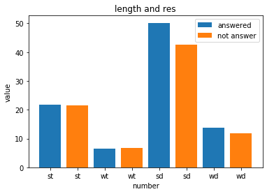

其中，st 代表 标题单字，wt代表 标题切词， sd代表 描述单字， wd代表描述切词。可以看到，这几项中，描述对于最终结果的影响更大。

其中，大致回答和未回答的占比为：

> ```python
> train: [1.01677264 0.98747618 1.179936   1.14694181]
> validation: [0.9666679  0.90628517 0.93269666 0.88167609]
> test: [0.99691864 0.96807607 1.34213718 1.42357846]
> ```

整体而言，回答了问题的描述的单字和切词长度要更长一点，而对于标题而言，几乎没有差别。

但是，整体而言，这一项的数值较大，需要对其进行相应的归一化，因此，考虑对不同的值除以不同的数值，分别为[20,8,50,12]

##### 时间与最终判断的关系

首先，需要判断两个时间的差距，之前已经进行了相应的处理，可以知道的是，通过分析占比：

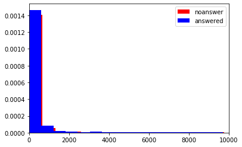

其中，蓝色表示回答了相应问题，可以看到，时间间隔越短，回答问题的可能性越大，从平均值来看，回答问题和不回答问题的平均时间间隔为

```python
不回答问题：747.0455097087379
回答问题：689.2039800995025
```

但是，可以看到，这一项的数值过大，显然需要相应地降低其数值，通过$\frac{1000}{time}$的方式修改其数值。

##### 浏览频率与回答问题关系

根据相应的分析，得到在训练集上其关系可以表示为：

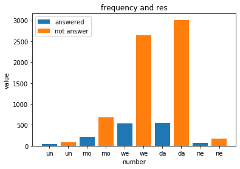

其中，un 代表 unknown , mo 代表 monthly , we 代表 weekly ，da 代表daily ， ne 代表newly 。其回答与不回答问题的比例为：

```python
train:[0.43902439 0.31586608 0.20136519 0.18459495 0.38505747]
validation:[0.66666667 0.17977528 0.1810585  0.1875     0.5       ]
test:[0.5625     0.4556962  0.22903226 0.20643432 0.45      ]
```

可以看到，对于回答问题的占比，`unknown`是最高的，其次是`newly`，然后是`monthly`，最后才是`daily` 和`weekly`，因此，考虑修改之前的数值分配方式，修改如下：

```python
    user_info[user_info == 'unknown'] = 4
    user_info[user_info == 'new'] = 3
    user_info[user_info == 'daily'] = 1
    user_info[user_info == 'weekly'] = 1
    user_info[user_info == 'monthly'] = 2
```

##### 二分类和最终判断的关系

关于这几类与最终判断的相关关系，可以表示如图:

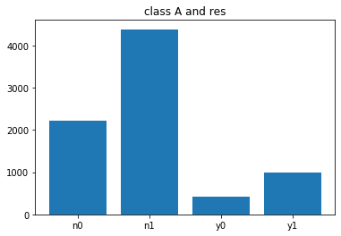

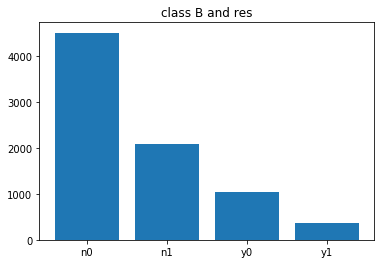

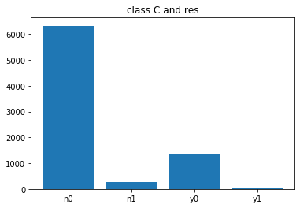

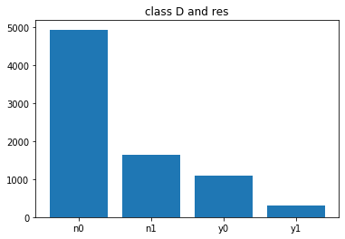

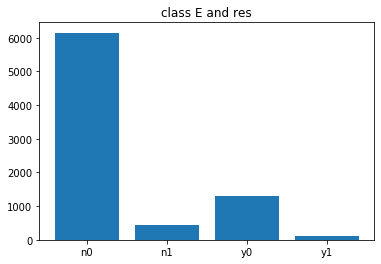

可以看到，这几类对于最终的结果都是有影响的。图像中X轴的表示：

n0 : 结果为不回答，分类为0

n1 : 结果为不回答，分类为1

y0 : 结果为回答，分类为0

y1 : 结果为回答，分类为1

##### 盐值分数对最终结果影响

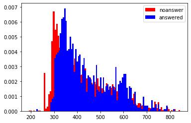

可以看到，整体而言，回答问题的用户的盐值分数更高。但是同时可以知道，盐值分数自身较大，查看为：

```python
x_train[:,11].min()
191.0
x_train[:,11].max()
844.0
```

因此可以考虑处理为： $\frac{x-191}{100}$

##### 话题关注度与最终判断

其最终关系如图：

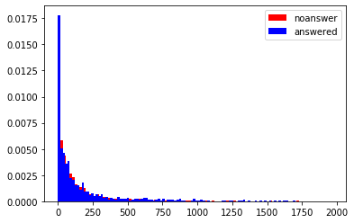

查看相应平均值：

```python
no 143.18977548543688
yes 155.8137882018479
```

故，关注度高，回答的可能性更大，但是同样也需要调整其值，查看到最大值为1965，平均值为145.4 ，最小值为0，故对其的调整应该为：$\frac{x}{145}$

#### 性别与最终判断

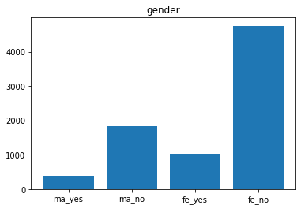

根据得到的结果，实际上女性更可能回答问题，因此修改相应的数值，为：

```python
    user_info[user_info == 'male'] = 0
    user_info[user_info == 'female'] = 1
```


### 问题求解

根据前述的分析，实际上我们需要通过最终处理之后的数据对其进行相应的预测，实际上该问题是一个二分类问题，但是由于数据量缺少，并且很多数据是无效数据，故而首先考虑使用传统机器学习方式进行分类。

#### 贝叶斯分类

直接导入相应的库：

```python
from sklearn.naive_bayes import GaussianNB
def bayes(X,Y,XValidation,YValidation):
    mb = GaussianNB().fit(X, Y)

    y_pred = mb.predict(XValidation)
    accuracy(y_pred,YValidation)
```

运行得到最终的结果为：

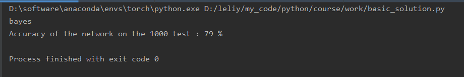

预测的准确率为 79%

#### Logistic Regression

传统的这样一种回归的方式来进行二分类，直接导入相应的库：

```python
from sklearn.linear_model import LogisticRegression
def logisticregression(X,Y,XValidation,YValidation):
    lr = LogisticRegression().fit(X, Y)

    y_pred = lr.predict(XValidation)
    accuracy(y_pred,YValidation)
```

运行得到最终的结果为：

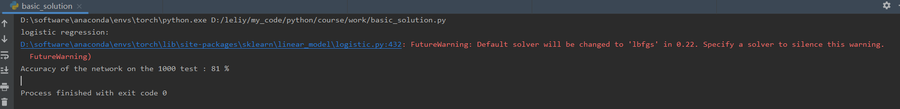

预测的准确率为81%

#### 支持向量机

利用支持向量机进行相应的二分类，通过带入相应的库，实现其代码为：

```python
def train(x_train,y_train):
    svm_clf = Pipeline((
    ("scaler", StandardScaler()),
    ("linear_svc", LinearSVC(C=1, loss="hinge")),
    ))
    svm_clf.fit(x_train, y_train)
    return svm_clf

def validation(predictor,x_validation,y_validation):
    validate = predictor.predict(x_validation) == y_validation
    size = len(y_validation)
    accu = np.sum(validate == True)/size
    print('Accuracy of the network on the %d test : %d %%' % (size,100 * accu))
```

最终运行得到的结果为：

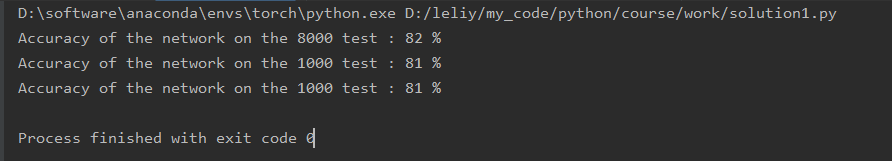

对于训练集而言，其准确率为 82% ，而对于验证集和测试集而言，达到的最终准确率都为81%

#### 多层感知机

MLP需要设置相应的隐藏层的参数，因此，通过设定范围进行训练：

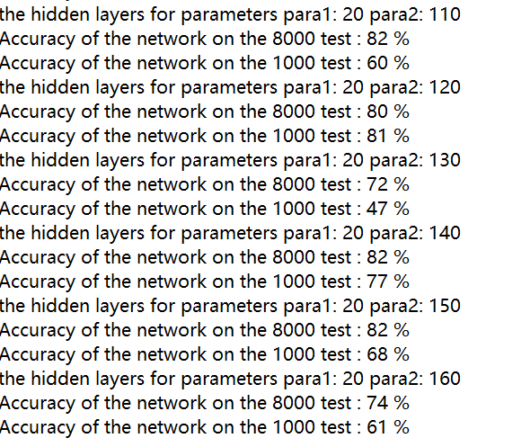

可以看到，对于不同参数而言，其最终效果是不同的，最终训练结果：

在(75,75)下，训练集准确率为82%，验证集和测试集为81%

#### 利用pytorch搭建神经网络

由于之前使用的机器学习方式预测出的准确率都只能达到80%左右的水平，考虑使用神经网络，看是否有所改进。

尝试利用pytorch搭建神经网络来对整个过程进行相应的训练

搭建的神经网络如下：

```python
class Net(nn.Module):

    def __init__(self):
        super(Net, self).__init__()
        self.fc1 = nn.Linear(14, 36)
        self.fc2 = nn.Linear(36, 60)
        self.fc3 = nn.Linear(60, 10)
        self.fc4 = nn.Linear(10, 2)

    def forward(self, x):
        x = F.relu(self.fc1(x))
        x = F.tanh(self.fc2(x))
        x = F.relu(self.fc3(x))
        x = F.sigmoid(self.fc4(x))
        return x


net = Net()
print(net)
```

可以看到，加上输出，一共是五层网络，考虑到数据量的缘故，因此，没有再增加网络的层数

设置相应的LOSS 和优化方法：

```python
import torch.optim as optim
epoches = 1000
criterion = nn.CrossEntropyLoss()
optimizer = optim.SGD(net.parameters(),lr = 0.01)
```

由于是一个分类结果，考虑使用CrossEntropyLoss（交叉熵）来计算loss，同时，最后一层使用的激活函数为sigmoid，用于实现最终的二分类结果。

最终的训练的loss 的下降如下图所示，已经收敛：

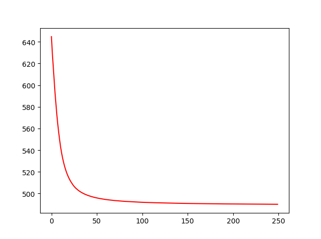

训练之后，其训练集准确率为 82%，验证集和测试集准确率为 81%，没有过拟合。

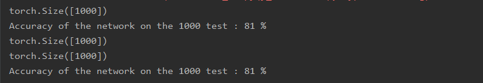

最终神经网络训练的结果也没有任何改进。尝试调整网络结构和参数得到的结果改进不大。

